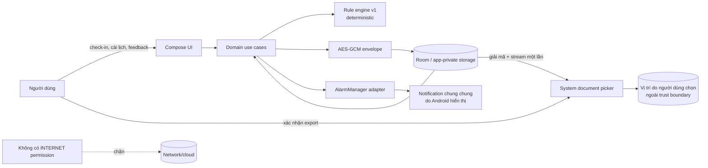

# Nhịp 2 Phút — Dữ liệu, quyền riêng tư và bảo mật MVP

> **Trạng thái:** Baseline triển khai v1  
> **Ngày khóa:** 2026-08-27  
> **Phạm vi:** Android, `vi-VN`, general wellness, không tài khoản, hoạt động hoàn toàn offline  
> **Tài liệu kỹ thuật liên quan:** [06-technical-architecture.md](06-technical-architecture.md)

Các từ **PHẢI**, **KHÔNG ĐƯỢC**, **NÊN** trong tài liệu này là yêu cầu kiểm thử được. Mọi thay đổi làm dữ liệu rời thiết bị, thêm SDK hoặc thêm permission phải qua một quyết định kiến trúc và cập nhật Privacy Policy/Data safety trước khi merge.

## 1. Ranh giới đã khóa

| ID | Yêu cầu bắt buộc |
|---|---|
| `DATA-001` | Dữ liệu người dùng chỉ được xử lý và lưu trong app-private storage trên thiết bị. Không có server, tài khoản, đăng nhập, đồng bộ hoặc API từ xa. |
| `DATA-002` | APK/AAB không khai báo `android.permission.INTERNET`; không có mã mở socket/HTTP/WebView do app điều khiển. |
| `DATA-003` | MVP không có Health Connect/wearable, calendar, activity recognition, phát hiện lái xe, billing, quảng cáo, analytics hoặc crash-reporting SDK. |
| `DATA-004` | Mọi sự kiện người dùng phải lưu đồng thời UTC instant, local date, IANA `ZoneId` và `utc_offset_minutes` tại lúc phát sinh. |
| `DATA-005` | Export toàn bộ dữ liệu cá nhân luôn miễn phí, chỉ bắt đầu từ thao tác rõ ràng của người dùng qua Storage Access Framework (SAF). |
| `DATA-006` | “Xóa toàn bộ dữ liệu” luôn miễn phí và phải xóa DB/WAL/SHM, file, cache, khóa Keystore, trạng thái lịch và notification đang hiển thị/đang chờ. |
| `SEC-001` | Chỉ xin permission tối thiểu, đúng lúc người dùng bật tính năng tương ứng; từ chối permission không làm hỏng luồng check-in/routine. |
| `SEC-002` | Payload do người dùng tạo phải được mã hóa AES-GCM bằng khóa không export được do Android Keystore bảo vệ. |
| `SEC-003` | Android backup và device-to-device transfer của app data phải bị tắt; không có cơ chế backup ngầm riêng. |
| `SEC-004` | Release build không log health/wellness values, nội dung check-in, outcome an toàn, ID bản ghi, lịch làm việc hoặc khóa/bí mật. |
| `SEC-005` | Mọi component nội bộ đặt `android:exported="false"`; chỉ launcher activity được export. Mọi `PendingIntent` là explicit và immutable. |
| `SEC-008` | `MainActivity` phải đặt `WindowManager.LayoutParams.FLAG_SECURE` trước khi render Compose và giữ cờ này suốt vòng đời Activity; không có screen nào được tự tắt cờ. |

Không được diễn giải “offline” thành “offline-first”: MVP **không có** đường network dự phòng. Việc người dùng chọn Google Drive hoặc một document provider khác trong system picker để lưu file export là hành động chủ động ra ngoài trust boundary của app, không phải app tự upload.

## 2. Luồng dữ liệu và trust boundary



Các trust boundary:

1. **Trong app process:** UI, rule engine, repository, crypto và scheduler orchestration.
2. **Android OS:** Keystore, app sandbox, AlarmManager, notification shade và system document picker.
3. **Ngoài kiểm soát của app:** thiết bị đã root/compromise, màn hình khóa/notification shade, file export sau khi SAF hoàn tất, và document provider người dùng chọn.

### SEC-006 — Notification privacy

Notification chỉ dùng nội dung trung tính như “Đã tới lúc nghỉ ngắn”. Không hiển thị mode, đau/khó chịu, năng lượng, lý do gợi ý hoặc tên routine trên lock screen.

`FLAG_SECURE` làm screenshot, screen-share/recording và recent-task thumbnail của app bị trống hoặc bị OS chặn, đồng thời ngăn nội dung xuất hiện trên non-secure display trên nền tảng hỗ trợ. Đây là trade-off privacy có chủ đích và phải được nói rõ trong phần Quyền riêng tư ở Settings; TalkBack/accessibility semantics vẫn hoạt động. Cờ được đặt một lần trước `setContent` và không toggle theo route vì transition/snapshot race có thể làm lộ frame ([Android — Secure sensitive activities](https://developer.android.com/security/fraud-prevention/activities)).

## 3. Kiểm kê dữ liệu và retention

Authority retention nội bộ là exact union `RetentionAuthorityV1`: `Finite(cutoff: RetentionCutoffV1)` hoặc `UntilFullDelete(policy_version=1, authority_kind=until_full_delete, source_table=app_profile, source_primary_key=1)`. `RetentionCutoffV1` finite gồm đúng `policy_version=1`, allowlisted `source_kind`, `source_id`, full `origin` LocalStamp, integer `calendar_days` và `deadline_at_utc`; source kind chỉ nhận `entity_base|entity_reference|event_reference|constraint_reference|snapshot_reference|companion_reference|weekly_summary_base`. ID phải resolve đúng loại hoặc maintenance fail closed. Không dùng sentinel date/`Instant.MAX`: finite row có derived `delete_after_epoch_day`, còn `UntilFullDelete` bắt buộc cột đó null và chỉ delete-all pipeline được xóa. Active `WorkScheduleVersion` cũng có prefilter null nhưng được phân biệt bằng table/state và chỉ nhận finite authority atomically khi bị replace; decoder không được coi nó là full-delete anchor.

Cutoff chuẩn 90 ngày được tính **một lần** bằng start-of-day của `origin.local_date + 90 calendar days` trong `origin.zone_id`, theo ZoneRules/DST, rồi lưu absolute deadline; không dùng `90×24h` và không tính lại bằng timezone hiện tại.

Plaintext `delete_after_epoch_day` chỉ là prefilter bảo thủ: `floorDiv(deadline_at_utc.epochMillis, 86_400_000)`—UTC epoch day của deadline. Maintenance query `delete_after_epoch_day <= current UTC epoch day`, sau đó bắt buộc decrypt/auth/validate cutoff và chỉ coi record eligible khi coherent `now.instant >= deadline_at_utc` **và** không còn FK/logical/graph reference. Equality mới eligible. Prefilter có thể lấy thừa row trong cùng UTC day nhưng không thể cho phép xóa sớm hoặc bỏ sót row đã đến hạn; nó không bao giờ là delete authority.

Khi event/constraint/snapshot/entity reference kéo retention, transaction tạo candidate cutoff mang provenance của edge đó. Chỉ khi `candidate.deadline_at_utc` muộn hơn current mới atomically adopt toàn candidate và cập nhật prefilter; candidate sớm hơn hoặc bằng giữ nguyên current/provenance. Cutoff không bao giờ giảm. Invariant graph: event, constraint hoặc immutable audit snapshot còn retention **không được** trỏ tới entity đã purge. Extension đi hết `Session → Decision → CheckIn → WorkScheduleVersion` hoặc `Decision → CheckIn → WorkScheduleVersion`; Session `source=reminder` đồng thời giữ `ReminderOccurrence → WorkScheduleVersion` nguồn.

Các event là bằng chứng bắt buộc để importer kiểm mirror không được hết hạn trước record mà chúng chứng minh. Storage vì vậy có closed edge vật lý `required_companion_event_ref(source,event)`; logical companion role/selector được derive duy nhất từ typed event registry và payload đã decrypt, không lưu plaintext role làm lộ lifecycle. Source authority kéo event theo chiều ngược, còn event authority kéo entity refs theo chiều xuôi. Propagation **có hướng**; cutoff/anchor muộn hơn của một target ordinary ref không bao giờ chảy ngược về event. Vì mọi event có ordinary ref tới AppProfile, quy tắc này là bắt buộc để một Session/event 90 ngày không vô tình thành full-delete-only. Mỗi transaction tạo source/event hoặc nâng authority chạy work queue theo đúng hướng tới fixed point, adopt `UntilFullDelete` hoặc finite deadline muộn hơn và cập nhật encrypted authority + prefilter atomically. Ngoại lệ lifecycle duy nhất: active `WorkScheduleVersion` có authority null và **không adopt finite candidate**; active pointer giữ row, còn incoming refs vẫn được index. Transaction replace trước tiên tạo finite base từ `replaced_at`, rồi scan/apply mọi retained incoming candidate trước commit. Không áp reverse edge cho observation/funnel tùy ý; allowlist role đóng được khóa tại `ARC-024`.

Dọn retention chạy khi mở app, sau mỗi lần ghi thành công và trước export; không tạo background worker riêng. Companion deletion set là least fixed point trên **chỉ** bipartite edge vật lý: từ source thêm mọi required event, từ mỗi event thêm mọi source đồng cấp, rồi lặp cho source mới đến khi không đổi; tuyệt đối không đi qua ordinary event ref. Một required companion event chỉ được purge cùng/sau toàn set này khi mọi member đã due, không active/pending và không còn ref ngoài set; source chỉ được purge khi toàn required companion/mirror hợp lệ. Missing companion/edge, decrypt/schema lỗi, bound/overflow hoặc cutoff không khép kín phải fail closed, không fabricate/backfill event. Sau khi loại các set đủ điều kiện, purge constraint đã inactive rồi session trước reminder occurrence và các entity còn lại theo thứ tự FK. Full delete do người dùng xác nhận bỏ qua retention và xóa toàn bộ ngay.

| Nhóm dữ liệu | Trường chính | Mục đích | Nơi lưu/mã hóa | Retention mặc định |
|---|---|---|---|---|
| Eligibility/onboarding | random-local `installation_id`; xác nhận 18+, eligibility/scope confirmation; immutable `safety_acknowledgements[]` + non-null `current_safety_acknowledgement_id`; mỗi acknowledgement giữ `kind=onboarding\|reack`, `content_version=ContentManifest.manifestVersion`, `content_digest=globalSafetyContentDigestSha256`, full LocalStamp; `onboarding_completed_at` + activation boot/elapsed/generation/mapping evidence | Giới hạn đúng đối tượng, audit đúng global-safety copy/re-ack và đo activation 24 elapsed hours không dùng app first-open | Room, toàn payload AES-GCM | Đến full delete. Re-ack append history/update pointer nhưng không reset activation. ID chỉ sinh trong eligible profile transaction; nếu không đủ điều kiện thì staging ở RAM bị bỏ, không lưu answer/ID |
| `WorkScheduleVersion` | UUID version, enabled, ISO weekday `1..7`, giờ bắt đầu/kết thúc, 1–2 giờ nhắc, `effective_from`, nullable `replaced_at` | Lập lịch local và tái lập đúng lịch đã áp dụng cho session/reminder lịch sử | Room, payload AES-GCM; chỉ active-version pointer là opaque FK plaintext | Version active giữ đến khi bị thay/xóa; version đã thay giữ tối thiểu 90 ngày và lâu hơn nếu còn session/reminder/event tham chiếu, rồi purge ở maintenance |
| Check-in | nullable `parent_id` nếu reconfirm, non-null `schedule_version_id`, non-null integer `rule_version=1`, discriminant `answers_kind`; `red_flag_stop` chỉ có red=true, trường sau null; `acute_stop` có red=false + acute khác NONE, trường thường null; `full` có red=false + acute=NONE + đủ energy/stiffness/intent; một `confirmed_at` LocalStamp và immutable freshness evidence | `confirmed_at` là cùng thời điểm submit+commit+freshness+retention; quyết định không bịa answer sau short-circuit, giữ lineage/schedule nguồn và xác minh TTL 6 giờ qua process death/time change | Room, payload AES-GCM; parent/schedule là opaque FK; `rule_version` là plaintext migration discriminator được allowlist | 90 ngày lịch tính theo local date gốc; chỉ full delete do người dùng xác nhận được xóa sớm. Child/source reference còn retention kéo dài parent/schedule, purge child-first |
| Decision | non-null `schedule_version_id`, outcome, reason code, ordered `invalid_fields`, `rule_version`, base/effective mode, audit `reconfirm_after` + `valid_until_work_end`, freshness evidence, exact nullable `created_safety_hold_snapshot`, `created_rest_suppression_snapshot`, `evaluation_day_mode_cap_snapshot`; **không có `routine_id`** | Hiển thị/giải thích decision/side effect có thể tái lập sau khi enforcement row hết hạn; selector chạy tách biệt | Room, payload AES-GCM; schedule ID là opaque FK | 90 ngày; giữ cùng check-in/schedule khi còn session active/pain pending/constraint/snapshot/event tham chiếu, purge session trước decision/check-in |
| Session/feedback | Session giữ `schedule_version_id`, selected-workday snapshot, `source=home\|reminder`, nullable `reminder_occurrence_id`, routine ID + content identity (`schema_version`, SemVer `content_version`, `routine_revision`, `manifest_digest_sha256`), nullable `runtime_day_mode_cap_snapshot_at_start`, `started_at` LocalStamp + four-field `start_*` elapsed anchor, monotonic PLAYING checkpoint/terminal-frozen counter, kết thúc/lifecycle + `completion_*`, exact key `session_origin_day_expires_at_utc` + constraint/evidence. Feedback keyed bằng `session_id` chỉ giữ nullable/deferred `effort`, `new_or_worse_pain`, `context_fit`, timestamps và post-session snapshots; không duplicate Session origin constraint | Lịch sử, safety gate, reminder attribution, immutable side-effect/content/elapsed audit và tổng kết tuần | Room, payload AES-GCM; schedule/reminder IDs là opaque FK | 90 ngày; session `ACTIVE` hoặc có pain gate `PENDING` không được retention xóa; constraint/event reference kéo dài source graph, sau đó purge FK-safe |
| `SafetyHold`/`DayModeCap` | hold kind/mode, `rule_version`, origin local date/ZoneId, absolute `expires_at_utc`, monotonic/boot evidence; hold có wire `source_type=check_in\|session` + `source_id`, cap có non-null `mode_trigger_session_id` + expiry `source_session_id` | Chặn/làm nhẹ đề xuất trong phần còn lại của ngày và truy nguyên đúng check-in/session nguồn | Room, encrypted `DailyConstraintsBundle` | Ngừng áp ngay khi clock evidence xác minh hết hiệu lực; physical record purge ở maintenance đầu tiên sau expiry. Trong khi row còn active/retained, nó giữ graph của cả hai source Session, dedupe nếu cùng ID |
| `RestDaySuppression` | `rule_version`, origin LocalStamp/ZoneId, `expires_at_utc`, five-field monotonic/boot evidence, `source_decision_id`; supersede audit nằm trong typed events | Tắt reminder còn lại sau `REST_ONLY`; fresh committed mode/rest/safety có thể thay atomically, còn INCOMPLETE/error giữ nguyên | Room, encrypted `DailyConstraintsBundle` | Ngừng áp theo clock-integrity resolver ở đầu origin-day kế tiếp hoặc bị decision mới hợp lệ thay sớm hơn; purge tại maintenance; trong khi retained giữ Decision→CheckIn→ScheduleVersion nguồn |
| Pending pain gate/`session_guard` | session lưu `pain_gate_status=pending\|resolved_no\|resolved_hold`; `resolved_hold` chỉ commit cùng post-session hold; feedback dùng chính `session_id` làm identity, không có `feedback_id`; guard chỉ có opaque active/pending session ID | Crash-safe block mọi session mới đến khi trả lời pain bắt buộc | Session payload AES-GCM; guard operational trong Room | Pending không tự hết hạn; clear khi answer được persist hoặc full delete |
| Clock integrity state | durable `clock_generation`, last boot marker, zone, elapsed và wall-minus-elapsed checkpoint | Phát hiện reboot/time/timezone discontinuity qua process death; không phải health outcome | Room singleton, payload AES-GCM; không export | Đến full delete; checkpoint cũ được thay atomically |
| Flow timing state | random correlation `check_in_flow_id`, process-instance + monotonic start/boot anchor, cumulative background và nullable current-background checkpoint | Tính check-in/total duration không dùng wall time; continuity loss được đánh dấu thay vì dựng lại | Room singleton, toàn payload AES-GCM; operational, không export trực tiếp | Thay khi bắt đầu flow mới; xóa khi session start, source decision hết hiệu lực/workEnd, hoặc full delete |
| `NotificationPromptAttemptV1` | random `attempt_id`, random in-process `origin_process_instance_id`, `trigger=automatic_onboarding\|explicit_user_retry`, full `attempted_at`, `state=PENDING\|RESOLVED\|INTERRUPTED`, nullable full `resolved_at`, nullable `prompt_result=granted\|not_granted`, nullable `interruption_reason=process_recreated_before_callback` | Không auto-nag lại sau Dismiss/process death và idempotent callback; không giả phân biệt nút Deny với swipe Dismiss | Room payload AES-GCM; attempt ID là correlation, không phải event entity-ref; record không export trực tiếp | Giữ mọi attempt đến full delete để automatic-at-most-once không reset; prompted/updated event audit vẫn export riêng |
| Weekly summary | exact `WeeklySummaryWireV1`: stable opaque `summary_id`, week start/zone, 13 visible count, ba typed rate và last-computed LocalStamp bốn field; không sinh pattern hoặc tương quan | Tổng kết hành vi local, không suy luận y khoa; audit đúng thời điểm recompute | Room, payload AES-GCM | Deadline cố định ở start-of-day `week_start_local_date + 13 weeks` trong immutable `week_zone_id` (`calendar_days=91`); recompute cập nhật payload/stamp nhưng giữ ID/zone và không trượt cutoff |
| Reminder occurrence | occurrence ID, `schedule_version_id`, fixed `generation` + required `creation_reason=initial\|slot_reeligible` hoặc snooze `parent_occurrence_id` + literal `ordinal=0` với creation reason absent, supersedes/merged-into refs, selected-workday snapshot; named LocalStamp `due_at`, nullable `delivered_at`, `first_opened_at`, `dismissed_at`; exact status enum `ARC-005` | Dedupe/reconcile và final-state metric mà không hồi sinh/overwrite terminal audit | Room, payload AES-GCM; schedule/occurrence IDs là opaque FK | Pending cho đến khi xử lý; terminal row bất biến tối thiểu 90 ngày và đến max cutoff của mọi retained Session/event/required-companion component tham chiếu; link graph giữ schedule và mọi parent/merge/supersede occurrence |
| PendingIntent identity registry | exact closed kind + opaque occurrence UUID; không time/schedule/outcome/health/copy | Crash-safe cancellation, đặc biệt khi main DB/key đã đóng/xóa | Keyless integrity-checked binary trong `noBackupFilesDir`, backup-excluded; không log/export | Entry tồn tại từ trước platform create đến sau platform cancel; stale superset được phép để retry; toàn registry xóa trong full delete sau phase `INTENTS_CANCELLED` |
| Local product event | event envelope/version, `installation_id` copy đúng encrypted AppProfile, nullable canonical envelope refs `decision_id\|session_id\|reminder_occurrence_id\|schedule_version_id`, allowlisted typed name/properties; nullable runtime-cap projection snapshot theo event contract; monotonic timing anchor/duration-or-invalid-reason; `onboarding_completed` lặp đúng `activation_*` anchor của profile và `routine_started\|routine_completed` lặp đúng `start_*\|completion_*` anchor của session; physical opaque `idempotency_key_version=1` + 32-byte HMAC theo MET-014 | Tính pilot metrics trên thiết bị và export chủ động; không phải remote analytics | Room, event payload AES-GCM; physical keyed HMAC plaintext chỉ phục vụ unique index và không export | Base 90 ngày trừ `weekly_summary_generated\|weekly_summary_viewed`: hai event copy fixed authority `week_start+13 weeks` của summary, không lấy occurrence+90. Required companion khác kế thừa authority source, gồm profile/ack đến full delete; event ref vẫn kéo source graph theo chiều xuôi |
| Diagnostic event | storage-only positive `sequence_id`; payload exact `occurred_at_utc`, typed `event_code`, strict SemVer `app_version`, integer `os_api>=26`, typed `component_code`; **không có dữ liệu người dùng** | Hỗ trợ tự chẩn đoán offline | Dedicated `noBackupFilesDir/nhip2phut-diagnostics.db`, tách main Room, app-private/redacted, không export | Đúng `7×24h` UTC từ `occurred_at_utc` và tối đa 200 sự kiện, điều kiện nào đến trước; namespace riêng, không dùng calendar-day cutoff |
| Sáu routine đóng gói | ID, mode, thời lượng, copy, media/checksum, catalog `manifestVersion` + routine `revision` dạng SemVer | Chạy offline và recovery đúng artifact | Read-only app resources/assets; không phải dữ liệu cá nhân | Theo vòng đời phiên bản app |
| File export | các bản ghi trên theo export schema | Người dùng mang dữ liệu đi | URI do SAF cấp; plaintext UTF-8 JSON | Do người dùng/document provider kiểm soát; app không thể tự thu hồi hoặc xóa |

### Không thu thập định danh ngoài phạm vi (`DATA-007`)

Không lưu tên, email, số điện thoại, ngày sinh đầy đủ, Advertising ID, Android ID, IP, vị trí, danh bạ, calendar, dữ liệu cảm biến hoặc identifier dùng để theo dõi. UUID bản ghi/`installation_id` được sinh ngẫu nhiên trong app, không lấy từ hardware/OS và không rời thiết bị ngoài export chủ động, **ngoại lệ duy nhất** là `ReminderOccurrence.id` deterministic UUIDv8 theo codec ARC-018 để dedupe/generation; preimage chỉ có UUID nguồn, slot/date/counter vận hành và không có health value. `installation_id` không có preference/store riêng: sinh đúng lúc eligible AppProfile transaction đầu tiên commit, mọi event copy cùng value; full delete xóa nó và onboarding mới sinh UUID mới.

Privacy Policy là artifact bundled hiện hành để xem trong Settings, **không** có consent checkbox và không lưu `accepted_privacy_policy_version`. Chỉ safety/eligibility acknowledgement cần audit như onboarding contract.

### Quy ước thời gian

`LocalStamp` là **một logical value bốn field**, không phải một UTC instant cộng zone “dùng chung” tùy ý:

```text
occurred_at_utc: InstantWireV1 JSON string
local_date: YYYY-MM-DD tại thời điểm tạo
zone_id: IANA ZoneId, ví dụ Asia/Ho_Chi_Minh
utc_offset_minutes: offset thực tế tại instant đó
```

`InstantWireV1` là representation duy nhất cho **mọi instant-valued leaf** trong JSON/event/export/content-audit wire, gồm flat `occurred_at_utc`, mọi `*_at_utc`, `expires_at_utc`, `reconfirm_after`, `valid_until_work_end`, `metadata.exported_at_utc` và leaf `occurred_at_utc` bên trong named LocalStamp như `effective_from`/`replaced_at`. Hai field schedule này là **object LocalStamp**, không phải string alias. Exact lexical form của mỗi instant leaf là UTC Gregorian `YYYY-MM-DDTHH:mm:ss.SSSZ`: year bốn chữ số `0001..9999`, month/day hợp lệ kể cả leap year, hour `00..23`, minute/second `00..59` (cấm leap second), đúng ba fractional digit, literal uppercase `T`/`Z`. Domain/storage instant phải millisecond-aligned; encode/decode qua exact signed epoch-millisecond tương ứng, không truncate/round. Numeric epoch, offset `+00:00`, lowercase, thiếu/thừa fraction, space separator, expanded/year-zero, invalid date hoặc trailing data đều bị reject, không normalize rồi accept. Field duration/evidence có suffix `_ms` vẫn là JSON int64 và **không** phải InstantWire.

Base key quartet trên chỉ dùng cho primary `occurred` stamp của event, constraint/audit-snapshot object và weekly-summary last-computed stamp đã định nghĩa. Record có nhiều thời điểm phải có **named LocalStamp riêng cho từng semantics** trong schema/DTO (check-in confirm/commit, session start/terminal, pain-answer, reminder due/deliver...), hoặc nested object chứa quartet riêng; không được đặt một `local_date/zone_id/offset` mơ hồ cạnh nhiều `*_at_utc` rồi suy rằng nó áp cho tất cả. Pure audit deadline như `expires_at_utc`/`reconfirm_after` không tự trở thành LocalStamp. Exporter/importer map 1:1 theo tên schema, từ chối quartet thiếu/trộn prefix; không tự suy field còn thiếu từ UTC/current zone. Weekly summary dùng exact primary quartet `occurred_at_utc`, `local_date`, `zone_id`, `utc_offset_minutes` cho lần compute gần nhất, tách khỏi `week_start_local_date/week_zone_id`.

Named field là nested object có **đúng** quartet base trên; không flatten bằng alias:

| Record | Named `LocalStamp` field |
|---|---|
| `profile` / acknowledgement | `onboarding_completed_at`, từng `acknowledged_at` |
| `work_schedule` | `effective_from`, nullable `replaced_at` |
| `check_ins` | `confirmed_at` |
| `decisions` | `created_at` |
| `sessions` | `started_at`, nullable `terminal_at` |
| `feedback` | nullable `pain_answered_at`, `updated_at` |
| `reminders` | non-null `due_at`; nullable `delivered_at`, `first_opened_at`, `dismissed_at` |

Event envelope, mỗi constraint/snapshot object và weekly-summary last-computed stamp dùng flat base quartet vì trong đúng scope đó chỉ có một primary occurrence. Các timestamp phụ như expiry/deadline vẫn có tên riêng và không mượn quartet của primary stamp.

Không suy lại `local_date` lịch sử từ timezone hiện tại. Retention dùng local date đã đóng dấu; thứ tự tuyệt đối dùng UTC instant. Khi timezone thay đổi, dữ liệu lịch sử giữ nguyên zone gốc, lịch tương lai được reconcile theo timezone thiết bị mới và recommendation hiện tại buộc reconfirm theo tài liệu kiến trúc.

## 4. Lưu trữ và mã hóa

### 4.1. App-private storage

- Room DB, WAL/SHM, preferences kỹ thuật và diagnostics chỉ nằm trong `dataDir`/`filesDir`/`noBackupFilesDir` của app.
- Không ghi dữ liệu vào shared storage, Downloads hoặc media collection, trừ đúng URI do người dùng chọn qua SAF khi export.
- Không dùng external cache cho payload đã giải mã.
- Routine media được đóng gói trong APK/AAB; chúng không chứa dữ liệu người dùng và không tải động.

Room được chọn vì Android khuyến nghị dùng Room thay vì SQLite trực tiếp, đồng thời hỗ trợ kiểm tra query lúc compile và migration có cấu trúc ([Android — Room](https://developer.android.com/training/data-storage/room)). Room **không được mô tả như mã hóa toàn DB**; bảo vệ nội dung người dùng nằm ở field-level envelope dưới đây.

### 4.2. Crypto envelope

Mỗi payload do người dùng tạo được serialize theo schema version rồi mã hóa độc lập:

```text
magic | crypto_version | key_version | payload_schema_version |
nonce_12_bytes | ciphertext | gcm_tag_128_bits
```

Contract bắt buộc:

- Thuật toán: `AES/GCM/NoPadding`, ưu tiên khóa 256-bit; chỉ hạ xuống 128-bit nếu thiết bị hợp lệ không hỗ trợ 256-bit.
- Khóa: sinh trong `AndroidKeyStore`, alias dạng `nhip2phut_data_v{keyVersion}`, purpose encrypt/decrypt, randomized encryption required, không cho export.
- Nonce: 12 byte từ `SecureRandom`, mới cho **mỗi** lần mã hóa; không bao giờ tái sử dụng với cùng khóa.
- AAD: canonical binary encoding của `magic`, `crypto_version`, `key_version`, `payload_schema_version`, `table_name`, `column_name`, `record_primary_key`. Mỗi top-level component encode `uint32_be(byte_length) || bytes`; ba version là đúng 4 byte `uint32_be`, magic/table/column là UTF-8 byte-exact. `record_primary_key` bắt đầu bằng type tag: `0x01 || 16 raw UUID bytes`, hoặc `0x02 || signed int64_be`; vì vậy encrypted singleton `app_profile/clock_state` dùng int64 key `1`, **không invent UUID**. Nếu schema tương lai mã hóa row composite-key, dùng `0x03 || uint16_be(part_count)` rồi từng typed part được length-prefix; MVP không tự chế codec khác. Không nối chuỗi mơ hồ; thay header/type/key hoặc chuyển ciphertext sang record/column khác phải làm xác thực thất bại.
- Không bật per-use biometric/device-credential authentication vì app phải đọc lịch khi chạy background; residual risk này được ghi rõ ở threat model.
- Plaintext/`SecretKey` không được đưa vào `String`, exception message, log hoặc diagnostic record. Giữ plaintext trong scope ngắn nhất và xóa `ByteArray` sau dùng khi khả thi.
- Lỗi GCM tag, schema không biết hoặc key không dùng được phải **fail closed**: không tạo recommendation/routine từ dữ liệu đó, không tự sinh khóa mới đè lên dữ liệu cũ. UI cho phép “Xóa dữ liệu và bắt đầu lại”.

Android Keystore giữ key material khó bị trích xuất và có thể gắn việc sử dụng khóa với phần cứng bảo mật khi thiết bị hỗ trợ ([Android Keystore](https://developer.android.com/privacy-and-security/keystore)); Android cũng liệt kê AES-GCM là lựa chọn mật mã được khuyến nghị ([Android cryptography](https://developer.android.com/privacy-and-security/cryptography)).

### 4.3. Metadata còn plaintext

Để Room có thể dọn retention và giữ quan hệ toàn vẹn, chỉ các trường sau được plaintext trong DB user-data: UUID ngẫu nhiên/opaque FK, deterministic `ReminderOccurrence` UUIDv8 theo ARC-018, loại bảng, `local_epoch_day`, conservative `delete_after_epoch_day`, integer `rule_version`, schema/crypto/key version, `product_event.idempotency_key_version=1` và exact 32-byte `product_event.idempotency_key` theo MET-014. Full `RetentionCutoffV1`/deadline/provenance nằm trong encrypted payload; epoch-day plaintext chỉ là UTC-day prefilter §3 và không authorize delete. Physical idempotency key là keyed HMAC nên trông pseudorandom với offline DB reader; nó chỉ phục vụ unique constraint, không dùng để authorize/aggregate/export. Outcome, event taxonomy, routine ID, giờ chính xác, health/wellness value và schedule vẫn ở trong encrypted payload. `rule_version` chỉ chọn codec/migration path, không tiết lộ outcome. Quy mô dữ liệu MVP nhỏ nên repository giải mã tập bản ghi giới hạn rồi lọc/aggregate trong bộ nhớ; ngoài exact event idempotency constraint không tạo index plaintext trên giá trị nhạy cảm. Diagnostic allowlist kỹ thuật ở §9 là namespace riêng và không được chứa user-derived value.

### 4.4. Event-idempotency PRF

`K_event_idem_v1` là một HMAC-SHA-256 key ngẫu nhiên, không export được trong Android Keystore, alias exact `n2p_event_idem_hmac_v1`, purpose sign/verify và không yêu cầu user authentication. App tạo hoặc reuse key này trước transaction đầu tiên commit eligible profile/product event. Key là dataset-scoped: immutable đến full delete, không backup/export/log và không rotate độc lập khi vẫn còn event. Nếu alias missing/invalid trong khi user DB còn event/profile, app trả `DATA_ERROR`; tuyệt đối không sinh key mới trên các row cũ.

Với logical preimage canonical của MET-014, physical key là đúng `HMAC-SHA-256(K_event_idem_v1, UTF8(RFC8785-JCS(preimage)))`; output đủ 32 byte, không truncate. Plaintext `idempotency_key_version` bắt buộc integer `1`; encrypted product-event payload mirror cùng version, nên decrypt/read phải kiểm byte-equal rồi recompute HMAC trước khi tin row. Unique index dùng cặp `(idempotency_key_version,idempotency_key)`. Missing/unknown version, key sai độ dài, HMAC mismatch hoặc legacy unkeyed SHA row đều fail closed; baseline chưa có production legacy để silently migrate.

Export không chứa version/key/alias. Validator export offline không có Keystore key và chỉ so canonical logical `(domain, ordered parts)` trong bộ nhớ để phát hiện duplicate/conflict; nó không được persist/export một public SHA fingerprint. Full delete xóa alias HMAC cùng mọi data-key alias **trước** khi xóa DB; onboarding eligible sau đó tạo key độc lập mới. `idempotency_key_version` nằm bên trong encrypted product-event payload và mirror byte-equal plaintext column, nên được GCM-authenticate như payload; exact AAD tuple tại §4.2 **không thêm component**. Thay đổi format/key lifecycle tương lai cần migration decrypt→recompute đã review; không fallback sang hash công khai.

### 4.5. Rotation và migration

- Một ciphertext luôn ghi `key_version` và `payload_schema_version`.
- Khi rotate key, tạo key mới trước, đọc/xác thực rồi re-encrypt từng record trong transaction nhỏ. Giữ key cũ đến khi đếm còn `0` record tham chiếu và migration verification đã qua; sau đó xóa alias cũ.
- Không dùng destructive Room migration trong production. Room schema export được commit và mọi migration có instrumentation test.
- Payload schema dùng upcaster thuần, tuần tự `vN -> vN+1`; unknown future version bị từ chối an toàn.

## 5. Backup, manifest và permission

### 5.1. Backup

Manifest phải đặt:

```xml
<application
    android:allowBackup="false"
    android:fullBackupContent="false"
    android:dataExtractionRules="@xml/data_extraction_rules"
    android:usesCleartextTraffic="false" />
```

`data_extraction_rules.xml` phải exclude root `.` cho cả `cloud-backup` và `device-transfer`. Cấu hình kép được giữ để bao phủ các nhánh Android/OEM; release test kiểm tra manifest đã merge, không chỉ source manifest. Android mô tả `allowBackup` và rules theo phiên bản tại [Auto Backup](https://developer.android.com/identity/data/autobackup).

Không lưu bản sao DB/key vào `noBackupFilesDir` với ý định “backup thủ công”. `noBackupFilesDir` chỉ có thể dùng cho marker kỹ thuật không nhạy cảm nếu cần.

### 5.2. Permission được phép

| Permission | Loại/thời điểm | Hành vi khi từ chối |
|---|---|---|
| `android.permission.POST_NOTIFICATIONS` | Runtime trên Android 13+; chỉ xin sau khi người dùng bật lịch nhắc, đã xem rationale và chưa có durable auto-prompt attempt | Lưu cấu hình nhưng trạng thái là `BLOCKED_PERMISSION`, không schedule/post; check-in, routine, history, export/delete vẫn dùng đủ. Không auto-prompt lại sau false/missing callback; CTA explicit phải chọn riêng **Thử lại hộp thoại** hoặc **Mở Settings** |
| `android.permission.RECEIVE_BOOT_COMPLETED` | Normal; dùng để reconcile lịch sau boot/package replace | Nếu OEM/force-stop ngăn receiver, reconcile khi app mở lần kế tiếp; không tuyên bố guarantee |

Android 13+ tắt notification mặc định cho app cài mới đến khi người dùng cấp `POST_NOTIFICATIONS`; app phải kiểm soát thời điểm xin và xử lý cả Allow/Deny/Dismiss ([Android notification permission](https://developer.android.com/develop/ui/compose/notifications/notification-permission)). API callback `false` không chứng minh người dùng nhấn **Deny** hay dismiss prompt, nên contract chỉ ghi `prompt_result=not_granted`; không suy luận intent. Null matrix: `PENDING` có cả `resolved_at/prompt_result/interruption_reason=null`; `RESOLVED` có resolved-at + result, interruption null; `INTERRUPTED` có resolved-at + exact interruption reason, result null. Trước khi launch **runtime dialog**, app phải atomically persist encrypted PENDING attempt + `notification_permission_prompted`; transaction fail thì không launch. Callback có kết quả resolve set-once và ghi `notification_permission_updated`. Khi process mới phát hiện PENDING thuộc process instance cũ trước callback, transaction chuyển nó sang `INTERRUPTED`, không fabricate system-prompt update; resume chỉ query OS/runtime và có thể ghi observation riêng. Tối đa một PENDING attempt; CTA thử lại runtime dialog disabled khi còn pending nhưng explicit retry được phép sau INTERRUPTED và tạo attempt ID mới. Auto onboarding prompt chỉ khi chưa từng có `automatic_onboarding` attempt ở bất kỳ state nào. Duplicate/late callback keyed bằng `attempt_id` không overwrite RESOLVED/INTERRUPTED hoặc rebound sang attempt mới.

Nhánh **Mở Settings** là command khác: chỉ phát explicit Settings intent, không tạo `NotificationPromptAttemptV1` và không ghi `notification_permission_prompted`. Khi cùng process quay lại từ navigation token này, app query OS rồi ghi tối đa một observation `notification_permission_updated(source=settings, attempt_id=null, prompt_result=null)` kể cả state không đổi; token được consume set-once. Nếu process bị recreate và token mất, cold-start/resume dùng observation `source=resume_check` theo registry, vẫn không tạo/resolve attempt. Vì Settings không tạo PENDING, bấm Back/không đổi quyền không thể khóa CTA retry vĩnh viễn.

### 5.3. Permission/capability bị cấm trong MVP

Release gate phải fail nếu merged manifest có bất kỳ mục nào sau:

- `INTERNET`, `ACCESS_NETWORK_STATE`;
- `READ_CALENDAR`, `WRITE_CALENDAR`;
- `ACTIVITY_RECOGNITION`, location, Bluetooth scan/connect, body sensors;
- Health Connect permissions;
- `SCHEDULE_EXACT_ALARM`, `USE_EXACT_ALARM`;
- `CALL_PHONE`; emergency action chỉ mở system dialer bằng `ACTION_DIAL`, không tự gọi;
- `READ_EXTERNAL_STORAGE`, `WRITE_EXTERNAL_STORAGE`, `MANAGE_EXTERNAL_STORAGE`, media permissions;
- account/authenticator, billing, install referrer, advertising ID;
- service/provider/receiver từ analytics, advertising hoặc crash SDK.

SAF `ACTION_CREATE_DOCUMENT` cho người dùng chọn đúng file đích mà không cần storage permission ([Android — Access documents with SAF](https://developer.android.com/training/data-storage/shared/documents-files)).

### 5.4. Component hardening

- `MainActivity`: `exported=true` chỉ vì có launcher intent filter; không nhận deep link MVP.
- `MainActivity` gọi `window.addFlags(FLAG_SECURE)` trước `setContent` và không clear flag cho đến khi Activity bị hủy; không có debug/release feature flag làm yếu production behavior.
- Boot/time/timezone/package receivers: explicit `exported=false`; chỉ nhận protected system broadcasts đã allowlist.
- Không khai báo custom `ContentProvider`, bound service hoặc broadcast public.
- Tất cả incoming extras được validate type/range; custom internal intents dùng explicit component/package.
- `PendingIntent.FLAG_IMMUTABLE | FLAG_UPDATE_CURRENT`; data URI chứa occurrence ID opaque, không chứa check-in/outcome.
- Không dùng notification trampoline; content intent mở thẳng `MainActivity` với route allowlist.

Android yêu cầu khai báo rõ `android:exported` cho component có intent filter và yêu cầu chỉ rõ mutability của `PendingIntent`; hướng dẫn chính thức khuyến nghị immutable khi có thể ([Android 12 behavior changes](https://developer.android.com/about/versions/12/behavior-changes-12), [Android exported components](https://developer.android.com/privacy-and-security/risks/android-exported)).

## 6. Export dữ liệu

### 6.1. UX bắt buộc

Trước khi mở system picker, hiển thị confirm không pre-checked:

> File export chứa check-in, lịch sử phiên và feedback ở dạng đọc được, không còn được app mã hóa. Bất kỳ ứng dụng hoặc dịch vụ lưu trữ nào bạn chọn có thể truy cập file này. Hãy chỉ lưu vào nơi bạn tin cậy. Xóa dữ liệu trong app sau này không xóa file đã export.

CTA: **Tiếp tục chọn nơi lưu** / **Hủy**. Không dùng share sheet mặc định cho export toàn bộ.

### 6.2. Contract file

- Intent: `ACTION_CREATE_DOCUMENT`, category `OPENABLE`, MIME `application/json`, tên gợi ý `nhip-2-phut-export-YYYY-MM-DD.json`.
- UTF-8 JSON, `export_schema_version=1`; mọi instant dùng exact `InstantWireV1`; mọi LocalStamp cộng `local_date`, IANA `zone_id` và `utc_offset_minutes` coherent tại instant đó.
- Root fields: object `metadata` và đúng chín arrays `profile`, `work_schedule`, `check_ins`, `decisions`, `sessions`, `feedback`, `reminders`, `events`, `weekly_summaries`. `profile` luôn là array và có tối đa một record; `work_schedule` chứa **mọi `WorkScheduleVersion` còn retention**, không chỉ version active. `metadata` chứa đúng `export_schema_version=1`, `exported_at_utc`, `app_version`, `content_version`, `rule_version=1`, `retention_policy_version=1`, `record_counts`; `content_version` là catalog manifest SemVer string, còn ba schema/rule/retention-policy version là integer. `record_counts` là object có đúng chín key mang tên các array trên và từng count phải khớp snapshot.
- Sáu entity collection dùng exact closed `WorkScheduleWireV1`, `CheckInWireV1`, `DecisionWireV1`, `SessionWireV1`, `FeedbackWireV1`, `ReminderWireV1` tại ARC §9.2: canonical row-ID key, exhaustive key/type/nullability/branch set, shared nested DTO và semantic array order đều normative. Encoder phát key theo registry; importer reject duplicate/missing/extra/alias/wrong type/null/unsorted array trước graph validation, không bỏ qua field lạ của schema v1. Entity arrays sort raw UUID; events sort `(instant,event UUID)`; weekly sort `(week start,summary UUID)`.
- `profile` export exact `ProfileWireV1` của ARC: required `installation_id`, literal `adult_confirmed=true`, `eligibility_scope_confirmed=true`, `locale=vi-VN`, nested `onboarding_completed_at`, four `activation_*`, nonempty exact `safety_acknowledgements[]` và `current_safety_acknowledgement_id`; cấm false/alias/extra/default. Mọi event phải có cùng installation ID, record current phải là acknowledgement append cuối và khớp bundled global-safety `content_version`/`content_digest` tại thời điểm acknowledgement. `profile` và `onboarding_completed` event export cùng four-field `activation_*` evidence + `onboarding_completed_at`; re-ack không sửa anchor này. `profile=[]` chỉ được khi mọi user-data/event collection khác cũng rỗng. Session/`routine_started` mirror `start_*`; mọi terminal Session giữ `completion_*`, nhưng chỉ `routine_completed` event mirror chúng—`routine_abandoned|routine_stopped` không có các property này. Đây là audit input elapsed, không phải hardware identifier và không được dùng để authorize trên thiết bị khác.
- Mỗi session export nested content identity với đúng `schema_version`, `content_version`, `routine_revision`, `manifest_digest_sha256`; `content_version` là domain catalog `manifestVersion`, giống định nghĩa của `metadata.content_version` nhưng là snapshot tại session, không thêm alias thứ hai. Mỗi `check_ins` giữ `parent_id`, non-null `schedule_version_id`, non-null integer `rule_version=1`, duy nhất `confirmed_at` và discriminated answer shape; không có `submitted_at`. `check_in_submitted` event phải dùng quartet envelope byte-equal `CheckIn.confirmed_at` từ cùng `ClockSnapshot`. `decisions` giữ cùng non-null `schedule_version_id`, cùng supported `rule_version` và canonical ordered `invalid_fields`.
- `reminders` giữ exact identity union: fixed có `generation` + required `creation_reason=initial|slot_reeligible`; snooze có `parent_occurrence_id`, literal `ordinal=0`, `supersedes_occurrence_id=null` và cấm `creation_reason`. Cả hai giữ nullable `merged_into_occurrence_id`; fixed non-initial mới dùng non-null supersedes. Source đã post giữ `DELIVERED`; terminal row không được rewrite thành pending trong export. Importer xác minh relation không cycle/dangling, creation-reason/generation matrix, một child trên mỗi source và tối đa một pending generation trên mỗi logical fixed key; fixed `MERGED` là consumed tombstone, không có restore branch.
- Không có array `daily_constraints`: `decisions` dùng exact nullable `created_safety_hold_snapshot`, `created_rest_suppression_snapshot`, `evaluation_day_mode_cap_snapshot`; `sessions` dùng nullable `runtime_day_mode_cap_snapshot_at_start`; `feedback` keyed bằng `session_id` dùng nullable `created_post_session_safety_hold_snapshot`, `day_mode_cap_update_snapshot`; `recommendation_shown|routine_selected` trong `events` dùng nullable `runtime_day_mode_cap_snapshot` theo exact conditional của MET-010A/dictionary. Mỗi cap snapshot populated giữ `rule_version`, full LocalStamp, `expires_at_utc`, five-field clock evidence, `max_mode`, `mode_trigger_session_id` và expiry `source_session_id`; các snapshot khác giữ exact kind/mode/source refs. Cap-update snapshot còn giữ invocation trigger so với mode-trigger/expiry-source provenance. Enforcement row có thể purge nhưng snapshot source không được rewrite; exporter giữ đúng nested event snapshot và importer require cả hai Session graph. Không tạo `feedback_id`; lifecycle vẫn nằm trong `events`. `session_guard`, diagnostics, ciphertext/nonce/key/crypto metadata, alarm request code và deletion marker không export.
- `weekly_summaries` chỉ chứa exact `WeeklySummaryWireV1`: stable `summary_id`, `week_start_local_date`, immutable `week_zone_id`, last-computed quartet, 13 visible nonnegative-int64 count và ba `{numerator,denominator,value_percent|null,suppression_reason}` rate. Null/reason iff denominator `<5`, còn denominator `>=5` dùng exact integer round-half-up của ARC §11; cấm alias/extra/derived pattern. Không miễn timestamp contract chỉ vì đây là derived data.
- Không export internal `RetentionCutoffV1`, `delete_after_epoch_day`, physical event `idempotency_key_version|idempotency_key`, HMAC/data-key alias, nonce, ciphertext, diagnostic log, cache, alarm/PendingIntent registry, direct `NotificationPromptAttemptV1` rows hoặc authoritative current OS notification-permission state/cache. Offline validator dựng canonical logical `(MET-014 domain, ordered parts)` trong RAM để reject duplicate/conflict; nó không recompute/đòi physical HMAC và không persist public fingerprint. Allowlisted encrypted history `notification_permission_prompted|notification_permission_updated` vẫn là product event và được export trong `events`; `attempt_id` chỉ là correlation.
- UI sinh random UUIDv4 `export_id` chỉ trong RAM trước picker. Picker cancel hoặc callback không có structurally-valid destination thì discard ID: không file do app ghi, không `export_started|export_completed|export_failed`, không denominator và không diagnostic chứa URI. Khi có destination hợp lệ, app commit `export_started` ngay trước export work; commit event thất bại thì abort trước khi mở/ghi destination.
- Export chạy sau khi dọn retention và đọc một coherent snapshot để các collection nhất quán. Pipeline exact là snapshot → encode UTF-8 JSON → open → write → flush → close. Stream trực tiếp sang URI do SAF trả về; không tạo plaintext temp file và không giữ persistable URI permission sau khi hoàn tất. Chỉ khi close thành công mới ghi `export_completed`.
- `export_failed.error_code` v1 chỉ nhận đúng `snapshot_read_failed|json_encode_failed|destination_open_failed|destination_write_failed|destination_flush_failed|destination_close_failed|provider_failed|security_denied`. First primary failure thắng; cleanup-close chỉ là primary nếu chưa có lỗi trước. Với cùng một destination-operation failure, security/permission thắng provider-specific failure, provider-specific thắng stage code. Không lưu/emit exception class/message/stack, provider name/authority, URI, path hoặc payload. Writer/importer reject unknown, alias, sai case và extra failure property.
- Nếu stream đã mở mà export fail, app best-effort close, không ghi `export_completed`, báo rằng provider có thể đã giữ file chưa hoàn chỉnh và để người dùng tự xóa. `export_completed` và `export_failed` dùng chung terminal idempotency key theo `export_id`, nên retry/race chỉ có một kết quả.

Theo định nghĩa Data safety hiện tại, xử lý chỉ trên thiết bị không cần khai báo là “collected”; hành động người dùng chủ động đưa dữ liệu vào drive riêng cũng có ngoại lệ tùy implementation. Release owner vẫn phải đối chiếu **bundle thực tế** và câu trả lời mới nhất, không sao chép máy móc baseline này ([Google Play — Data safety](https://support.google.com/googleplay/android-developer/answer/10787469?hl=en)).

## 7. Xóa toàn bộ dữ liệu

### 7.1. UX

- Settings có CTA miễn phí **Xóa toàn bộ dữ liệu trên thiết bị này**.
- Confirm nêu rõ không thể khôi phục và không xóa được file đã export.
- Không yêu cầu đăng nhập, subscription, network hoặc liên hệ hỗ trợ.
- Thành công đưa app về onboarding sạch và hủy mọi reminder.

### 7.2. Quy trình crash-resilient

Mọi `PendingIntent` do reminder tạo phải đi qua `PendingIntentIdentityRegistryV1`, một registry keyless luôn tồn tại trong `noBackupFilesDir` và độc lập với Room/Keystore. Binary exact là: ASCII magic `N2PPI001` (8 byte) → `uint16_be(schema_version=1)` → `uint16_be(count)` với `0<=count<=4096` → `count` entry sorted/unique theo unsigned bytes, mỗi entry `kind:uint8 || occurrence_uuid:16 raw bytes` → SHA-256 32 byte của toàn prefix trước digest; cấm trailing byte. Kind đóng: `1=ALARM`, `2=NOTIFICATION_CONTENT`, `3=NOTIFICATION_START`, `4=NOTIFICATION_DELETE`, `5=SNOOZE_15`, `6=SNOOZE_30`, `7=SNOOZE_60`.

Mỗi entry reconstruct một identity duy nhất: request code `0`, MIME null, categories rỗng, data URI `nhip2phut://pending-intent/<kind-token>/<lowercase-uuid>`. `<kind-token>` lần lượt là `alarm|content|start|delete|snooze-15|snooze-30|snooze-60`; action là `${applicationId}.action.REMINDER_ALARM_V1|REMINDER_CONTENT_V1|REMINDER_START_V1|REMINDER_DELETE_V1|REMINDER_SNOOZE_15_V1|REMINDER_SNOOZE_30_V1|REMINDER_SNOOZE_60_V1`. Component/call lần lượt: `ReminderAlarmReceiver/getBroadcast`; `MainActivity/getActivity` cho content/start; `ReminderDeleteReceiver/getBroadcast`; và `ReminderActionReceiver/getBroadcast` cho ba snooze. Extras không tham gia identity và callback không được dùng extras thay URI/action đã validate. Create/update path, chỉ sau durable registry add và marker-absent check, dùng `FLAG_UPDATE_CURRENT|FLAG_IMMUTABLE`. Cancel/verify path dùng riêng `FLAG_NO_CREATE|FLAG_IMMUTABLE`; `null` nghĩa token đã absent và cho phép durable-remove. Recovery có marker tuyệt đối không gọi `UPDATE_CURRENT`, nên không tạo token mới trong lúc xóa.

Registry chỉ chứa opaque occurrence UUID + kind vận hành, không health value, schedule/time, outcome hoặc copy; nó app-private, backup-excluded, không log/export và chỉ phục vụ cancellation/full delete. Update dùng temp cùng thư mục → file `fsync` → atomic rename → directory `fsync`. Tất cả path tạo/schedule/post/cancel `PendingIntent` dùng một cross-component `DeletionCoordinator` lock: check deletion marker absent, durable-add identity **trước** platform create/schedule/post; nếu registry corrupt/full/write fail thì không tạo side effect. Cancel platform (`AlarmManager.cancel` cho alarm, `PendingIntent.cancel` cho mọi kind, notification cancel khi áp dụng) **trước** durable-remove; crash có thể để stale superset để cancel lại, không được để live identity thiếu registry. Receiver kiểm marker trước DB/post và tự cancel/no-op nếu delete đang chạy.

Deletion marker là keyless `DeletionMarkerV1` trong `noBackupFilesDir`: magic `N2PDEL01`, schema `1`, phase exact `MARKED|INTENTS_CANCELLED|KEYS_ERASED|FILES_PURGED` và SHA-256 integrity; không chứa ID/user data. Mỗi phase update theo cùng temp/fsync/atomic-rename/directory-fsync protocol. Marker chỉ được tạo dưới exclusive coordinator lock sau khi registry đã validate; marker là commit point cấm mọi identity mới.

Sau confirm bước 2, UI đi thẳng tới việc durable-create `MARKED`; không ghi `delete_all_started` hay event DB nào. Full reset vì DB/key/session corrupt phải dùng được chính đường này, nên event store/decrypt không phải precondition và event không được phép chặn xóa.

```mermaid
stateDiagram-v2
    [*] --> Ready
    Ready --> Marked: người dùng xác nhận
    Marked --> NotificationsCancelled
    NotificationsCancelled --> CryptoErased: xóa Keystore aliases
    CryptoErased --> FilesPurged: DB/WAL/SHM/files/cache
    FilesPurged --> FreshInstallState: xóa settings + deletion marker
    Marked --> Marked: process chết; tiếp tục khi mở lại
    NotificationsCancelled --> Marked: process chết; marker còn
    CryptoErased --> Marked: process chết; dữ liệu còn lại không giải mã được
    FreshInstallState --> [*]
```



Thứ tự bắt buộc:

1. Giữ exclusive coordinator lock; validate registry rồi atomic-create/fsync marker phase `MARKED`. Marker không nằm trong DB/preferences và bị backup exclude. Registry missing/corrupt tại đây không được giả empty hoặc tiếp tục crypto erase; giữ dữ liệu và báo retry/reset qua OS storage settings.
2. Disable scheduler. Đọc registry không cần Room/key, reconstruct/cancel từng identity idempotently rồi durable-remove; gọi `NotificationManager.cancelAll()`. Chỉ khi registry valid+empty và mọi cancellation không throw mới persist marker phase `INTENTS_CANCELLED`.
3. Đóng main Room; xóa **mọi** data-key alias active/retiring cùng `n2p_event_idem_hmac_v1` khỏi Android Keystore, verify alias absent rồi persist `KEYS_ERASED`. Đây là crypto-erasure tức thời nếu process chết giữa chừng.
4. Xóa DB chính, `-wal`, `-shm`, journal — gồm flow timing singleton và toàn bộ notification prompt attempt — cùng file nội bộ, media/temp export, dedicated diagnostics DB/sidecars và cache do app tạo, **trừ marker/coordinator/identity registry**, rồi persist `FILES_PURGED`.
5. Xóa DataStore/SharedPreferences và content cache; verify lại không còn alias, DB sidecar, prompt/timing state, user file, registered/platform PendingIntent hoặc notification. Xóa empty identity registry/coordinator artifacts; chỉ sau khi tất cả pass mới xóa deletion marker cuối cùng và `fsync` thư mục.
6. Khởi động lại onboarding trong process mới hoặc recreate task; không giữ decrypted object trong singleton.

Khi app/receiver khởi động và thấy marker, nó không mở main DB/không schedule/post notification mà đọc phase + registry và tiếp tục idempotent từ bước tương ứng. Kill ngay sau marker, giữa từng identity cancel/remove, phase write, alias delete hoặc file delete đều phải hội tụ. Registry missing/corrupt trước phase `INTENTS_CANCELLED` giữ marker và fail closed; không đoán identity từ DB đã bị cấm. `File.delete()`/key/PendingIntent cancellation trả lỗi phải được xử lý; chỉ báo thành công khi kiểm tra lại không còn alias, DB sidecar, file, registry identity, alarm/PendingIntent hoặc notification. Không tuyên bố secure overwrite trên flash storage.

Uninstall/clear app storage cũng phải đưa app về fresh state nhờ backup bị tắt. File export ở ngoài app sandbox không thuộc phạm vi xóa; UI phải nhắc lại điều này.

## 8. Threat model

| Mối đe dọa | Vector/tài sản | Kiểm soát | Residual risk được chấp nhận trong MVP |
|---|---|---|---|
| Trích file app từ backup hoặc physical acquisition | Check-in, feedback, lịch | Sandbox, backup/D2D off, payload AES-GCM, key trong Keystore | Thiết bị đã root/OS compromise hoặc attacker điều khiển app process có thể đọc plaintext |
| Sửa ciphertext hoặc tráo record | Decision/`SafetyHold` | GCM authentication + AAD gắn table/record/schema; fail closed | Attacker có quyền điều khiển process có thể gọi API hợp lệ; ngoài threat model app-only |
| App khác gọi receiver/activity nội bộ | Xóa dữ liệu, schedule, export | `exported=false`, explicit immutable PendingIntent, validate extras | Launcher activity vẫn public theo Android; không xử lý input nhạy cảm từ intent |
| Lộ nội dung qua lock screen | Mode, pain, routine | Notification copy chung chung, không extras nhạy cảm, user kiểm soát channel/lock-screen visibility | Người nhìn màn hình vẫn biết app nhắc nghỉ ngắn |
| Lộ UI qua screenshot, recent-app thumbnail hoặc screen share | Check-in, decision, feedback | `FLAG_SECURE` đặt trước frame đầu và giữ suốt Activity lifetime; device test screenshot/recents/non-secure display | OEM/OS compromise ngoài threat boundary; người dùng không thể chụp/chia sẻ trực tiếp màn hình app |
| Lộ qua log/crash SDK | Toàn bộ health/wellness data | Không SDK, strip release logs, structured code allowlist | OS có thể ghi generic process exception; exception message của app phải được sanitize |
| Dictionary-test plaintext event key từ DB acquisition | Taxonomy sự kiện/pain/hold/cap/reminder behavior | Physical unique key dùng per-dataset non-exportable HMAC key; event payload/mask vẫn AES-GCM; export không chứa physical key | Attacker điều khiển app process/Keystore use nằm ngoài offline-at-rest guarantee |
| Lộ file export | Plaintext JSON | Confirm rõ, SAF user-selected, stream một lần, không giữ URI/temp | Sau export, người dùng/provider chịu trách nhiệm; app không thể revoke bản sao |
| Dependency thêm permission/network | Toàn bộ data | Allowlist dependency, merged-manifest gate, SBOM/review diff, không runtime SDK ngoài AndroidX/Kotlin | Lỗ hổng trong framework/OS vẫn có thể tồn tại; cập nhật theo release cadence |
| Key bị invalidate/corrupt | Availability | Fail closed, không tự ghi đè key, cho phép full reset | Dữ liệu cũ có thể mất vĩnh viễn; chấp nhận vì không có cloud recovery |
| Time/notification bị OEM trì hoãn | Nhắc nhở | Reconcile và late guard trong kiến trúc | Không có guarantee đúng phút; đây là availability/UX, không dùng exact alarm |
| Người dùng đang lái xe vẫn nhận nhắc | An toàn bối cảnh | Không claim phát hiện lái xe; copy yêu cầu bỏ qua khi đang lái; snooze/pause thủ công | MVP không có tín hiệu đủ để biết đang lái xe |

MVP bảo vệ dữ liệu **at rest** khi app process không chạy; không hứa bảo vệ trước người đã mở khóa thiết bị và có quyền dùng app. Không thu thập credential nên repo không được chứa API key/client secret. Signing key release nằm ngoài repo và được quản lý bằng quy trình phát hành.

## 9. Logging và diagnostics

Release build:

- R8 loại `Log.v/d/i` và mọi log có variable; warning/error chỉ dùng compile-time event code.
- Không gọi `toString()` trên domain/entity/exception có thể chứa payload; các wrapper nhạy cảm override thành `[REDACTED]`.
- Không ghi stack trace vào file người dùng. Diagnostic payload chỉ gồm `occurred_at_utc` canonical UTC epoch-millisecond, `event_code`, strict canonical SemVer `app_version`, integer `os_api>=26`, `component_code`; `sequence_id` dương chỉ là physical row key. Không có property map/free text/extra column.
- `DiagnosticEventCodeV1` nhận đúng 12 uppercase literal: `DB_OPEN_FAILED|DB_TRANSACTION_FAILED|CRYPTO_KEY_INVALID|CRYPTO_PAYLOAD_INVALID|CONTENT_CONTRACT_FAILED|DATA_CONTRACT_FAILED|CLOCK_CONTINUITY_UNKNOWN|RETENTION_MAINTENANCE_FAILED|ALARM_RECONCILE_FAILED|NOTIFICATION_POST_FAILED|EXPORT_PIPELINE_FAILED|DELETE_ALL_FAILED`. `DiagnosticComponentCodeV1` nhận đúng `DATABASE|CRYPTO|CONTENT|DATA_INTEGRITY|CLOCK|RETENTION|SCHEDULER|NOTIFICATION|EXPORT|DELETION`.
- Pair mapping là total/fixed: hai `DB_*→DATABASE`; hai `CRYPTO_*→CRYPTO`; rồi lần lượt `CONTENT_CONTRACT_FAILED→CONTENT`, `DATA_CONTRACT_FAILED→DATA_INTEGRITY`, `CLOCK_CONTINUITY_UNKNOWN→CLOCK`, `RETENTION_MAINTENANCE_FAILED→RETENTION`, `ALARM_RECONCILE_FAILED→SCHEDULER`, `NOTIFICATION_POST_FAILED→NOTIFICATION`, `EXPORT_PIPELINE_FAILED→EXPORT`, `DELETE_ALL_FAILED→DELETION`. Codec explicit case-sensitive; unknown/sai case/mismatched pair/noncanonical time/version/API/sequence hoặc extra field bị reject, không fallback.
- Không ghi outcome như `URGENT_STOP`, reason code, routine ID, UUID, local date/zone, permission choice hoặc tên document provider.
- Không analytics/crash upload. Diagnostics chỉ là ring buffer dedicated app-private/no-backup đã redacted: xóa tại equality `now >= occurred_at_utc + 7×24h`, rồi chỉ giữ 200 row mới nhất theo `sequence_id`. MVP không có Support screen, diagnostic-export route, share intent hoặc cách đưa diagnostics vào data export. Full delete xóa DB này cùng sidecar; nếu diagnostic store tự fail thì drop record, không nới fail-closed domain behavior.
- Chỉ typed system failure được map vào registry. User bỏ qua/không chọn routine không tạo diagnostic; riêng system `NO_COMPATIBLE_ROUTINE` do validated content vắng dùng generic `CONTENT_CONTRACT_FAILED`, không routine/mode ID.

Android cảnh báo log có thể làm lộ PII/credential và khuyến nghị sanitize hoặc bỏ log ở production ([Android — Log info disclosure](https://developer.android.com/privacy-and-security/risks/log-info-disclosure)).

## 10. Yêu cầu phát hành Google Play

### SEC-007 — Google Play release checklist

Mỗi build candidate phải hoàn thành checklist sau bằng trạng thái thực tế của bundle; policy có thể thay đổi nên phải kiểm tra lại trong tuần submit.

1. **Health apps declaration:** khai đúng app general wellness/fitness, không phải medical device, không Health Connect/device sensors trong MVP. Tất cả app trên Play phải hoàn thành form; app có health content còn chịu Health Content and Services policy ([Health apps declaration](https://support.google.com/googleplay/android-developer/answer/14738291?hl=en-GB), [Health Content and Services](https://support.google.com/googleplay/android-developer/answer/16679511?hl=en)).
2. **Privacy Policy:** URL HTTPS công khai, active, không geofence, không phải PDF, nội dung không thể bị người dùng tùy ý sửa. App phải bundle **toàn văn đã duyệt** bằng `vi-VN` cùng `policy_version`, effective date và SHA-256 digest, render offline bằng Compose trong Settings. Canonical digest tính trên đúng bytes UTF-8, line ending LF, không BOM; public copy phải được phát sinh/review từ cùng canonical source thay vì hash markup HTML. Nút tùy chọn **Xem bản công khai** chỉ phát `ACTION_VIEW` tới URL HTTPS cố định để browser ngoài mở sau thao tác user; không WebView, network client hoặc `INTERNET`. Release owner phải chứng minh version/digest của canonical text trong artifact trùng bản public đã duyệt; lệch canonical content thì block release. Chính sách phải nói rõ dữ liệu nhập, local processing, encryption, retention, export/delete, permission notification, không bán/chia sẻ, contact và ngày hiệu lực. Google Play yêu cầu policy toàn diện truy cập được trong app và có URL public trong Play Console ([Google Play — User Data](https://support.google.com/googleplay/android-developer/answer/10144311?hl=en)).
3. **Disclaimer trong store listing và trong app:** “Nhịp 2 Phút không phải thiết bị y tế và không chẩn đoán, điều trị, chữa khỏi hoặc ngăn ngừa bất kỳ tình trạng y tế nào. Hãy tham khảo chuyên gia y tế về tư vấn, chẩn đoán hoặc điều trị.” Google Play yêu cầu disclaimer cho health app không phải medical device và nhắc tham khảo chuyên gia ([policy](https://support.google.com/googleplay/android-developer/answer/16679511?hl=en)).
4. **Data safety:** baseline là không collected/không shared vì dữ liệu chỉ xử lý on-device; export là hành động user-initiated. Phải chạy lại SDK/manifest/data-flow audit trên AAB cuối trước khi trả lời form.
5. **Target audience:** 18+; store assets/copy không hướng đến trẻ em. Không khai Families nếu không có review pháp lý/sản phẩm mới.
6. **Ads/purchases:** khai không ads, không in-app purchase/subscription cho MVP; không có Billing dependency.
7. **Target API:** implementation baseline khóa 27-08-2026 là `minSdk=26`, `targetSdk=36`, `compileSdk=36`, phù hợp mốc Play từ 31-08-2026 tại thời điểm review. Vẫn phải đọc lại policy tại ngày submit; nếu policy tăng, cập nhật doc/ADR/build baseline và test behavior changes trước release, không âm thầm thay số ([Target API requirements](https://developer.android.com/google/play/requirements/target-sdk)).
8. **Permission declaration:** chỉ `POST_NOTIFICATIONS` và `RECEIVE_BOOT_COMPLETED`; permission list trong Play Console phải khớp merged manifest.
9. **Listing claims:** không dùng “phát hiện”, “điều trị”, “ngăn ngừa”, “phục hồi %”, “không nhắc khi lái xe”, AI/wearable/calendar hoặc timing chính xác.
10. **Pilot/research gate:** trước khi tuyển hoặc phân phối build cho pilot 14 ngày, owner phải lập biên bản đánh giá liệu hoạt động này có phải health-related human-subject research theo luật áp dụng và policy Google Play hay không. Nếu thuộc phạm vi, phải có ethics/IRB-equivalent approval; nếu không thuộc, phải có documented exemption/ý kiến đủ thẩm quyền. Không được tự tuyên bố miễn trừ. Google Play yêu cầu human-subject health research tuân thủ consent/quy định và có IRB hoặc hội đồng đạo đức tương đương trừ khi thực sự được miễn ([Health Content and Services](https://support.google.com/googleplay/android-developer/answer/16679511?hl=en)).

## 11. Verification và Definition of Done

| ID | Kiểm thử/evidence bắt buộc |
|---|---|
| `DATA-101` | Static scan source/dependency và merged manifest chứng minh không có `INTERNET`, network client, WebView, analytics/crash/ad/billing SDK. Test trên airplane mode hoàn tất mọi luồng trừ việc browser/provider bên ngoài do người dùng mở. |
| `DATA-102` | Fixture hai timezone/quanh DST: mọi named LocalStamp nested và primary flat quartet round-trip exact, không trộn stamp khi record có nhiều thời điểm; weekly last-computed tách week start/zone; thiếu/mixed tuple fail import. Mọi instant exact `YYYY-MM-DDTHH:mm:ss.SSSZ`; numeric epoch, offset alias, fraction 0/1/2/4+, lowercase/space/year-zero/leap-second/non-millisecond và semantic date invalid đều fail, không normalize. |
| `DATA-103` | Retention clock/graph fixtures: base 90 calendar days qua DST/timezone; equality eligible và `-1ms` chưa eligible; UTC epoch-day prefilter có thể lấy thừa nhưng không xóa sớm/bỏ sót; finite candidate muộn hơn adopt toàn provenance, sớm hơn/equality giữ current. Directed closure chạy source→required companion→ordinary refs/dependency, không ordinary-ref reverse: Session/routine event vẫn finite dù mọi event ref AppProfile full-delete. Day 90/91 giữ profile onboarding/re-ack companions đến delete; weekly row 91 ngày giữ generated companion; late feedback ngày 89 nâng Session start/terminal/skip/pain/feedback+side-effect event rồi Decision/CheckIn companions và full source graph. Missing edge/event/mirror hoặc authority/prefilter mismatch fail closed; exact companion deletion set purge FK-safe. Diagnostic vẫn đúng `7×24h` UTC/max-200. |
| `DATA-104` | Generated export fixtures đủ chín array và closed six-entity WireV1 registry: với từng object mutate mỗi required key thành missing/extra/alias/wrong type/null, duplicate key, branch-opposite key, enum case, canonical row-ID name và từng semantic array reorder/duplicate; tất cả fail trước graph validation. Valid fixtures giữ installation/event identity, schedule/source graph, early-stop union, acknowledgement pointer, snapshots, LocalStamp/clock/content/start-completion evidence, three session modes và reminder UUIDv8/literal snooze ordinal 0/link/stamps. Check-in `submitted_at`, version/timestamp mirror mismatch bị reject. Offline MET-014 duplicate logical key vẫn fail; physical HMAC/key không export. On-device forensic golden verify HMAC. Picker cancel/null zero event; injected snapshot/encode/open/write/flush/close/security/provider failures chứng minh exact precedence, terminal-after-close và không plaintext temp/raw URI/provider/exception. |
| `DATA-105` | Full-delete test kiểm tra DB/WAL/SHM, dedicated diagnostics DB/sidecar, files/cache/preferences, mọi data/HMAC alias, installation ID, flow timing state, notification prompt attempt, registry identity, alarm/PendingIntent và notification đều không còn. Kill tại marker→cancel gap, trước/sau từng registry add/platform-create/platform-cancel/registry-remove, từng marker phase/key/file delete rồi relaunch/receiver phải không mở main DB/post và vẫn hội tụ; corrupt registry trước `INTENTS_CANCELLED` fail closed. Onboarding eligible sau xóa sinh installation ID + HMAC key mới. |
| `SEC-101` | Giải mã đúng; mỗi lần mã hóa có nonce khác; golden AAD cover UUID/int64 singleton exact bytes; thay một bit/tag/type/key hoặc tráo ciphertext giữa UUID/singleton/record/column phải fail closed. |
| `SEC-102` | Key rotation/migration test giữ đủ record; key cũ chỉ xóa sau verify. Keystore invalidation không tự tạo recommendation. |
| `SEC-103` | Backup/restore và device-transfer test trên API bands/OEM đại diện không khôi phục app data; merged manifest/rules đúng. |
| `SEC-104` | Permission test: runtime-dialog attempt/event commit trước launcher; callback true/false; false không phân biệt Deny/Dismiss; process recreate chuyển PENDING→INTERRUPTED; missing/duplicate/late callback; auto-at-most-once, explicit dialog retry ID mới. Nhánh Settings không tạo attempt/prompted event; grant, Back/no-change và same-process return đều consume token/ghi đúng observation, process recreate dùng resume-check và không để PENDING. Runtime revoke vẫn reconcile; core app dùng được và không nag loop. |
| `SEC-105` | Release log/diagnostic scan không thấy input values, outcome/reason, UUID, schedule, URI hoặc key material. Golden duyệt exact 12 event-code/10 component-code fixed pairs; reject unknown/sai case/mismatch/extra/free text. Dedicated no-backup DB vẫn ghi được main `DB_OPEN_FAILED`, đúng UTC `7×24h`/max-200, bị full delete và không có user-facing export/share route. |
| `SEC-106` | Component/intent security test: chỉ launcher exported; malformed extras bị bỏ; mọi PendingIntent explicit + immutable; notification không lộ dữ liệu nhạy cảm. |
| `SEC-107` | AAB dependency SBOM, Play SDK Index review, Data safety, Health declaration, Privacy Policy, disclaimer và store claims được hai người sign-off trước rollout. |
| `SEC-108` | Pilot research assessment có owner/date/jurisdiction/scope và đính kèm approval hoặc documented exemption nếu áp dụng; chưa có evidence thì không enrollment/distribution. |
| `SEC-109` | Airplane-mode test mở được toàn văn Privacy Policy bundled; manifest version/effective date/SHA-256 trên exact UTF-8/LF/no-BOM bytes khớp canonical public policy đã duyệt. Chỉ nút user-tap mới tạo fixed HTTPS `ACTION_VIEW`; release scan không có WebView/network fetch. |
| `SEC-110` | Global-safety update test: digest/version mismatch bắt re-ack, append history/update current pointer nhưng giữ nguyên activation anchor; corrupt/dangling pointer fail closed. Emergency adapter dùng đúng signed digits qua `ACTION_DIAL`; merged manifest/source scan không có `CALL_PHONE`/`ACTION_CALL`. |
| `SEC-111` | Device test trên min/mid/target API: trước frame Compose đầu tiên `MainActivity` đã có `FLAG_SECURE`; screenshot, screen recording/share, recent-task thumbnail và non-secure display không lộ UI. Điều hướng mọi route/background-foreground không clear cờ; TalkBack vẫn đọc semantics. |

Không đạt bất kỳ gate nào ở trên thì build không được phát hành. Kiểm tra thủ công “có vẻ offline” không thay thế manifest/dependency scan và test runtime.

## 12. Nguồn chính thức

- [Android Developers — Guide to app architecture](https://developer.android.com/topic/architecture)
- [Android Developers — Room](https://developer.android.com/training/data-storage/room)
- [Android Developers — Android Keystore](https://developer.android.com/privacy-and-security/keystore)
- [Android Developers — Cryptography](https://developer.android.com/privacy-and-security/cryptography)
- [Android Developers — Auto Backup](https://developer.android.com/identity/data/autobackup)
- [Android Developers — Storage Access Framework](https://developer.android.com/training/data-storage/shared/documents-files)
- [Android Developers — Notification runtime permission](https://developer.android.com/develop/ui/compose/notifications/notification-permission)
- [Android Developers — Secure sensitive activities](https://developer.android.com/security/fraud-prevention/activities)
- [Android Developers — Common intents: Phone](https://developer.android.com/guide/components/intents-common#Phone)
- [Google Play — Health Content and Services](https://support.google.com/googleplay/android-developer/answer/16679511?hl=en)
- [Google Play — User Data and Privacy Policy](https://support.google.com/googleplay/android-developer/answer/10144311?hl=en)
- [Google Play — Data safety form](https://support.google.com/googleplay/android-developer/answer/10787469?hl=en)
- [Android Developers — Target API requirements](https://developer.android.com/google/play/requirements/target-sdk)
