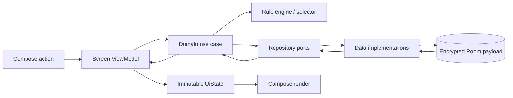
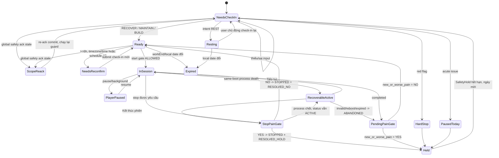

# Nhịp 2 Phút — Kiến trúc kỹ thuật Android MVP

> **Trạng thái:** Baseline triển khai v1  
> **Ngày khóa:** 2026-08-27  
> **Nền tảng:** Android-first, `vi-VN`, phone portrait/adaptive, hoàn toàn offline  
> **Data/security baseline:** [05-data-privacy-security.md](05-data-privacy-security.md)

Tài liệu này là contract chung cho product, Android, QA và content. Các từ **PHẢI**, **KHÔNG ĐƯỢC**, **NÊN** là yêu cầu kiểm thử được. Rule, mode ID, routine ID, schema và state được ghi bằng tên code canonical; UI dùng bản dịch `vi-VN` tương ứng.

## 1. Quyết định kiến trúc đã khóa

| ID | Quyết định |
|---|---|
| `ARC-001` | Một app Android native, một activity, UI Jetpack Compose, UDF; local Room là single source of truth. |
| `ARC-002` | Không tài khoản, không backend và không `INTERNET` permission. Không AI/LLM, Health Connect/wearable, calendar, activity/driving detection, billing, analytics hoặc crash SDK. |
| `ARC-003` | Rule engine là hàm thuần, deterministic, versioned. Active `SafetyHold` luôn thắng; safety field được đánh giá trước field thường; missing/invalid input không được biến thành default. |
| `ARC-004` | Catalog đóng gồm đúng sáu routine offline, ID và mode bất biến. App không tải hoặc sinh content mới. |
| `ARC-005` | Reminder là 1–2 giờ wall-clock cố định trên weekday người dùng chọn, dùng inexact AlarmManager; không exact alarm và không guarantee đúng phút. |
| `ARC-006` | App không biết người dùng có đang họp/lái xe hay không. UI/store không được claim “không nhắc khi lái xe”; người dùng tự bỏ qua, pause hoặc snooze. |
| `ARC-007` | Mọi dữ liệu người dùng mã hóa field-level AES-GCM/Keystore, backup tắt, export/delete miễn phí theo tài liệu 05. |
| `ARC-008` | Manual check-in/routine được phép trên mọi local day nhưng chỉ trong `[workStart, workEnd)`; check-in hết hạn ở `workEnd`, sau 6 giờ phải reconfirm trước start. Selected weekday chỉ điều khiển notification và qualified metric. |
| `ARC-009` | User chỉ được chọn cùng mode hoặc nhẹ hơn; không có code path nâng mode từ override, wearable, lịch sử hoặc feedback. |
| `ARC-010` | Lỗi contract/crypto/content phải fail closed: không routine và không suy diễn default an toàn giả. |
| `ARC-025` | `MainActivity` đặt `FLAG_SECURE` trước `setContent` và giữ suốt Activity lifetime; không toggle theo màn hình hoặc build flavor release. |

## 2. Stack và chính sách SDK

### 2.1. Stack production

| Thành phần | Lựa chọn |
|---|---|
| Ngôn ngữ/build | Kotlin, Gradle Kotlin DSL, Android Gradle Plugin ổn định, JDK theo compatibility matrix của AGP |
| UI | Jetpack Compose + Material 3, AndroidX Lifecycle/ViewModel, Navigation Compose, lifecycle-aware Flow collection |
| Concurrency | Kotlin coroutines + `StateFlow`/`Flow`; repository API main-safe |
| Persistence | Room + KSP; encrypted payload serializer có schema version; không lưu user state trong DataStore/SharedPreferences; deletion marker crash-resilient là file `noBackupFilesDir` được `fsync` theo doc 05 |
| Time | `java.time` (`Instant`, `LocalDate`, `LocalTime`, `ZoneId`, `ZoneRules`) qua `Clock.snapshot()` inject được, gồm wall + monotonic + boot + durable clock-generation/mapping evidence |
| Reminder | `AlarmManager` one-shot inexact + explicit `BroadcastReceiver` + `NotificationCompat`; không WorkManager cho giờ nhắc |
| Crypto | JCA `Cipher(AES/GCM/NoPadding)`, `Mac(HmacSHA256)`, `SecureRandom`, Android Keystore |
| Export | Activity Result API + SAF `ACTION_CREATE_DOCUMENT`, một UTF-8 JSON |
| Privacy Policy | Toàn văn `vi-VN` + manifest version/effective-date/SHA-256 đóng gói trong app, render bằng Compose; optional fixed HTTPS `ACTION_VIEW` qua browser ngoài |
| Dependency injection | Constructor injection qua `AppContainer`; không cần runtime DI framework cho MVP |
| Test | Kotlin/JUnit cho domain, Room migration/instrumentation, AndroidX UI/Compose test, fake clock/zone/alarm/notification |

Android khuyến nghị UI/data layer rõ ràng, repository, UDF, ViewModel, coroutines/Flow và Compose cho app mới ([Guide to app architecture](https://developer.android.com/topic/architecture), [Architecture recommendations](https://developer.android.com/topic/architecture/recommendations)). Dependency version không ghi cứng trong doc: pin tập trung ở `gradle/libs.versions.toml`, chỉ dùng stable release và review release notes/merged manifest khi nâng.

Không thêm Retrofit/OkHttp/Ktor/WebView/Firebase/Play Services/Billing/Health Connect/analytics/crash SDK. Build-time test tool được phép nhưng không được đóng gói vào runtime artifact.

Policy resource là canonical text trên exact bytes UTF-8, line ending LF, không BOM; không HTML/remote image/script và renderer không tự mở link. `BundledPolicyManifest(policyVersion, effectiveDate, sha256, publicHttpsUrl)` được build cùng text. Settings luôn đọc resource local; chỉ action rõ ràng **Xem bản công khai** mới validate fixed `https` URL rồi gọi external `ACTION_VIEW`. Public copy được phát sinh/review từ cùng canonical source; CI/release evidence so version/digest trên source này, không hash HTML và app không tự fetch để so.

### 2.2. SDK policy (`ARC-011`)

- Implementation baseline khóa ngày 27-08-2026: `minSdk=26`, `targetSdk=36`, `compileSdk=36`. Min SDK là quyết định sản phẩm; API 36 đáp ứng mốc Play áp dụng từ 31-08-2026 cho app/update mới tại thời điểm khóa ([Google Play target API requirements](https://developer.android.com/google/play/requirements/target-sdk)).
- CI fail nếu ba giá trị khác baseline này, dependency dùng preview/alpha mà chưa có ADR, hoặc manifest merge thêm permission bị cấm. Release owner vẫn phải đọc lại policy trước submit; nếu Play/Android nâng yêu cầu, phải cập nhật tài liệu/ADR/version catalog và chạy lại compatibility suite trước khi đổi baseline, không âm thầm dựa vào câu “stable mới nhất”.
- Test tối thiểu trên min SDK, một API trung gian phổ biến, target SDK và bản Android stable mới nhất; thêm OEM có aggressive battery management cho reminder QA.

## 3. Module, layer và dependency

```text
:app
  ├── :ui
  ├── :data
  ├── :platform
  └── :domain

:ui       ──────> :domain
:data     ──────> :domain
:platform ──────> :domain
:domain   ──────> (Kotlin/JDK only; không Android API)
```

| Module | Trách nhiệm | Không được làm |
|---|---|---|
| `:domain` | Model canonical, validation, rule engine, routine selector, start gate, use-case contract và repository/OS ports | Import `android.*`, Room/Compose, đọc clock/timezone global, format UI string |
| `:data` | Room entities/DAO/database, AES-GCM envelope, repository implementation, bundled catalog loader, retention/migration | Chọn mode trong DAO, post notification, mở Activity |
| `:platform` | Clock/zone, AlarmManager, notification channel/receiver, permission state, SAF export, complete-delete adapter | Chứa rule/safety decision, log payload, gọi network |
| `:ui` | Compose screens, `ViewModel`, immutable `UiState`, event mapping, accessibility và `vi-VN` resources | Truy cập DAO/Keystore/AlarmManager trực tiếp, tự tính outcome |
| `:app` | `Application`, `AppContainer`, `MainActivity`, navigation graph, manifest và wiring receiver | Business rule hoặc data mapping ngoài composition root |

### ARC-012 — Dependency direction

Dependency chỉ đi theo sơ đồ trên. Android entry point rất mỏng: receiver gọi đúng use case qua app container và kết thúc trong vài giây; Activity chỉ render state/dispatch action. Mọi object dài hạn thuộc application scope, không giữ decrypted payload sau use case.

`MainActivity.onCreate` phải gọi `window.addFlags(WindowManager.LayoutParams.FLAG_SECURE)` ngay sau `super.onCreate` và **trước mọi `setContent`/sensitive view**; không có code path `clearFlags`. Cờ giữ qua toàn navigation, background/foreground và recovery screen; không quyết định theo decrypted state hoặc current route. Screenshot, screen recording/share, recent-task preview và non-secure display có thể bị blank/blocked; đây là trade-off được công bố trong phần Quyền riêng tư ở Settings, không phải lỗi. Compose semantics/TalkBack không bị tắt ([Android — Secure sensitive activities](https://developer.android.com/security/fraud-prevention/activities)).

### 3.1. Luồng UDF



UI không nhận one-off event không bền từ ViewModel cho quyết định an toàn. Navigation/dialog cần thiết được biểu diễn trong `UiState` và đánh dấu consumed bằng action idempotent.

## 4. Domain model canonical

### 4.1. Input và output rule engine

```kotlin
enum class AcuteIssue {
    NONE,
    ACUTE_ILLNESS,
    NEW_OR_WORSENING_PAIN_OR_INJURY,
    MEDICALLY_RESTRICTED
}

enum class Energy { LOW, OKAY, GOOD }
enum class Stiffness { NONE, MILD, NOTABLE }
enum class Intent { REST, GENTLE, MODERATE }
enum class Mode { RECOVER, MAINTAIN, BUILD }
enum class DayModeCapMode { RECOVER, MAINTAIN }

fun DayModeCapMode.asMode(): Mode = when (this) {
    DayModeCapMode.RECOVER -> Mode.RECOVER
    DayModeCapMode.MAINTAIN -> Mode.MAINTAIN
}

data class RuleInputV1(
    val safetyLockActive: Boolean,
    val redFlag: Boolean,
    val acuteIssue: AcuteIssue,
    val energy: Energy,
    val stiffness: Stiffness,
    val intent: Intent,
    val dayModeCap: DayModeCapMode?
)

enum class RuleOutcome {
    BLOCKED_FOR_TODAY,
    URGENT_STOP,
    PAUSE_TODAY,
    INCOMPLETE,
    REST_ONLY,
    RECOVER,
    MAINTAIN,
    BUILD
}

enum class PresentationRouteV1 {
    BLOCKED_HOLD,
    URGENT_STOP,
    PAUSE_ACUTE_ILLNESS,
    PAUSE_NEW_OR_WORSENING_PAIN_OR_INJURY,
    PAUSE_MEDICALLY_RESTRICTED,
    INCOMPLETE_FORM,
    INCOMPLETE_CONSTRAINT_DATA,
    REST_ONLY,
    MODE_RECOMMENDATION
}

enum class ReasonCode {
    SAF_LOCK_ACTIVE,
    SAF_RED_FLAG_PRESENT,
    SAF_INPUT_MISSING,
    SAF_INPUT_INVALID,
    SAF_ACUTE_ILLNESS,
    SAF_ACUTE_NEW_OR_WORSENING_PAIN,
    SAF_MEDICALLY_RESTRICTED,
    SAF_INTENT_REST,
    SAF_ENERGY_LOW,
    SAF_STIFFNESS_NOTABLE,
    SAF_BUILD_CONDITIONS,
    SAF_MAINTAIN_DEFAULT,
    SAF_DAY_MODE_CAP_APPLIED
}

enum class RuleInputField(val serializedName: String) {
    RED_FLAG("red_flag"),
    ACUTE_ISSUE("acute_issue"),
    ENERGY("energy"),
    STIFFNESS("stiffness"),
    INTENT("intent"),
    DAY_MODE_CAP("day_mode_cap")
}

data class RuleDecisionDraft(
    val outcome: RuleOutcome,
    val baseMode: Mode?,
    val effectiveMode: Mode?,
    val allowedModes: List<Mode>,
    val reasonCodes: List<ReasonCode>,
    val invalidFields: List<RuleInputField>,
    val presentationRoute: PresentationRouteV1
)

sealed interface DraftField<out T> {
    data object Missing : DraftField<Nothing>
    data object Invalid : DraftField<Nothing> // không giữ raw token
    data class Valid<T>(val value: T) : DraftField<T>
}

data class RuleInputDraftV1(
    val safetyLockActive: Boolean,
    val redFlag: DraftField<Boolean>,
    val acuteIssue: DraftField<AcuteIssue>,
    val energy: DraftField<Energy>,
    val stiffness: DraftField<Stiffness>,
    val intent: DraftField<Intent>,
    val dayModeCap: DraftField<DayModeCapMode?> // Valid(null) nghĩa là absent/expired
)
```

#### ARC-013 — Rule-input fail-closed codec

Không đặt default cho bất kỳ trường input nào. UI giữ `RuleInputDraftV1` với field nullable/invalid-state riêng để engine có thể hard-stop từ `redFlag`/`acuteIssue` trước khi các field thường hoàn tất. Chỉ sau safety-first validation mới tạo được `RuleInputV1`. Unknown enum từ DB/export hoặc field thiếu không được map về `NONE`/`OKAY`.

Tên field serialized/audit snapshot của `RuleInputV1` là đúng: `safety_lock_active`, `red_flag`, `acute_issue`, `energy`, `stiffness`, `intent`, `day_mode_cap`. Input codec ghi đúng lowercase token: acute `none|acute_illness|new_or_worsening_pain_or_injury|medically_restricted`, energy `low|okay|good`, stiffness `none|mild|notable`, intent `rest|gentle|moderate`; valid `day_mode_cap` chỉ uppercase `RECOVER|MAINTAIN` hoặc `null`. Raw `BUILD`/unknown/shape sai trong authenticated+decoded inner cap slot map `DraftField.Invalid`, không thể tạo `RuleInputV1`; outcome/decision `Mode` vẫn có đủ ba value. Enum serialize bằng exact token, không ordinal. GCM/key/envelope/bundle-schema/decode/source-validation fail trả `CONTRACT_ERROR` trước engine; invalid cap không được coi như `Valid(null)`.

`ReasonCode` và `PresentationRouteV1` serialize đúng literal uppercase ở trên; registry đóng cho `rule_version=1`, không dùng free text hoặc alias. Đoạn này chỉ định **transient engine-result wire** `RuleDecisionV1`: domain `presentationRoute` map 1:1 sang required `presentation_route`, còn `allowedModes` map sang required `allowed_modes`; missing/unknown/legacy `message_key`, sai canonical mode order hoặc outcome/reason/route mismatch bị decoder từ chối. Persisted/export `DecisionWireV1` ở §9 cố ý không chứa hai field dẫn xuất này và reject chúng như extra; reader gọi đúng pure functions `deriveAllowedModes(effective_mode)` và `derivePresentationRoute(outcome, reason_codes, invalid_fields)` theo 03/SAF-011, SAF-030, SAF-031. Đây là logical render route, **không** phải `MessageKey`. Safety routes resolve qua typed signed CNT-015 object; `INCOMPLETE_*|REST_ONLY|MODE_RECOMMENDATION` và “Vì sao” reason dùng fixed app resources `vi-VN`, không đi qua `MessageCatalog`.

### 4.2. Timestamp, decision và constraints

```kotlin
data class LocalStamp(
    val instant: Instant,
    val localDate: LocalDate,
    val zoneId: ZoneId,
    val utcOffsetMinutes: Int
)

enum class RetentionSourceKind {
    ENTITY_BASE,
    ENTITY_REFERENCE,
    EVENT_REFERENCE,
    CONSTRAINT_REFERENCE,
    SNAPSHOT_REFERENCE,
    COMPANION_REFERENCE,
    WEEKLY_SUMMARY_BASE
}

data class RetentionCutoffV1(
    val policyVersion: Int, // exact 1
    val sourceKind: RetentionSourceKind,
    val sourceId: UUID,
    val origin: LocalStamp,
    val calendarDays: Int,
    val deadlineAtUtc: Instant
)

sealed interface RetentionAuthorityV1 {
    data class Finite(val cutoff: RetentionCutoffV1) : RetentionAuthorityV1
    data object UntilFullDeleteFromAppProfile : RetentionAuthorityV1
    // internal wire exact: policy_version=1, authority_kind=until_full_delete,
    // source_table=app_profile, source_primary_key=1
}

data class ClockEvidence(
    val bootMarker: Long,
    val createdElapsedRealtimeMillis: Long,
    val monotonicDeadlineMillis: Long,
    val remainingElapsedMillisAtLastCheckpoint: Long,
    val originalDurationMillis: Long
)

data class ClockSnapshot(
    val instant: Instant,
    val elapsedRealtimeMillis: Long,
    val bootMarker: Long,
    val clockGeneration: Long,
    val zoneId: ZoneId,
    val utcOffsetMinutes: Int
)

data class DecisionFreshnessEvidence(
    val confirmedBootMarker: Long,
    val confirmedElapsedRealtimeMillis: Long,
    val ttlMonotonicDeadlineMillis: Long,
    val confirmedClockGeneration: Long,
    val confirmedZoneId: ZoneId,
    val confirmedWallMinusElapsedMillis: Long
)

data class ElapsedAnchorEvidence(
    val bootMarker: Long,
    val elapsedRealtimeMillis: Long,
    val clockGeneration: Long,
    val wallMinusElapsedMillis: Long
)

enum class TimingInvalidReason {
    SAME_BOOT_UNAVAILABLE,
    ELAPSED_ROLLBACK,
    OVERFLOW,
    BACKGROUND_OVER_10M
}

sealed interface DurationMeasurement {
    data class Valid(val durationMillis: Long) : DurationMeasurement
    data class Invalid(val reason: TimingInvalidReason) : DurationMeasurement
}

data class FlowTimingState(
    val checkInFlowId: UUID,
    val originProcessInstanceId: UUID,
    val timingStartBootMarker: Long,
    val timingStartElapsedRealtimeMillis: Long,
    val accumulatedBackgroundMillis: Long,
    val currentBackgroundStartedElapsedRealtimeMillis: Long?,
    val invalidReason: TimingInvalidReason? // chỉ ba continuity reason, không persist BACKGROUND_OVER_10M
)

enum class NotificationPromptTrigger { AUTOMATIC_ONBOARDING, EXPLICIT_USER_RETRY }
enum class NotificationPromptAttemptState { PENDING, RESOLVED, INTERRUPTED }
enum class NotificationPromptResult { GRANTED, NOT_GRANTED }
enum class NotificationPromptInterruptionReason { PROCESS_RECREATED_BEFORE_CALLBACK }

data class NotificationPromptAttemptV1(
    val attemptId: UUID,
    val originProcessInstanceId: UUID,
    val trigger: NotificationPromptTrigger,
    val attemptedAt: LocalStamp,
    val state: NotificationPromptAttemptState,
    val resolvedAt: LocalStamp?,
    val promptResult: NotificationPromptResult?,
    val interruptionReason: NotificationPromptInterruptionReason?
)

data class ActivationAnchorEvidence(
    val completedAt: LocalStamp,
    val elapsedAnchor: ElapsedAnchorEvidence
)

enum class SafetyAcknowledgementKind { ONBOARDING, REACK }

data class SafetyAcknowledgement(
    val id: UUID,
    val kind: SafetyAcknowledgementKind,
    val contentVersion: SemVer,
    val contentDigest: String, // globalSafetyContentDigestSha256, 64 lowercase hex
    val acknowledgedAt: LocalStamp
)

data class AppProfile(
    val installationId: UUID, // random local, sinh đúng lúc eligible profile transaction đầu tiên
    val adultConfirmed: Boolean,
    val eligibilityScopeConfirmed: Boolean,
    val locale: String, // vi-VN
    val activationAnchor: ActivationAnchorEvidence, // bất biến sau onboarding đầu tiên
    val safetyAcknowledgements: List<SafetyAcknowledgement>,
    val currentSafetyAcknowledgementId: UUID
)

enum class GlobalSafetyAckState { CURRENT, REACK_REQUIRED, DATA_ERROR }

sealed interface PersistedCheckInAnswersV1 {
    data class RedFlagStop(
        val redFlag: Boolean = true
    ) : PersistedCheckInAnswersV1

    data class AcuteStop(
        val redFlag: Boolean = false,
        val acuteIssue: AcuteIssue // bắt buộc khác NONE
    ) : PersistedCheckInAnswersV1

    data class Full(
        val redFlag: Boolean = false,
        val acuteIssue: AcuteIssue = AcuteIssue.NONE,
        val energy: Energy,
        val stiffness: Stiffness,
        val intent: Intent
    ) : PersistedCheckInAnswersV1
}

data class CheckIn(
    val id: UUID,
    val parentCheckInId: UUID?, // wire: parent_id; null chỉ với root check-in
    val scheduleVersionId: UUID,
    val ruleVersion: Int,
    val answers: PersistedCheckInAnswersV1,
    val confirmedAt: LocalStamp,
    val freshnessEvidence: DecisionFreshnessEvidence
)

enum class SafetyHoldKind {
    RED_FLAG,
    ACUTE_ILLNESS,
    NEW_OR_WORSENING_PAIN_OR_INJURY,
    MEDICALLY_RESTRICTED,
    POST_SESSION_NEW_OR_WORSE_PAIN
}

enum class ConstraintSourceType { CHECK_IN, SESSION }

data class SafetyHold(
    val kind: SafetyHoldKind,
    val sourceType: ConstraintSourceType,
    val sourceId: UUID, // checkInId hoặc sessionId theo sourceType
    val ruleVersion: Int, // 1 trong MVP; kế thừa source decision/session
    val occurred: LocalStamp,
    val expiresAtUtc: Instant, // đầu local date kế tiếp trong occurred.zoneId
    val clockEvidence: ClockEvidence
)

data class DayModeCap(
    val maxMode: DayModeCapMode,
    val modeTriggerSessionId: UUID, // feedback session gần nhất thực sự hạ maxMode
    val sourceSessionId: UUID, // expiry-source session cung cấp expiry/origin đang được giữ
    val ruleVersion: Int,
    val occurred: LocalStamp,
    val expiresAtUtc: Instant,
    val clockEvidence: ClockEvidence
)

data class SafetyHoldAuditSnapshot(
    val kind: SafetyHoldKind,
    val sourceType: ConstraintSourceType,
    val sourceId: UUID,
    val ruleVersion: Int,
    val occurred: LocalStamp,
    val expiresAtUtc: Instant,
    val clockEvidence: ClockEvidence
)

data class DayModeCapAuditSnapshot(
    val maxMode: DayModeCapMode,
    val modeTriggerSessionId: UUID,
    val sourceSessionId: UUID, // expiry-source origin/expiry đang được giữ
    val ruleVersion: Int,
    val occurred: LocalStamp,
    val expiresAtUtc: Instant,
    val clockEvidence: ClockEvidence
)

data class RestDaySuppressionAuditSnapshot(
    val sourceDecisionId: UUID,
    val ruleVersion: Int,
    val occurred: LocalStamp,
    val expiresAtUtc: Instant,
    val clockEvidence: ClockEvidence
)

data class Decision(
    val id: UUID,
    val checkInId: UUID,
    val scheduleVersionId: UUID,
    val ruleVersion: Int, // luôn 1 trong MVP
    val outcome: RuleOutcome,
    val baseMode: Mode?,
    val effectiveMode: Mode?,
    val reasonCodes: List<ReasonCode>,
    val invalidFields: List<RuleInputField>,
    val createdSafetyHoldSnapshot: SafetyHoldAuditSnapshot?,
    val createdRestSuppressionSnapshot: RestDaySuppressionAuditSnapshot?,
    val evaluationDayModeCapSnapshot: DayModeCapAuditSnapshot?,
    val created: LocalStamp,
    val reconfirmAfter: Instant, // audit/UI wall deadline; không phải authorization authority
    val freshnessEvidence: DecisionFreshnessEvidence,
    val validUntilWorkEnd: Instant // audit boundary của origin day; không authorize sau clock/zone change
)

data class RestDaySuppression(
    val sourceDecisionId: UUID,
    val ruleVersion: Int,
    val occurred: LocalStamp,
    val expiresAtUtc: Instant,
    val clockEvidence: ClockEvidence
)

data class DailyConstraintsBundle(
    val safetyHold: SafetyHold?,
    val dayModeCap: DayModeCap?,
    val restDaySuppression: RestDaySuppression?
)
```

`ProfileWireV1` dùng cho storage/export có **đúng** các key sau, không alias/extra/default:

| Key | Exact type/value |
|---|---|
| `installation_id` | canonical lowercase UUID; map `AppProfile.installationId` |
| `adult_confirmed` | JSON boolean literal `true` |
| `eligibility_scope_confirmed` | JSON boolean literal `true` |
| `locale` | exact string `vi-VN` |
| `onboarding_completed_at` | non-null nested `LocalStamp` exact four keys |
| `activation_boot_marker` | nonnegative JSON int64 |
| `activation_elapsed_realtime_ms` | nonnegative JSON int64 |
| `activation_clock_generation` | nonnegative JSON int64 |
| `activation_wall_minus_elapsed_ms` | signed JSON int64 |
| `safety_acknowledgements` | nonempty array exact `SafetyAcknowledgementWireV1` theo append order |
| `current_safety_acknowledgement_id` | canonical lowercase UUID |

`SafetyAcknowledgementWireV1` có đúng `acknowledgement_id`, `kind=onboarding|reack`, strict SemVer `content_version`, 64 lowercase-hex `content_digest`, nested exact `acknowledged_at` LocalStamp. ID unique; phần tử đầu tiên bắt buộc `onboarding`, mọi phần tử sau bắt buộc `reack`, và current pointer phải bằng ID phần tử append cuối. `false`, locale khác, array rỗng, sai order/kind/pointer, numeric string/float, missing hoặc extra key đều fail decode/import; không coerce một profile ineligible thành eligible. Export `profile=[]` chỉ hợp lệ khi tám collection user-data/event còn lại cũng rỗng; nếu có record/event thì phải có đúng một profile.

`LocalStamp` luôn là một value object bốn field nhất quán. Base codec `occurred_at_utc`, `local_date`, `zone_id`, `utc_offset_minutes` chỉ dành cho primary `occurred` stamp của event/constraint/audit-snapshot và weekly-summary last-computed record. Entity có nhiều thời điểm phải dùng named LocalStamp/nested DTO riêng cho check-in confirm/commit, session start/terminal, pain answer và reminder due/deliver; mapper không được gắn một quartet generic cho nhiều `*_at_utc`. `expires_at_utc`/`reconfirm_after` là deadline audit riêng, không tự có local fields. Decoder từ chối missing/mixed quartet và không suy từ current zone.

Wire mapper dùng nested LocalStamp object (bên trong có đúng bốn base key) dưới exact field: profile `onboarding_completed_at`; acknowledgement `acknowledged_at`; schedule `effective_from`/nullable `replaced_at`; check-in chỉ `confirmed_at`; decision `created_at`; session `started_at`/nullable `terminal_at`; feedback nullable `pain_answered_at` + non-null `updated_at`; reminder `due_at` và nullable `delivered_at|first_opened_at|dismissed_at` theo lifecycle. Không có `CheckIn.submitted_at`: `confirmed_at` là submit+commit+freshness+retention stamp. Event envelope, constraint/snapshot object và weekly last-computed stamp giữ flat quartet trong chính scope của chúng. Không tạo alias flatten khác; round-trip/migration fixture bắt buộc exact shape.

`NotificationPromptAttemptV1` internal wire dùng exact `attempt_id`, `origin_process_instance_id`, `trigger=automatic_onboarding|explicit_user_retry`, nested `attempted_at`, `state=PENDING|RESOLVED|INTERRUPTED`, nullable nested `resolved_at`, nullable `prompt_result=granted|not_granted`, nullable `interruption_reason=process_recreated_before_callback`. Matrix bắt buộc: PENDING có ba nullable field đều null; RESOLVED có resolved-at/result non-null và interruption null; INTERRUPTED có resolved-at/interruption non-null và result null. Unknown enum/matrix mismatch fail decode; attempt không authorize notification và không thay runtime OS query.

`RetentionAuthorityV1` là internal encrypted DTO, không thuộc export. Finite branch có exact `authority_kind=finite` + nested `cutoff`; cutoff có đúng `policy_version=1`, `source_kind`, `source_id`, nested full `origin`, integer `calendar_days`, `deadline_at_utc`, với source kind lowercase `entity_base|entity_reference|event_reference|constraint_reference|snapshot_reference|companion_reference|weekly_summary_base`. Decoder yêu cầu source ID resolve đúng loại, `calendar_days > 0`, origin quartet coherent và recomputed start-of-day deadline theo `origin.localDate + calendarDays` trong `origin.zoneId` byte-equivalent stored instant. Full branch có đúng `policy_version=1`, `authority_kind=until_full_delete`, `source_table=app_profile`, integer `source_primary_key=1` và không có cutoff/deadline; chỉ required companion propagation từ authenticated profile/ack được tạo branch này. Finite dùng non-null derived prefilter; full branch bắt buộc prefilter null. Mismatch/unknown branch/policy/source fail closed và row không được purge; không dùng max-date sentinel.

`SafetyHold`/`DayModeCap`/`RestDaySuppression.occurred` là `LocalStamp`, serialize 1:1 thành `occurred_at_utc`, `local_date`, `zone_id`, `utc_offset_minutes`. Nó chụp origin day/zone và `expiresAtUtc` được resolve tại đầu local date kế tiếp trong zone đó. `DayModeCap.modeTriggerSessionId` truy lần feedback gần nhất thực sự hạ mode; `sourceSessionId` chỉ truy expiry/origin và hai ID có thể khác nhau. Expiry instant không được tính lại từ timezone hiện tại. Sau hold/cap expiry phải check-in mới trong zone hiện tại. `ruleVersion` là integer `1`, được persist cùng decision.

`ClockEvidence` codec dùng đúng key `origin_boot_marker`, `created_elapsed_realtime_ms`, `monotonic_deadline_ms`, `remaining_elapsed_ms_at_last_checkpoint`, `original_duration_ms`. Ba constraint đều persist `rule_version=1`. Persistence DTO parse raw cap token/ID trước domain: `BUILD`/unknown, missing/wrong-type `mode_trigger_session_id` hoặc `source_session_id` không thể tạo `DayModeCap`; enum inner sai sau authenticated decode thì `DraftField.Invalid`/`INCOMPLETE`, còn source ID dangling/wrong-type là `CONTRACT_ERROR`. Active domain cap chỉ `MAINTAIN|RECOVER`.

`DecisionFreshnessEvidence` là snapshot bất biến, được ghi atomically giống nhau vào source check-in và decision với key `confirmed_boot_marker`, `confirmed_elapsed_realtime_ms`, `ttl_monotonic_deadline_ms`, `confirmed_clock_generation`, `confirmed_zone_id`, `confirmed_wall_minus_elapsed_ms`. `reconfirmAfter`/`validUntilWorkEnd` serialize exact thành `reconfirm_after`/`valid_until_work_end` để hiển thị/audit; không thêm alias `_utc`. Start gate **không** dùng hai wall deadline này làm bằng chứng TTL hoặc so ngày/zone mới với origin deadline.

Profile wire giữ random-local `installation_id`, immutable nested array `safety_acknowledgements` và non-null `current_safety_acknowledgement_id`; không derive current bằng timestamp. `installation_id` được sinh đúng một lần bằng secure UUID trong transaction đầu tiên tạo **eligible** AppProfile, lưu trong encrypted payload; event sau đó copy đúng ID này, không đọc hardware/OS/preference riêng. Pre-eligibility event chỉ staging trong RAM và chỉ insert cùng/sau successful profile commit; ineligible/cancelled onboarding discard staging và không tạo ID. Full delete xóa profile/ID; onboarding eligible tiếp theo sinh ID mới, không khôi phục giá trị cũ. Mỗi acknowledgement record có `acknowledgement_id`, `kind=onboarding|reack`, SemVer `content_version`, `content_digest`, và full acknowledged-at LocalStamp. `content_version` **chỉ** map `ContentManifest.manifestVersion`; `content_digest` **chỉ** map `globalSafetyContent.globalSafetyContentDigestSha256`, không dùng app version, manifest root digest hoặc routine digest. Onboarding tạo record đầu + pointer + activation anchor; re-ack chỉ append record/update pointer, không sửa activation anchor. Pointer dangling/duplicate, history/schema/digest invalid hoặc bundled global safety artifact/sign-off invalid => `DATA_ERROR`, không mời user “chấp nhận lại” để che contract lỗi.

Với bundled artifact đã validate, current record khớp byte-exact cả version + global digest => `CURRENT`, khác => `REACK_REQUIRED`. Re-ack commit atomically append history, đổi pointer và ghi idempotent `scope_reack_completed` với required `{acknowledgement_id, supersedes_acknowledgement_id, content_version, content_digest}`; `supersedes_acknowledgement_id` phải bằng previous current pointer. `scope_reack_required` ghi previous/required version+digest và trigger allowlist. History giữ đến full delete, nằm trong `profile` array record chứ không tạo export collection mới.

Persisted check-in codec có required discriminator `answers_kind=red_flag_stop|acute_stop|full`. `red_flag_stop` chỉ cho `red_flag=true`, mọi later field wire `null`; `acute_stop` chỉ cho `red_flag=false`, acute thuộc ba non-`none` enum và ordinary fields `null`; `full` chỉ cho `red_flag=false`, `acute_issue=none`, ba ordinary field non-null. Unknown discriminator, field thừa/non-null trái shape, default giả hoặc enum sai là `CONTRACT_ERROR`/migration failure. Missing/invalid draft chỉ tồn tại trong UI/rule evaluation và **không persist CheckIn/Decision**. Persisted `INCOMPLETE` duy nhất của MVP là valid `Full` CheckIn cộng bundle đã authenticate/decode/source-validate nhưng inner `day_mode_cap` enum/shape invalid, với `invalid_fields=[day_mode_cap]`.

Ba exact Decision wire field là nullable `created_safety_hold_snapshot`, `created_rest_suppression_snapshot`, `evaluation_day_mode_cap_snapshot`. Snapshot là deep value copy bất biến tại transaction tạo/evaluate; checkpoint hoặc purge `daily_constraint` không được sửa/xóa nó. Mỗi snapshot chứa `rule_version`, full `LocalStamp`, `expires_at_utc`, nguyên five-field `ClockEvidence` và đúng kind/mode/source refs; cap snapshot luôn có cả mode-trigger và expiry-source Session ID. Invariant: `URGENT_STOP|PAUSE_TODAY` có đúng created hold snapshot; `REST_ONLY` có đúng suppression snapshot; reason `SAF_DAY_MODE_CAP_APPLIED` có evaluation cap snapshot; các field không áp dụng phải null.

Reconfirm luôn insert `CheckIn` mới: `parent_id` trỏ trực tiếp tới check-in đang được xác nhận lại; root có `null`. Parent phải tồn tại, khác chính record, cùng installation/lineage và không được mutate. Check-in và Decision cùng persist non-null source `schedule_version_id` lấy từ active pointer trong transaction evaluate. `invalidFields` serialize đúng ordered `invalid_fields`; nó chỉ được non-empty khi `outcome=INCOMPLETE`, không trùng field và phải theo canonical order của `RuleInputField`. Mọi outcome khác bắt buộc `[]`.

`Decision` không chứa `routineId` hoặc “routine mặc định”. Selector ở §7 chạy sau decision; routine thực tế chỉ được ghi ở session và event cho lần recommendation được hiển thị.

`Decision.checkInId` luôn non-null. Khi đã có active hold, `BLOCKED_FOR_TODAY` chỉ là runtime `RuleDecisionDraft`/start-gate presentation `BLOCKED_HOLD` từ authenticated `SafetyHold`: không insert check-in/decision mới chỉ để rerender màn chặn. Local event `safety_screen_shown` chỉ ghi typed `route_id` sau render thành công theo mapping dưới đây; persisted decision nguồn tạo hold (red/acute) vẫn là record audit/export.

Source contract không dùng một `feedback_id` giả: red/acute hold có `sourceType=CHECK_IN, sourceId=checkInId`; post-session pain hold có `sourceType=SESSION, sourceId=sessionId`; cap mới có `modeTriggerSessionId=sourceSessionId=current session`, còn merge sau đó có thể tách mode trigger khỏi expiry source theo §4.4; suppression có `sourceDecisionId=decisionId`. Các reference nằm trong encrypted bundle, được DAO xác minh tồn tại và đúng loại trong cùng transaction tạo side effect.

Domain `ConstraintSourceType.CHECK_IN|SESSION` serialize explicit thành wire/export/event `source_type=check_in|session`; decoder chỉ nhận hai token lowercase này và không dùng enum case conversion ngầm.

### 4.3. Feedback canonical

```kotlin
enum class Effort { EASY, MODERATE, TOO_HARD }
enum class ContextFit { YES, NO }
enum class NewOrWorsePain { YES, NO }
enum class PainGateStatus { PENDING, RESOLVED_NO, RESOLVED_HOLD }
enum class RoutineSessionStatus { ACTIVE, COMPLETED, STOPPED, ABANDONED }
enum class PlayerSubstate { PLAYING, PAUSED }
enum class PlayerPhase { STEP_TIMER, STEP_TRANSITION, COMPLETION_CTA_WAIT }
enum class RoutineStartSource { HOME, REMINDER }
enum class RecoveryFailureReason {
    REBOOT_OR_CLOCK_DISCONTINUITY,
    WORK_WINDOW_OR_DATE_EXPIRED,
    CONTENT_UNAVAILABLE_OR_IDENTITY_MISMATCH
}

sealed interface CompleteOrAbandonCommand {
    data object Complete : CompleteOrAbandonCommand
    data class Abandon(val reason: RecoveryFailureReason) : CompleteOrAbandonCommand
}

data class RoutineStartContext(
    val source: RoutineStartSource,
    val reminderOccurrenceId: UUID?
)

@JvmInline
value class SemVer private constructor(val value: String) // parse/validate SemVer 2.0.0

data class ContentIdentity(
    val schemaVersion: SemVer, // "1.0.0" trong MVP
    val manifestVersion: SemVer,
    val routineRevision: SemVer,
    val manifestDigestSha256: String // đúng 64 lowercase hex
)

data class SessionStartEvidence(
    val startedAt: LocalStamp,
    val elapsedAnchor: ElapsedAnchorEvidence
)

data class SessionOriginConstraint(
    val terminal: LocalStamp,
    val sessionOriginDayExpiresAtUtc: Instant,
    val clockEvidence: ClockEvidence,
    val terminalElapsedAnchor: ElapsedAnchorEvidence
)

data class SessionRuntimeCapAuditSnapshot(
    val appliedCap: DayModeCapAuditSnapshot,
    val decisionEffectiveModeBeforeRuntimeCap: Mode,
    val runtimeEffectiveModeAtStart: Mode
)

enum class CapDeadlineSource { EXISTING_LATER, CANDIDATE_LATER, SAME }

data class DayModeCapUpdateAuditSnapshot(
    val triggerSessionId: UUID,
    val expirySourceSessionId: UUID,
    val basisMode: Mode,
    val previousMaxMode: DayModeCapMode?,
    val resultingCap: DayModeCapAuditSnapshot,
    val deadlineSource: CapDeadlineSource
)

data class SessionFeedback(
    val sessionId: UUID,
    val painGateStatus: PainGateStatus,
    val newOrWorsePain: NewOrWorsePain?,
    val painAnsweredAt: LocalStamp?,
    val effort: Effort?,
    val contextFit: ContextFit?,
    val createdPostSessionSafetyHoldSnapshot: SafetyHoldAuditSnapshot?,
    val dayModeCapUpdateSnapshot: DayModeCapUpdateAuditSnapshot?,
    val updatedAt: LocalStamp
)

data class SkippedStepRecord(
    val stepId: String,
    val activeElapsedMillis: Long
)

data class PlayerCheckpoint(
    val substate: PlayerSubstate?,
    val phase: PlayerPhase,
    val stepIndex: Int,
    val currentStepRemainingMillis: Long,
    val transitionRemainingMillis: Long,
    val accumulatedActiveMillis: Long,
    val skippedSteps: List<SkippedStepRecord>,
    val segmentStartedElapsedRealtime: Long?,
    val lastCheckpointElapsedRealtime: Long,
    val bootMarker: Long,
    val lastAnnouncedCadenceOrdinal: Long,
    val contentIdentity: ContentIdentity
)
```

Player-checkpoint codec ghi exact `substate=PLAYING|PAUSED|null`, `phase=STEP_TIMER|STEP_TRANSITION|COMPLETION_CTA_WAIT`, `step_index`, `current_step_remaining_ms`, `transition_remaining_ms`, `accumulated_active_ms`, ordered `skipped_steps[]` với exact `{step_id, active_elapsed_ms}`, nullable `segment_started_elapsed_realtime_ms`, `last_checkpoint_elapsed_realtime_ms`, `boot_marker`, `last_announced_cadence_ordinal` (int64 không âm) và nested content identity. Constructor/decoder bắt buộc `step_index >= 0`, mọi counter/remaining không âm, `0 <= last_announced_cadence_ordinal <= floor(accumulated_active_ms / 30_000)`. Session mới bắt đầu step `0`, full signed planned duration, transition remaining `0`, substate PLAYING, empty skipped records và ordinal `0`. Unknown/missing field, negative value hoặc announcement ordinal đi trước counter làm checkpoint invalid và đi qua fail-closed recovery, không reset về `0` để replay.

Với routine đã verify, `plannedStepMillis(i)` bằng signed `dosage.seconds*1_000` hoặc `dosage.estimatedSeconds*1_000`; `plannedTransitionMillis(i)=transitionAfterSeconds*1_000`, đều checked int64. Canonical phase matrix:

| Phase | Remaining invariant | Substate/segment invariant |
|---|---|---|
| `STEP_TIMER` | `0 < currentStepRemainingMillis <= plannedStepMillis(stepIndex)`; transition remaining `0` | PLAYING iff segment start non-null; PAUSED iff null |
| `STEP_TRANSITION` | current-step remaining `0`; `0 < transitionRemainingMillis <= plannedTransitionMillis(stepIndex)` | PLAYING iff segment start non-null; PAUSED iff null; transition duration `0` không được tạo phase này |
| `COMPLETION_CTA_WAIT` | `stepIndex=last`, cả hai remaining `0` | bắt buộc `substate=null` + segment null; Session vẫn ACTIVE đến CTA/pain flow |

`stepIndex` phải nằm trong signed `steps.indices`; content identity/revision phải đúng snapshot. `skippedSteps` resolve đúng step ID của snapshot, unique, strictly theo catalog order và không có step sau `stepIndex`; current step chỉ có thể xuất hiện khi phase đã rời `STEP_TIMER`. Mỗi record bắt buộc `0 <= activeElapsedMillis < plannedStepMillis(step)`; giá trị là `planned-currentRemaining` sau khi reconcile ngay trước skip. Đây là source of truth cho `routine_completed.step_skip_count=skippedSteps.size` và at-most-once `routine_step_skipped`; event mirror exact `step_id + active_elapsed_ms`, không đếm/reconstruct từ event rời. Reducer không persist boundary state có remaining `0` trong `STEP_TIMER|STEP_TRANSITION`: cùng transaction phải normalize sang transition, step kế tiếp hoặc CTA wait. Nhờ vậy step/phase/remaining là recovery authority; tuyệt đối không suy current-step progress từ total `accumulatedActiveMillis`.

Feedback codec ghi `effort=easy|moderate|too_hard`, `new_or_worse_pain=yes|no`, `context_fit=yes|no`; `pain_gate_status=pending|resolved_no|resolved_hold` là snake_case của domain `PENDING|RESOLVED_NO|RESOLVED_HOLD`; session lifecycle ghi uppercase `ACTIVE|COMPLETED|STOPPED|ABANDONED`. `RESOLVED_HOLD` chỉ được persist trong cùng transaction đã tạo post-session hold. Mapper là explicit và round-trip tested, không dùng enum ordinal/case conversion ngầm.

Logical Feedback record keyed bằng `session_id` được tạo/update trong encrypted Session payload cùng terminal transaction: `COMPLETED|ABANDONED` bắt đầu với pain/status `null/PENDING`, `pain_answered_at=null`, `updated_at=terminal_at`; `STOPPED` chỉ commit sau answer nên bắt đầu bằng answer + `RESOLVED_NO|RESOLVED_HOLD`, với `pain_answered_at`/`updated_at` cùng answer `LocalStamp`. Mỗi pain hoặc optional-feedback commit sau đó cập nhật `updated_at` bằng snapshot của chính transaction; field answer đã non-null không được overwrite, `Để sau` không ghi record/event mới, và không có alias `submitted_at` cho Feedback.

`SessionOriginConstraint.terminal` là terminal `LocalStamp`, tách khỏi `localDateAtStart` dùng cho metric. Nó chỉ persist/export trong **Session wire**: exact nested `terminal_at` LocalStamp, cạnh exact key `session_origin_day_expires_at_utc`, nested five-field constraint clock evidence và terminal elapsed anchor; không thêm flat generic occurrence alias hoặc alias expiry thiếu `_day_`. `feedback` không duplicate object này: reducer/use case join immutable Session theo `session_id` trong cùng transaction rồi trả aggregate domain tạm thời. Terminal transition dùng cùng một coherent `ClockSnapshot` để tạo cả bốn phần, nên completion evidence không lệch origin constraint.

`ElapsedAnchorEvidence` codec dùng đúng bốn field theo prefix của record: onboarding `activation_boot_marker`, `activation_elapsed_realtime_ms`, `activation_clock_generation`, `activation_wall_minus_elapsed_ms`; mọi terminal Session giữ terminal anchor dưới exact wire prefix `completion_boot_marker`, `completion_elapsed_realtime_ms`, `completion_clock_generation`, `completion_wall_minus_elapsed_ms`. Chỉ event `routine_completed` mirror bốn field `completion_*` để tính activation; `routine_abandoned` chỉ có exact `reason` + `pain_gate_status=PENDING`, còn `routine_stopped` chỉ có exact `elapsed_ms` + final resolved `pain_gate_status`, không được tự thêm terminal/completion evidence vào hai event này. Evidence là metric/audit evidence, không thay five-field `ClockEvidence` dùng enforce constraint.

Start transaction chụp một coherent `ClockSnapshot` để persist `SessionStartEvidence.startedAt` cùng exact `start_boot_marker`, `start_elapsed_realtime_ms`, `start_clock_generation`, `start_wall_minus_elapsed_ms`; idempotent `routine_started` event mirror đúng bốn giá trị này. Study-day classifier so start anchor với immutable onboarding activation anchor chỉ khi boot marker/generation khớp, elapsed không lùi và mapping drift `<=2_000 ms`; `delta=start_elapsed_realtime_ms-activation_elapsed_realtime_ms`, day `k` dùng half-open `[86_400_000×(k-1), 86_400_000×k)` cho `k=1..14`. Discontinuity/out-of-range là `unknown_clock`/ngoài pilot theo metric contract, tuyệt đối không fallback wall time. `completion_*` vẫn là evidence riêng cho activation/completion gates, không được dùng thay `start_*`.

Session wire field `runtime_day_mode_cap_snapshot_at_start` chỉ non-null khi một cap active **sau** immutable Decision làm runtime mode nhẹ hơn `Decision.effectiveMode`; nó giữ full cap snapshot cùng before/runtime modes. Feedback wire fields `created_post_session_safety_hold_snapshot` và `day_mode_cap_update_snapshot` giữ reducer side effect. Cap-update snapshot bắt buộc `trigger_session_id=session_id` của feedback, `expiry_source_session_id=resulting_cap.source_session_id`, basis/previous/result mode và `deadline_source=existing_later|candidate_later|same`. Khi cap mới được tạo hoặc `maxMode` hạ strict, `resulting_cap.mode_trigger_session_id=trigger_session_id`; existing `RECOVER→RECOVER` chỉ merge deadline giữ mode trigger cũ và được phép khác invocation. Post-session hold snapshot chỉ non-null với `RESOLVED_HOLD`; cap-update snapshot chỉ non-null khi pain `NO`, effort `TOO_HARD` và update đã thực sự commit trước origin expiry. Mỗi effect keyed bởi session ID chỉ commit một lần; retry trả snapshot cũ, không hạ cap lần nữa hoặc phát event trùng.

`RoutineStartSource` serialize `home|reminder`. `reminderOccurrenceId` là canonical UUIDv8 nhưng vẫn được coi là opaque ở navigation boundary. Start transaction chỉ normalize thành `REMINDER + id` khi validated navigation context đến từ **first successful notification body/action tap**, ID parse hợp lệ, row nguồn resolve được, status vẫn `DELIVERED`, `firstOpenedAt != null`, và `occurrence.scheduleVersionId == activeScheduleId == CheckIn.scheduleVersionId == Decision.scheduleVersionId`; nếu thiếu bất kỳ điều kiện nào (kể cả tap chưa ghi thành công, forged ID hoặc delivered occurrence của version cũ sau schedule edit/reconfirm), attribution được atomically normalize thành `HOME + null`, không fail authorization và không giữ stale ID. Input `HOME` luôn lưu `null`. Prompt-to-start metric còn phải kiểm cùng ID + cửa sổ 60 phút ở analysis; cửa sổ đó **không** phải start-authorization condition và không được đổi source Session sau commit.

### 4.4. Precedence sau feedback (`ARC-014`)

1. `COMPLETED`/`ABANDONED` tạo `SessionOriginConstraint` và `painGateStatus=PENDING` trong cùng terminal transaction; mọi RoutineSession mới bị chặn đến khi pain được resolve. Với stop chủ động, session giữ `ACTIVE` trong lúc hỏi pain; answer `NO|YES` mới atomically tạo terminal origin rồi commit `STOPPED + RESOLVED_NO|RESOLVED_HOLD`. Process chết trước answer vẫn recovery `ACTIVE`, không có `STOPPED` thiếu pain. `effort`/`contextFit` luôn có thể null/defer.
2. `newOrWorsePain=YES` / `RESOLVED_HOLD`: tại **clock snapshot của câu trả lời**, tạo `SafetyHold(kind=POST_SESSION_NEW_OR_WORSE_PAIN, sourceType=SESSION, sourceId=sessionId)` với origin local date/zone là `painAnsweredAt` và expiry là đầu ngày kế tiếp trong zone đó; hủy reminder còn lại hôm trả lời và **không** tạo `DayModeCap` từ cùng feedback. Vì vậy câu trả lời muộn sang ngày sau vẫn tạo hold cho ngày trả lời, không dùng expiry cũ của session.
3. `newOrWorsePain=NO` / `RESOLVED_NO`: clear pending guard. Nếu `effort=TOO_HARD` và clock-integrity resolver xác nhận `sessionOriginConstraint` còn active, tạo/cập nhật `DayModeCap` cho phần còn lại của terminal-origin day. Cùng boot monotonic deadline là authority nên wall rollback không thể tạo cap sau true deadline. Cap candidate kế thừa terminal origin/expiry/evidence, **không** dùng current answer zone. Basis là active `DayModeCap.maxMode` nếu đã có; nếu chưa có, dùng `session.runtimeEffectiveModeAtStart` snapshot — transaction-local ceiling sau cap tại start, **không** dùng immutable decision ceiling hay mode routine user đã chọn nhẹ hơn. Hạ đúng một bậc: `BUILD -> MAINTAIN`, `MAINTAIN -> RECOVER`, `RECOVER -> RECOVER`.
4. Rule trên áp dụng giống nhau cho mọi terminal status `COMPLETED|STOPPED|ABANDONED`; không được giới hạn cap ở completed session. Nếu effort được trả lời sau pain: chỉ tạo cap khi pain đã `RESOLVED_NO` và constraint của origin day còn active; effort đến tại/sau expiry vẫn được lưu nhưng không tác động mode. `contextFit=NO` chỉ tính rate tổng kết.

`DayModeCap` chỉ áp dụng sau safety outcomes và không ảnh hưởng ngày sau. User luôn có thể chọn nhẹ hơn hoặc bỏ qua. Active `SafetyHold.kind` được giải mã/xác thực và đưa cho presentation để chọn copy riêng cho `RED_FLAG`, từng acute enum, hoặc `POST_SESSION_NEW_OR_WORSE_PAIN`; authorization chỉ cần biết hold còn active và không thể bị copy layer thay đổi.

```kotlin
fun nextCapMode(session: RoutineSession, activeCap: DayModeCap?): DayModeCapMode =
    lowerOne(activeCap?.maxMode?.asMode() ?: session.runtimeEffectiveModeAtStart)

fun lowerOne(mode: Mode): DayModeCapMode = when (mode) {
    BUILD -> DayModeCapMode.MAINTAIN
    MAINTAIN -> DayModeCapMode.RECOVER
    RECOVER -> DayModeCapMode.RECOVER
}
```

Cap origin/expiry lấy từ `SessionOriginConstraint` tạo ở terminal transition; feedback defer chỉ áp cap nếu resolver §6.1 còn trả active. Pain hold luôn lấy `LocalStamp` của câu trả lời, không lấy terminal origin/evidence của session.

Khi đã có active cap và feedback mới tạo candidate, mode luôn hạ từ active cap nhưng expiry merge theo remaining/effective deadline resolve tại **cùng ClockSnapshot**: candidate muộn hơn thì adopt candidate origin/evidence/`sourceSessionId`; existing muộn hơn hoặc bằng thì giữ origin/evidence/expiry source của existing cap. Nếu `maxMode` hạ strict, set `modeTriggerSessionId=current feedback session`; existing `RECOVER→RECOVER` giữ mode trigger cũ, dù candidate deadline muộn hơn làm expiry source đổi. Không lấy min và không recompute expiry từ timezone hiện tại. Feedback record + `day_mode_cap_updated` ghi invocation `trigger_session_id` cùng `expiry_source_session_id`; full resulting snapshot giữ thêm mode trigger, nên audit không nhầm ba vai trò.

## 5. Rule engine version `1`

### 5.1. Precedence và decision table

Đánh giá từ trên xuống; dòng đầu khớp là kết quả. Safety-first split validation cố ý cho phép red flag hoặc acute issue hợp lệ chặn luồng trước khi energy/stiffness/intent hoàn tất.

Trước khi gọi hàm thuần, orchestrator dùng clock-integrity adapter để resolve persisted constraint thành `safety_lock_active` boolean và `day_mode_cap` nullable/invalid. Engine không đọc clock/DB. Authenticated bundle có cap slot invalid được truyền như field invalid để row 5 trả `INCOMPLETE`; lỗi AES-GCM/bundle schema hoặc `SafetyHold` không giải mã/xác thực được là `CONTRACT_ERROR` ngoài engine và không có routine.

| Thứ tự | Điều kiện trên `RuleInputDraftV1` + system state | `outcome` | `baseMode` | Reason code |
|---:|---|---|---|---|
| 0 | Có `SafetyHold` active | `BLOCKED_FOR_TODAY` | — | `SAF_LOCK_ACTIVE`; hold kind là field riêng cho copy |
| 1 | `redFlag` parse hợp lệ và bằng `true` | `URGENT_STOP` | — | `SAF_RED_FLAG_PRESENT` |
| 2 | `redFlag` missing/invalid | `INCOMPLETE` | — | `SAF_INPUT_MISSING` hoặc `SAF_INPUT_INVALID`; `invalid_fields=[red_flag]` |
| 3 | `acuteIssue` parse hợp lệ và khác `NONE` | `PAUSE_TODAY` | — | reason tương ứng acute issue |
| 4 | `acuteIssue` missing/invalid | `INCOMPLETE` | — | `SAF_INPUT_MISSING` hoặc `SAF_INPUT_INVALID`; `invalid_fields=[acute_issue]` |
| 5 | Bất kỳ `energy`, `stiffness`, `intent` missing/invalid, hoặc authenticated+decoded active inner `dayModeCap` enum/shape invalid | `INCOMPLETE` | — | `SAF_INPUT_MISSING`/`SAF_INPUT_INVALID`; `invalid_fields` theo `energy, stiffness, intent, day_mode_cap` |
| 6 | `intent == REST` | `REST_ONLY` | — | `SAF_INTENT_REST` |
| 7 | `energy == LOW \|\| stiffness == NOTABLE` | `RECOVER` | `RECOVER` | `SAF_ENERGY_LOW`, `SAF_STIFFNESS_NOTABLE` (giữ cả hai nếu cùng đúng) |
| 8 | `energy == GOOD && stiffness in {NONE, MILD} && intent == MODERATE` | `BUILD` | `BUILD` | `SAF_BUILD_CONDITIONS` |
| 9 | Mọi input hợp lệ còn lại | `MAINTAIN` | `MAINTAIN` | `SAF_MAINTAIN_DEFAULT` |

Reason cho acute issue:

| Input | Reason | `SafetyHold` side effect |
|---|---|---|
| `ACUTE_ILLNESS` | `SAF_ACUTE_ILLNESS` | `SafetyHold.kind=ACUTE_ILLNESS` |
| `NEW_OR_WORSENING_PAIN_OR_INJURY` | `SAF_ACUTE_NEW_OR_WORSENING_PAIN` | `SafetyHold.kind=NEW_OR_WORSENING_PAIN_OR_INJURY` |
| `MEDICALLY_RESTRICTED` | `SAF_MEDICALLY_RESTRICTED` | `SafetyHold.kind=MEDICALLY_RESTRICTED` |

`redFlag=true` tạo `SafetyHold.kind=RED_FLAG`. `REST_ONLY` tạo `RestDaySuppression`, **không** tạo `SafetyHold`. Hold/suppression/cap side effect nằm trong `EvaluateCheckInUseCase` transaction, không nằm trong hàm rule thuần.

Mọi constructor `RuleDecisionDraft` phải set route total theo contract: blocked=`BLOCKED_HOLD`; urgent=`URGENT_STOP`; pause chọn đúng một trong ba `PAUSE_*` theo acute enum; incomplete có exact `[DAY_MODE_CAP]` authenticated-corrupt=`INCOMPLETE_CONSTRAINT_DATA`, mọi draft-form incomplete=`INCOMPLETE_FORM`; rest=`REST_ONLY`; ba mode=`MODE_RECOMMENDATION`. Cap chỉ đổi `effectiveMode`/reasons, không đổi route. Unknown outcome/reason/route combination là contract error, không default sang recommendation.

### 5.2. Pseudocode chuẩn

```kotlin
enum class FieldErrorKind { MISSING, INVALID }

data class FieldError(
    val field: RuleInputField,
    val kind: FieldErrorKind
)

fun evaluateV1(
    draft: RuleInputDraftV1
): RuleDecisionDraft {
    if (draft.safetyLockActive == true) {
        return blockedForToday(SAF_LOCK_ACTIVE)
    }

    when (val red = parseRedFlag(draft.redFlag)) {
        is Valid -> if (red.value) return urgentStop(SAF_RED_FLAG_PRESENT)
        Missing -> return incomplete(SAF_INPUT_MISSING, listOf(RuleInputField.RED_FLAG))
        Invalid -> return incomplete(SAF_INPUT_INVALID, listOf(RuleInputField.RED_FLAG))
    }

    when (val acute = parseAcuteIssue(draft.acuteIssue)) {
        is Valid -> if (acute.value != NONE) return pauseToday(acute.value.reason)
        Missing -> return incomplete(SAF_INPUT_MISSING, listOf(RuleInputField.ACUTE_ISSUE))
        Invalid -> return incomplete(SAF_INPUT_INVALID, listOf(RuleInputField.ACUTE_ISSUE))
    }

    // FieldError được trả đúng order: energy, stiffness, intent, day_mode_cap.
    // Absent/expired cap là hợp lệ; chỉ authenticated+decoded inner cap shape sai là INVALID.
    // Primary reason lấy kind của lỗi ĐẦU TIÊN, không gom invalid trước missing.
    val validated = validateOrdinaryFieldsAndCap(draft)
    if (validated.fieldErrors.isNotEmpty()) {
        val primaryReason = when (validated.fieldErrors.first().kind) {
            MISSING -> SAF_INPUT_MISSING
            INVALID -> SAF_INPUT_INVALID
        }
        return incomplete(
            primaryReason,
            invalidFields = validated.fieldErrors.map { it.field }
        )
    }
    val input: RuleInputV1 = validated.input

    val base = when {
        input.intent == REST -> restOnly(SAF_INTENT_REST)
        input.energy == LOW || input.stiffness == NOTABLE -> recover(
            reasons = listOfNotNull(
                SAF_ENERGY_LOW.takeIf { input.energy == LOW },
                SAF_STIFFNESS_NOTABLE.takeIf { input.stiffness == NOTABLE }
            )
        )
        input.energy == GOOD &&
            input.stiffness in setOf(NONE, MILD) &&
            input.intent == MODERATE -> build(SAF_BUILD_CONDITIONS)
        else -> maintain(SAF_MAINTAIN_DEFAULT)
    }

    // Cap không đổi base outcome; chỉ giới hạn mode dùng để chọn/authorize routine.
    val effectiveMode = if (
        base.baseMode != null && input.dayModeCap != null
    ) lighterOf(base.baseMode, input.dayModeCap.asMode()) else base.baseMode

    return base.copy(
        effectiveMode = effectiveMode,
        reasonCodes = base.reasonCodes +
            listOfNotNull(SAF_DAY_MODE_CAP_APPLIED.takeIf { effectiveMode != base.baseMode })
    )
}
```

Thứ tự enum không được dùng ngầm. `lighterOf` là helper explicit theo `RECOVER < MAINTAIN < BUILD`, có unit test đầy đủ. `Decision.outcome` luôn là outcome từ decision table; `Decision.effectiveMode` là snapshot tại lúc evaluate, không được tin như authority bất biến sau feedback.

Trước **mỗi** selector/start, repository resolve active cap mới nhất rồi tính:

```kotlin
fun runtimeEffectiveMode(decision: Decision, activeCap: DayModeCap?): Mode? {
    val snapshot = decision.effectiveMode ?: return null
    return activeCap?.let { lighterOf(snapshot, it.maxMode.asMode()) } ?: snapshot
}

data class RecommendationProjection(
    val baseMode: Mode?,
    val decisionEffectiveMode: Mode?,
    val runtimeEffectiveMode: Mode?,
    val reasonCodes: List<ReasonCode>,
    val capApplied: Boolean,
    val runtimeDayModeCapSnapshot: DayModeCapAuditSnapshot?
)

fun recommendationProjection(decision: Decision, activeCap: DayModeCap?): RecommendationProjection {
    val runtimeMode = runtimeEffectiveMode(decision, activeCap)
    val capAppliedAfterDecision = runtimeMode != null && runtimeMode != decision.effectiveMode
    return RecommendationProjection(
        baseMode = decision.baseMode,
        decisionEffectiveMode = decision.effectiveMode,
        runtimeEffectiveMode = runtimeMode,
        reasonCodes = decision.reasonCodes + listOfNotNull(
            SAF_DAY_MODE_CAP_APPLIED.takeIf {
                capAppliedAfterDecision && SAF_DAY_MODE_CAP_APPLIED !in decision.reasonCodes
            }
        ),
        capApplied = runtimeMode != null && runtimeMode != decision.baseMode,
        runtimeDayModeCapSnapshot = activeCap
            ?.takeIf { capAppliedAfterDecision }
            ?.toAuditSnapshot()
    )
}
```

Authenticated+decoded inner cap invalid trả fail-closed `INCOMPLETE` data/start state, không được bỏ qua; lỗi bundle/crypto/source là `CONTRACT_ERROR` trước selector. Selector lọc exact theo `runtimeEffectiveMode`; start gate **reproject độc lập trong start transaction** rồi so chosen mode với fresh value, không tin recommendation/selection event cũ. Session copy riêng `decisionEffectiveModeAtStart=Decision.effectiveMode`, `runtimeEffectiveModeAtStart=fresh runtimeEffectiveMode` và selected `routineMode <= runtime`; không dùng field này thay field kia. Projection chỉ append `SAF_DAY_MODE_CAP_APPLIED` cho presentation và copy `runtimeDayModeCapSnapshot` khi cap active làm runtime mode nhẹ hơn immutable Decision; nếu bằng thì snapshot null. `toAuditSnapshot()` chạy sau resolver checkpoint/reconcile trên authenticated cap trong cùng serialized transaction; không mutate `Decision`.

Typed event adapter ghi `recommendation_shown` với exact properties `routine_id`, `base_mode=Decision.baseMode`, `decision_effective_mode=Decision.effectiveMode`, `runtime_effective_mode=projection.runtimeEffectiveMode`, `cap_applied=(runtime_effective_mode < base_mode)` và nullable `runtime_day_mode_cap_snapshot`; mọi mode là exact wire enum, thỏa `runtime_effective_mode <= decision_effective_mode <= base_mode`, và các field phải thuộc cùng DB/cap snapshot. `routine_selected` luôn ghi exact properties `routine_id`, `routine_mode`, fresh `runtime_effective_mode`, `selection` và cùng conditional cap snapshot: `recommended` iff cùng routine ID với recommendation hiện hành, `same_mode` iff routine khác nhưng chosen mode bằng runtime mode, `lighter_mode` iff chosen mode nhẹ hơn runtime mode; heavier/missing projection bị reject. Snapshot bắt buộc non-null iff runtime nhẹ hơn `Decision.effectiveMode`, null iff bằng; transaction event tạo dedup refs tới cả `mode_trigger_session_id` và expiry `source_session_id`. Nếu cap đổi sau recommendation hoặc selection, projection/event trước vẫn là audit snapshot; start reproject mới có quyền authorize. Vì vậy Build decision cũ + cap Maintain vừa render/emit cap copy đúng, vừa không thể start/deep-link Build; cap xuất hiện sau khi đã chọn còn có thể trả `MODE_NOT_ALLOWED` và buộc chọn lại. Feedback tiếp theo hạ từ active cap, hoặc từ session runtime ceiling nếu cap không còn resolve được, không từ routine user đã chọn.

### 5.3. Mapping output → UX/routine

| `outcome` | Hành vi |
|---|---|
| `INCOMPLETE` | Nếu lỗi chỉ thuộc form `red_flag\|acute_issue\|energy\|stiffness\|intent`: highlight đúng field. Nếu `invalid_fields` có `day_mode_cap`: hiện fail-closed data state với **Thử lại** và Settings **Xuất dữ liệu/Xóa toàn bộ**, không highlight field không tồn tại, không clear/default cap, không routine |
| `BLOCKED_FOR_TODAY` | Màn `SafetyHold` dùng authenticated `kind`; không cho check-in lại/deep link để né hold, không routine/reminder hôm đó |
| `URGENT_STOP` | Hard-stop guidance theo safety copy đã duyệt; persist `SafetyHold`; không routine |
| `PAUSE_TODAY` | Pause guidance; persist `SafetyHold`; không routine |
| `REST_ONLY` | Persist non-safety `RestDaySuppression`, không gợi ý routine; cancel/skip reminder còn lại hôm đó |
| `RECOVER` | Chọn default theo `effectiveMode=RECOVER`; user chỉ chọn `RECOVER` hoặc bỏ qua |
| `MAINTAIN` | Chọn theo `effectiveMode` (`MAINTAIN` hoặc cap `RECOVER`); user chọn mode bằng/nhẹ hơn effective mode |
| `BUILD` | Chọn theo `effectiveMode` (`BUILD`, cap `MAINTAIN` hoặc `RECOVER`); user chọn mode bằng/nhẹ hơn effective mode |

Copy “Vì sao” là fixed app-resource template ánh xạ từ reason code, không phải signed safety `MessageKey` và không sinh tự do. Với nhiều reason, render theo thứ tự allowlist ở bảng rule; không nội suy số/diagnosis. Không có AI module hoặc prompt trong source tree.

Safety presentation adapter không lookup bằng string tùy ý. Sau global artifact verify, nó map route như sau và chỉ khi render thành công mới tạo event:

| Runtime source | Typed CNT-015 slot | `safety_screen_shown.route_id` |
|---|---|---|
| `URGENT_STOP` | `globalSafetyContent.urgentStop` | `urgent_stop` |
| `PAUSE_ACUTE_ILLNESS` | `pauseToday` + `reasonKeys.acuteIllnessKey` | `pause_acute_illness` |
| `PAUSE_NEW_OR_WORSENING_PAIN_OR_INJURY` | `pauseToday` + `reasonKeys.newOrWorseningPainOrInjuryKey` | `pause_new_or_worsening_pain_or_injury` |
| `PAUSE_MEDICALLY_RESTRICTED` | `pauseToday` + `reasonKeys.medicallyRestrictedKey` | `pause_medically_restricted` |
| `BLOCKED_HOLD + RED_FLAG` | `holdRouteBindings.redFlag → urgentStop` | `blocked_red_flag` |
| `BLOCKED_HOLD + ACUTE_ILLNESS` | `holdRouteBindings.acuteIllness` | `blocked_acute_illness` |
| `BLOCKED_HOLD + NEW_OR_WORSENING_PAIN_OR_INJURY` | `holdRouteBindings.newOrWorseningPainOrInjury` | `blocked_new_or_worsening_pain_or_injury` |
| `BLOCKED_HOLD + MEDICALLY_RESTRICTED` | `holdRouteBindings.medicallyRestricted` | `blocked_medically_restricted` |
| `BLOCKED_HOLD + POST_SESSION_NEW_OR_WORSE_PAIN` | `holdRouteBindings.postSessionNewOrWorsePain` | `blocked_post_session_new_or_worse_pain` |

Event properties là exact `result`, enum `route_id` và `content_digest` byte-equal bundled `globalSafetyContentDigestSha256` đã render; cấm legacy `message_key`. Result/reason/hold-kind không khớp row, hold kind/source không authenticate, hoặc corrupt typed binding trả contract error; không phát event bằng route đoán. `corruptHoldFailClosed` là typed operational safety route nhưng không giả thành một trong chín route ID khi source hold không xác thực.

Người dùng có thể chủ động submit check-in mới sau `REST_ONLY`. Chỉ committed fresh outcome `RECOVER|MAINTAIN|BUILD|REST_ONLY|URGENT_STOP|PAUSE_TODAY` mới supersede suppression cũ; `INCOMPLETE` hoặc contract/storage error giữ nguyên. Mode outcome clear suppression và insert lại chỉ fixed slots **còn ở tương lai**; REST_ONLY atomically thay bằng suppression mới; urgent/pause atomically thay bằng `SafetyHold`. Không post bù slot đã qua và active hold không thể bị resubmit để thay.

### 5.4. Test exhaustiveness

- Test exhaustive full valid Cartesian `2 lock × 2 red × 4 acute × 3 energy × 3 stiffness × 3 intent × 3 cap(null|MAINTAIN|RECOVER) = 1,296` tổ hợp; không pairwise sampling.
- Test riêng từng authenticated `SafetyHold.kind` cho copy khi lock active; kind không được đưa vào pure engine input hoặc làm đổi `BLOCKED_FOR_TODAY`.
- Safety-first tests: red true thắng mọi field còn thiếu/sai; red missing/sai thắng acute; acute valid khác `NONE` thắng energy/stiffness/intent thiếu/sai; acute missing/sai trả `INCOMPLETE`.
- Test từng ordinary field null/unknown/future/corrupt luôn `INCOMPLETE` sau khi red=false và acute=NONE hợp lệ.
- Property: red/acute safety outcome không có mode; `DayModeCap` không đổi `outcome`, chỉ làm `effectiveMode` bằng/nhẹ hơn `baseMode`; override không bao giờ nặng hơn effective mode.
- Golden test `reasonCodes`, `outcome`, `baseMode`, `effectiveMode`, `ruleVersion=1` và `vi-VN` template.

## 6. Check-in lifecycle và start gate

Work settings canonical:

```kotlin
data class WorkScheduleVersion(
    val id: UUID,
    val enabled: Boolean,
    val selectedWeekdays: Set<Int>, // ISO-8601 Monday=1 ... Sunday=7
    val workStart: LocalTime,
    val workEnd: LocalTime,
    val reminderTimes: List<LocalTime>, // size 1..2, distinct, sorted
    val effectiveFrom: LocalStamp,
    val replacedAt: LocalStamp?
)
```

Validation: weekdays chỉ `1..7`, không rỗng; `workStart < workEnd`; không ca qua đêm; 1–2 reminder khác nhau, mỗi giờ nằm trong khoảng nửa mở `[workStart, workEnd)`. Cả `workStart`, `workEnd` và từng `reminderTimes` bắt buộc `second=0,nano=0`.

Wire/export codec duy nhất cho `work_start`, `work_end`, `reminder_times[]` là ASCII zero-padded `HH:mm`, regex `^(?:[01][0-9]|2[0-3]):[0-5][0-9]$`. Mapper phải parse thành `LocalTime`, kiểm second/nano bằng `0`, rồi serialize lại byte-identical; từ chối `H:mm`, `HH:m`, `HH:mm:ss`, whitespace, Unicode digit hoặc migration value khác canonical. `reminder_times` phải distinct và sorted tăng dần sau parse, không tự sort/dedupe input sai để làm nó hợp lệ. Fixed occurrence sinh từ các slot này là minute-aligned; snooze due lấy exact `snoozedAt + 15/30/60 phút` nên có thể giữ arbitrary second/millisecond và tuyệt đối không round về phút.

Mỗi lần Save tạo UUID/version mới bất biến. Trong một transaction: đánh dấu `replacedAt` cho version active cũ, insert version mới với `replacedAt=null`, rồi đổi opaque active pointer. Không sửa lịch sử. Version đã thay được giữ ít nhất 90 ngày và lâu hơn khi còn session/reminder/event tham chiếu; export `work_schedule` gồm mọi version còn retention.

Khi submit check-in hợp lệ trong `[workStart, workEnd)` trên bất kỳ local day nào, transaction **phải** đọc/khóa `active_work_schedule.schedule_version_id` cùng immutable version tương ứng; ID đó là source duy nhất được ghi giống nhau vào `CheckIn.scheduleVersionId` và `Decision.scheduleVersionId`:

- lấy đúng một coherent `snapshot = Clock.snapshot()`, rồi tạo một `confirmedAt: LocalStamp` từ instant/zone/offset của snapshot đó; persist nó thành `CheckIn.confirmedAt`, dùng cùng value cho `Decision.created`, retention origin và quartet envelope event `check_in_submitted`—không gọi clock lần hai;
- `validUntilWorkEnd` là instant resolve từ `confirmedAt.localDate + workEnd` trong zone lúc submit;
- `ttlMonotonicDeadlineMillis = snapshot.elapsedRealtimeMillis + 6h`; phép cộng phải checked-overflow;
- `confirmedWallMinusElapsedMillis = subtractExact(snapshot.instant.toEpochMilli(), snapshot.elapsedRealtimeMillis)`; overflow rollback transaction thay vì persist evidence mơ hồ. Cùng `snapshot.bootMarker`, durable `snapshot.clockGeneration`, `snapshot.zoneId` và elapsed confirmation tạo `DecisionFreshnessEvidence` bất biến;
- cùng freshness evidence được persist vào check-in và decision trong transaction commit; `reconfirmAfter = min(confirmedAt.instant + 6h, validUntilWorkEnd)` chỉ là wall value cho export/audit/UI;
- recommendation không được mang sang local date khác.

Nếu active pointer/version đổi giữa lúc form được render và transaction commit, hoặc current local time không còn trong `[workStart, workEnd)` của version đang active, transaction không ghi CheckIn/Decision và trả typed lifecycle result để reload/reconfirm. `selectedWeekdays` không phải submit guard: manual flow vẫn hợp lệ trên ngày không được chọn.

Ngày không thuộc `selectedWeekdays` vẫn cho manual flow đầy đủ và áp cùng safety/hold/cap/pain gate. Trong Start transaction, sau khi khóa exact source schedule version, mapper tính `isoDay = startedAt.localDate.dayOfWeek.value` và bắt buộc `isSelectedWorkdayAtStart == schedule.selectedWeekdays.contains(isoDay)`. Cờ không đến từ UI/event, không đọc `enabled`, active pointer/current schedule hoặc current zone sau đó; `routine_started` mirror byte-equal. Importer recompute từ retained source ScheduleVersion + Session `started_at` và reject flip. Scheduler không tạo notification trên ngày false; session đó không được tính vào `qualified_break_days`.

Trước **mỗi** lần start routine, mọi entry point đi qua `StartCommandAdapter`: adapter xác thực typed command envelope/process store, authenticated AppProfile/product-event write prerequisite rồi compare-and-remove `PreflightAttestationV1` một lần ngay trước khi gọi serialized DB authorization transaction. `AuthorizeRoutineStartUseCase` chỉ nhận opaque `VerifiedPreflightClaimV1` + `VerifiedStartEventBoundaryV1`, không tin UI state/boolean/attestation object trực tiếp:

```kotlin
enum class StartGate {
    ALLOWED,
    PENDING_SAFETY_FEEDBACK,
    SESSION_ALREADY_ACTIVE,
    SCOPE_REACK_REQUIRED,
    RECONFIRM_REQUIRED,
    EXPIRED,
    SAFETY_LOCKED,
    OUTCOME_HAS_NO_ROUTINE,
    MODE_NOT_ALLOWED,
    CONTRACT_ERROR
}

enum class StartGateReason {
    SCHEDULE_CHANGED,
    TTL,
    LOCAL_DATE_CHANGED,
    TIMEZONE_OR_TIME_CHANGE,
    CLOCK_UNKNOWN
}

data class StartGateResult(
    val gate: StartGate,
    val reason: StartGateReason? = null
)
```

Invariant constructor: `reason != null` **iff** `gate == RECONFIRM_REQUIRED`; mọi gate khác, gồm `EXPIRED`, bắt buộc `reason=null`. Decoder/event writer từ chối reasonless reconfirm hoặc reason gắn gate khác.

Boundary có hai phase tách biệt. **Pre-trusted phase:** adapter validate command shape + process identity, routine/full `ContentIdentity`, acknowledgement true, exact ordered context set và nonce còn authoritative. Nó còn chạy read-only `StartEventBoundaryProbe`: authenticate/decrypt AppProfile, verify `installation_id`, event schema/HMAC-key availability và exact MET-010A `routine_start_blocked` envelope capability có required Decision+Schedule slots, nhưng không allocate event ID/insert row. Corrupt/missing profile, event store/key unavailable hoặc không dựng được authenticated envelope trả `StartGateResult(CONTRACT_ERROR,null)` ở đây. Chỉ sau mọi probe pass, adapter atomically take nonce, tạo hai non-constructible claim và gọi transaction ngay, không suspend/side effect trung gian. Missing/forged/stale/reused/wrong process/preflight/routine/content, acknowledgement false hoặc context thiếu/thừa/sai order cũng trả cùng pre-boundary result, kể cả khi DB đang có hold; không tạo Session, không allocate event draft ID và không ghi `routine_start_blocked`. Proof đã take không bao giờ restore, kể cả domain gate block hoặc transaction/storage rollback. Deep-link/notification/direct call thiếu proof cũng dừng tại phase này.

**Trusted transaction precedence sau valid claim:** active `SafetyHold` → `SAFETY_LOCKED`; `session_guard.pending_pain_session_id != null` → `PENDING_SAFETY_FEEDBACK`; guard có active session → `SESSION_ALREADY_ACTIVE` và route session/recovery hiện tại; coherent global-safety state `REACK_REQUIRED` → `SCOPE_REACK_REQUIRED`; decision/cap/freshness/schedule payload corrupt/missing, content/DB state đổi sau probe, claim-vs-current catalog/DB mismatch hoặc `CheckIn.scheduleVersionId != Decision.scheduleVersionId` → `CONTRACT_ERROR`; active schedule pointer không còn bằng source `scheduleVersionId` → `RECONFIRM_REQUIRED(reason=SCHEDULE_CHANGED)`; current local time ngoài current active `[workStart, workEnd)` → `EXPIRED`; nếu vẫn trong window nhưng current local date khác `Decision.created.localDate` → `RECONFIRM_REQUIRED(reason=LOCAL_DATE_CHANGED)`; freshness resolver dưới đây map non-`FRESH` sang cùng named reason; outcome không có routine → `OUTCOME_HAS_NO_ROUTINE`; chosen mode nặng hơn transaction-local `runtimeEffectiveMode` → `MODE_NOT_ALLOWED`; còn lại `ALLOWED`. Mọi typed non-ALLOWED **domain gate** được phát hiện sau trusted boundary ghi đúng một `routine_start_blocked` theo MET-010A/MET-014 trong cùng transaction; trusted `CONTRACT_ERROR` có `reason=null`. Nếu event store/transaction trở nên unavailable sau probe thì toàn transaction rollback, trả infrastructure failure, không Session/event và không giả một domain gate. Event không mang proof/nonce/ack/context. Không so `now` của ngày/zone mới với `validUntilWorkEnd` instant của origin day để biến một case cần reconfirm thành `EXPIRED`.

`StartGateReason` serialize explicit thành đúng `schedule_changed|ttl|local_date_changed|timezone_or_time_change|clock_unknown`; không dùng enum-case conversion. `routine_start_blocked` và `check_in_reconfirmation_required` dùng cùng reason mapper/idempotency key, nên cùng một snapshot không thể phát hai lý do khác nhau.

Check-in entry/submit dùng cùng ba guard ưu tiên đầu (`SafetyHold` → pending pain → active-session recovery), rồi global-safety state. `SCOPE_REACK_REQUIRED` route tới bundled re-ack screen; chỉ sau successful re-ack transaction mới mở form. Re-ack không clear hold/pending guard, không mutate decision và không reset original activation. Khi start `ALLOWED`, session copy đúng `scheduleVersionId` đang đồng thời là active pointer, CheckIn source và Decision source; không được tự “nâng” một decision cũ sang schedule mới.

TTL sáu giờ dùng elapsed time và interval nửa mở. `clock_generation` là counter durable: receiver `TIME_SET`/`TIMEZONE_CHANGED` increment trước reconcile; startup/resume cũng increment nếu persisted zone khác current zone. Mỗi snapshot/checkpoint lưu mapping `instantEpochMillis - elapsedRealtimeMillis` trong encrypted `clock_state`; evidence của decision vẫn bất biến, không được “rebase” sau clock change. Việc process chết/missed broadcast được bắt bằng generation/zone hoặc mapping drift:

```kotlin
const val MAX_CLOCK_MAPPING_DRIFT_MS = 2_000L
enum class Freshness { FRESH, TTL, TIMEZONE_OR_TIME_CHANGE, CLOCK_UNKNOWN }

fun resolveDecisionFreshness(d: Decision, now: ClockSnapshot): Freshness {
    val f = d.freshnessEvidence
    if (now.bootMarker != f.confirmedBootMarker ||
        now.elapsedRealtimeMillis < f.confirmedElapsedRealtimeMillis
    ) return CLOCK_UNKNOWN

    if (now.clockGeneration != f.confirmedClockGeneration ||
        now.zoneId != f.confirmedZoneId
    ) return TIMEZONE_OR_TIME_CHANGE

    val currentMapping = subtractExactOrNull(
        now.instant.toEpochMilli(),
        now.elapsedRealtimeMillis
    ) ?: return CLOCK_UNKNOWN
    if (absoluteDifference(currentMapping, f.confirmedWallMinusElapsedMillis) >
        MAX_CLOCK_MAPPING_DRIFT_MS
    ) return TIMEZONE_OR_TIME_CHANGE

    return if (now.elapsedRealtimeMillis < f.ttlMonotonicDeadlineMillis) FRESH
           else TTL // equality đã hết TTL
}

fun Freshness.toStartGateReason(): StartGateReason = when (this) {
    TTL -> StartGateReason.TTL
    TIMEZONE_OR_TIME_CHANGE -> StartGateReason.TIMEZONE_OR_TIME_CHANGE
    CLOCK_UNKNOWN -> StartGateReason.CLOCK_UNKNOWN
    FRESH -> error("FRESH has no reconfirm reason")
}
```

`subtractExactOrNull`/`absoluteDifference` phải overflow-safe; arithmetic overflow trả `CLOCK_UNKNOWN`. Boot mismatch hoặc elapsed rollback cũng là `CLOCK_UNKNOWN`; generation/zone mismatch hay mapping drift quá tolerance là `TIMEZONE_OR_TIME_CHANGE`; monotonic equality/over deadline là `TTL`. Mapping drift đúng `2_000 ms` vẫn nằm trong tolerance; lớn hơn mới reconfirm. False-positive reconfirm được chấp nhận. Window/date guard chạy trước resolver như precedence trên và chỉ có thể chặn/reconfirm sớm hơn; nó **không bao giờ** làm freshness stale/unknown trở lại hợp lệ. Các gate/reason này là lifecycle result, không phải safety/health outcome.

`PENDING_SAFETY_FEEDBACK` route tới mandatory local state `PENDING_PAIN_GATE`, không tự map thành rule outcome `INCOMPLETE` và không tạo outcome thứ chín. Pending gate không tự hết hạn.

#### ARC-022 — Active-session recovery

Active session qua process death **không tự động abandoned**. `RecoverActiveSessionUseCase` chạy trước authorize:

- Nếu vẫn cùng `localDateAtStart`, `now < workEnd` resolve từ `scheduleVersionId` + start zone, `ContentIdentity` (SemVer + manifest digest + routine revision/assets) và checkpoint hợp lệ, boot marker không đổi và monotonic clock liên tục: giữ status `ACTIVE`, guard tiếp tục chặn session khác, hiển thị recovery screen **Tiếp tục** / **Kết thúc phiên**. Tiếp tục resume player; **Kết thúc phiên** chỉ mở pain question và giữ `ACTIVE` cho tới khi answer atomically commit `STOPPED + RESOLVED_NO|RESOLVED_HOLD`.
- Nếu đã reboot/boot marker đổi hoặc monotonic time lùi/không chứng minh liên tục: transaction dùng reason `REBOOT_OR_CLOCK_DISCONTINUITY`; qua local date/workEnd: `WORK_WINDOW_OR_DATE_EXPIRED`; bundled content/artifact unavailable, checksum fail hoặc identity không còn resolve dùng `CONTENT_UNAVAILABLE_OR_IDENTITY_MISMATCH` **chỉ khi** Session payload đã authenticate/decrypt, schema và toàn checkpoint/cross-invariant vẫn hợp lệ. Ba nhánh atomically freeze checkpoint hiện có, ghi `routine_recovery_failed` + `routine_abandoned`, chuyển Session thành `ABANDONED`, active guard thành pending pain guard, rồi route `PENDING_PAIN_GATE`.
- Nếu Session/checkpoint auth, decrypt, schema, counter/phase/catalog-cross-invariant hỏng thì không gọi `Abandon`, không reset/fabricate checkpoint và không ghi hai product event. Repository trả typed `DataFailure.SessionCorrupt`; plaintext guard pointer vẫn giữ active Session ID để chặn start, UI chỉ render `DATA_ERROR` với explicit full reset/delete. Export/maintenance fail closed cho tới reset; diagnostic chỉ có allowlisted redacted component/error code.
- `substate=PAUSED` chỉ là player state/event bên trong status `ACTIVE`, không phải persisted terminal status; `COMPLETION_CTA_WAIT` dùng substate null, không giả thành pause event.
- Timer chỉ checked-add `accumulatedActiveMillis` từ đoạn `STEP_TIMER + PLAYING` bằng monotonic clock. Transition có remaining riêng nhưng không cộng active; pause/background và CTA wait không tiến phase. Skipped-step planned dosage không được cộng. Khi PLAYING, checkpoint tối đa mỗi 5 giây và tại step/pause/lifecycle transition; crash chỉ khôi phục exact phase/remaining ở checkpoint cuối, không lấy chênh sau checkpoint, wall time hoặc tự completion.
- Demo media/variation selection không thuộc checkpoint. Recovery luôn dựng primary signed demo của current step ở media position `0`; **Phát lại demo** sau recovery vẫn chỉ seek/play media và không đổi canonical session state.

### 6.1. Clock integrity cho hold/cap/suppression (`ARC-023`)

Platform cung cấp một coherent `ClockSnapshot(instant, elapsedRealtimeMillis, bootMarker, clockGeneration, zoneId, utcOffsetMinutes)` qua adapter được serialize với `clock_state`. `bootMarker` ưu tiên OS boot count; nếu không đọc/xác minh được thì coi là discontinuity. Khi tạo `SafetyHold`, `DayModeCap` hoặc `RestDaySuppression`:

1. Resolve **một lần** `expiresAtUtc` từ đầu local date kế tiếp trong origin `ZoneId`; không bao giờ rewrite instant này.
2. `originalDurationMillis = expiresAtUtc - constraint.occurred.instant` (DST-aware, không giả định 24 giờ).
3. Persist monotonic deadline trên cùng boot và `remainingElapsedMillisAtLastCheckpoint=originalDurationMillis`.

Resolve active state:

```kotlin
fun resolveConstraint(c: DailyConstraint, now: ClockSnapshot): ConstraintResolution {
    val e = c.clockEvidence
    if (now.bootMarker == e.bootMarker &&
        now.elapsedRealtimeMillis >= e.createdElapsedRealtimeMillis) {
        val remaining = maxOf(0, e.monotonicDeadlineMillis - now.elapsedRealtimeMillis)
        checkpointRemaining(c.id, remaining)
        return if (remaining > 0) ACTIVE else INACTIVE_RECHECK_REQUIRED
    }

    // Reboot/monotonic discontinuity: fail closed, không tin riêng wall clock.
    val wallRemaining = clamp(
        c.expiresAtUtc.toEpochMilli() - now.instant.toEpochMilli(),
        0,
        e.originalDurationMillis
    )
    val conservativeRemaining = maxOf(
        e.remainingElapsedMillisAtLastCheckpoint,
        wallRemaining
    )
    return reconcileOnCurrentBoot(c, now, conservativeRemaining)
}
```

- Trong cùng boot, `TIME_SET`/timezone/DST không làm hold/cap/suppression hết sớm vì authority là monotonic deadline. Decision hiện tại vẫn bị yêu cầu reconfirm.
- Khi boot/discontinuity đổi, authorization/reminder fail closed trong lúc transaction reconcile. Evidence mới dùng `currentElapsed + conservativeRemaining`; persisted `expiresAtUtc` giữ nguyên để audit/export. Cách này ưu tiên **không rút ngắn/bypass** so với checkpoint đã biết và có thể kéo dài constraint qua downtime.
- Khi effective monotonic remaining về `0`, constraint inactive; app không khôi phục decision cũ mà yêu cầu full check-in trong current zone. Tại equality là inactive.
- Checkpoint remaining khi app foreground, receiver chạy, trước authorize, khi pause/session transition và mỗi lần constraint mutate. Không dùng wall-clock duration cho routine timer.

Residual limitation: app offline không có trusted time source nên không thể vừa chứng minh thời gian đã trôi qua khi thiết bị tắt vừa tuyệt đối tránh kéo dài constraint sau reboot/manual clock tampering. Thiết kế fail conservative; không hứa “hết đúng nửa đêm” sau discontinuity. Full delete vẫn là quyền người dùng và xóa constraint. Rooted/compromised OS nằm ngoài guarantee.

#### ARC-015 — Decision reconfirmation

Reconfirm là toàn bộ check-in được prefill để người dùng xác nhận/cập nhật; submit tạo check-in + decision mới, không kéo dài record cũ. Đổi timezone hoặc system time làm recommendation hiện tại cần reconfirm trước start. `SafetyHold` giữ persisted expiry instant gốc; clock integrity xử lý theo §6.1.



## 7. Catalog offline và selector

### 7.1. Sáu ID canonical

| Routine ID | Tên `vi-VN` | Mode | Thời lượng |
|---|---|---|---:|
| `REC-01` | Thả lỏng tại ghế | `RECOVER` | 2 phút |
| `REC-02` | Đi bộ chậm | `RECOVER` | 3 phút |
| `MAI-01` | Reset bàn làm việc | `MAINTAIN` | 2 phút |
| `MAI-02` | Mobility đứng | `MAINTAIN` | 4 phút |
| `BUI-01` | Sức mạnh với ghế | `BUILD` | 4 phút |
| `BUI-02` | Cardio yên lặng | `BUILD` | 5 phút |

`RoutineDescriptor` map **đủ** contract 04: immutable ID, `schemaVersion="1.0.0"`, `manifestVersion: SemVer`, routine `revision: SemVer`, `manifestDigestSha256`, `compatibleRuleVersions` (MVP exact tuple chứa integer `1`), mode, `titleKey`, `summaryKey`, duration seconds, ordered steps, exact `EasierVariation`, toàn `SafetyContentContract`, assets, `AccessibilityContract` và toàn `RoutineContextContract`. `AccessibilityContract` v1 chỉ nhận đúng sáu `MessageKey` slot và ba fixed flag của CNT-030; mỗi step giữ chính `screenReaderInstructionKey`. Loader unknown-field-strict nên phải reject legacy `progressAnnouncementKeys` ở mọi nesting thay vì ignore. Context không được rút gọn thành một boolean “có ghế”: phải giữ đúng bốn field theo fixed order `stableChair`, `stableDeskOrWall`, `standingSpace`, `walkingPath`, mỗi field có state `REQUIRED|NOT_REQUIRED|PENDING_REVIEW` và key tương ứng trong `preflightRequirementKeys`, cùng `reviewStatus`, `floorRequired=false`, `exerciseEquipmentRequired=false`, `impact=LOW_NO_JUMP`, `noise=QUIET`.

UI adapter consume signed identity/accessibility key theo đúng binding, không dùng key đúng type ở sai surface để bù một field bị bỏ:

| Signed field | Binding bắt buộc |
|---|---|
| `Routine.titleKey` | Visible routine title trên card/chọn bài, pre-flight và Player; tên `vi-VN` trong bảng trên chỉ là release expectation, runtime không hard-code nó |
| `Routine.summaryKey` | Visible card description và visible routine overview ở pre-flight |
| `EasierVariation.titleKey` | Heading visible **và** accessible của block alternative khi **Cách dễ hơn** mở; không thay routine title |
| `screenReaderTitleKey` | Semantic pane title/level-1 heading khi vào pre-flight và Player; visual title vẫn lấy `Routine.titleKey` |
| `routineOverviewKey` | Accessible overview ngay sau title ở pre-flight, trước safety content; không thay visible `Routine.summaryKey` |
| `postureAndSetupKey` | Semantic heading/intro ngay trước per-routine safety sequence bên dưới |
| `stopButtonLabelKey` | Accessible name của Stop/Dừng bài trong `STEP_TIMER` + `STEP_TRANSITION` và entry của stop dialog; absent ở `COMPLETION_CTA_WAIT`, không gắn cho pain answer |
| `pauseButtonLabelKey` | Accessible name của Pause trong `STEP_TIMER` + `STEP_TRANSITION` khi `substate=PLAYING`; absent ở `COMPLETION_CTA_WAIT`; Resume dùng fixed app resource `player_resume_action`, không đổi nghĩa signed key |
| `skipButtonLabelKey` | Accessible name của Skip chỉ ở `STEP_TIMER` khi remaining `>0`; transition/CTA hoặc equality phải absent/disabled và không phát click |

Mọi key phải resolve đúng một approved `vi-VN` message nằm trong signed routine digest. Pre-flight ordering ở adapter là: visible/semantic title + overview → global `preflightSafety` → `postureAndSetupKey` → exact per-routine safety block → acknowledgement → context prompts. Không render `summaryKey`, `routineOverviewKey` hoặc `postureAndSetupKey` như alias thay nhau.

Easier variation không phải flat instruction/demo pool. Descriptor giữ exact `EasierVariation.steps[]`; mỗi item có `{sourceStepId, instructionKey, demoAssetIds, requiredDistinctDemoAngles}`. Loader yêu cầu đúng một variation, `steps.length == routine.steps.length`, bijection giữ nguyên index (`variation.steps[i].sourceStepId == routine.steps[i].id`), không thiếu/lặp/map chéo; demo IDs non-empty/unique, chỉ trỏ video cùng routine và số angle distinct đạt requirement **của item đó**. Variation step kế thừa dosage + `transitionAfterSeconds` từ source step; schema v1 từ chối timing/dosage override hoặc mapping variation-level thứ hai. `Routine.context` là conservative union đã ký cho cả primary + variation: variation không được thêm support/equipment/floor/impact/noise requirement ngoài context đó.

Player adapter chỉ expose signed variation item cùng index hiện tại qua action **Cách dễ hơn**. Toggle mở block với exact `EasierVariation.titleKey`, rồi thay instruction/demo của step hiện tại nhưng giữ source dosage, transition và timer; không đổi `routineId`, mode, session status, progress accounting, event taxonomy hoặc persist một “override” mới. Quay lại primary cũng chỉ là view state. Context-union hoặc per-step mapping/title/instruction invalid làm routine unavailable trước start, không được phát hiện muộn rồi tự sửa trong player.

`ReplayCurrentDemoUseCase` chỉ nhận demo asset hiện đang hiển thị mà adapter đã chứng minh thuộc exact signed primary/easier step. Nó gọi media port seek **chính asset đó** về position `0` rồi play; không đổi angle/asset selection, `PlayerCheckpoint`, phase/substate/remaining/transition, active counter/cadence, skip record, Session hoặc product event. Media position/playback là presentation state không persist/export. Asset không thuộc signed current-step set trả `ContentContractFailure`, không fallback sang demo khác.

Release loader từ chối context chưa `APPROVED`, bất kỳ `PENDING_REVIEW`, `REQUIRED` mà key null/không resolve tới approved `SAFETY` message, hoặc `NOT_REQUIRED` mà key non-null. Nó cũng yêu cầu routine safety `APPROVED`, comfortable-range/escalation key non-null, setup/stop array non-empty và exact contraindication disposition/cardinality. `BuildRoutinePreflightUseCase` trả immutable ordered render model sau global checklist và trước contexts: `comfortableRangeInstructionKey` → từng `setupSafetyKeys[]` theo manifest order → `contraindicationKeys[]` theo manifest order **chỉ** khi disposition `LISTED` → từng `stopRuleKeys[]` theo manifest order → `escalationMessageKey`. `NONE_BEYOND_GLOBAL` tạo segment contraindication cardinality `0`, không placeholder. Adapter không sort/dedupe/collapse, thay bằng global copy hoặc bỏ segment.

Ngay sau block đó, adapter render code-native control `preflight_routine_safety_acknowledgement` với exact copy `vi-VN`: **“Tôi đã đọc hướng dẫn an toàn của bài này.”**. Sau acknowledgement mới tới context prompts: mỗi field `REQUIRED` render theo fixed order và signed key; tất cả phải trả Có. Trả Không chỉ mở manual selector same/lighter, không persist/infer context và không auto-fallback. Start chỉ enable khi acknowledgement current routine/content là `true` **và** exact required-context set đều Có.

```kotlin
enum class RoutineContextField {
    STABLE_CHAIR,
    STABLE_DESK_OR_WALL,
    STANDING_SPACE,
    WALKING_PATH
}

@JvmInline
value class PreflightNonce internal constructor(val value: UUID)

class PreflightAttestationV1 internal constructor(
    val preflightInstanceId: UUID,
    val originProcessInstanceId: UUID,
    val nonce: PreflightNonce, // opaque CSPRNG UUIDv4, 122 random bits, never serialized
    val routineId: String,
    val contentIdentity: ContentIdentity,
    val routineSafetyAcknowledged: Boolean, // factory chỉ issue true
    val requiredContextYesFields: List<RoutineContextField>
)

class VerifiedPreflightClaimV1 internal constructor(
    val routineId: String,
    val contentIdentity: ContentIdentity,
    val requiredContextYesFields: List<RoutineContextField>
)

class VerifiedStartEventBoundaryV1 internal constructor(
    val decisionId: UUID,
    val scheduleVersionId: UUID
)
```

Process-scoped `PreflightAttestationStore` là factory duy nhất. Mỗi lần vào pre-flight nó tạo random UUIDv4 `preflightInstanceId` và UUIDv4 nonce (mỗi value có 122 random bit sau fixed version/variant) rồi giữ authoritative state trong RAM; `requiredContextYesFields` phải value-and-order equal exact list field `REQUIRED` của descriptor theo enum order trên, không thiếu/thừa/lặp và field `NOT_REQUIRED` không được xuất hiện. Factory chỉ issue attestation khi full content identity/routine vẫn current, safety acknowledgement true và mọi required answer true. Class không có public constructor/copy/deserializer. Đổi routine, content identity, rời pre-flight hoặc process instance phải invalidate instance cũ cùng context confirmations; không ghi Room/DataStore/`SavedStateHandle`/saved-instance state, analytics hoặc export. Same-process configuration recreation có thể giữ process store, nhưng new process luôn bắt đầu unchecked/unanswered.

`StartCommandAdapter` là caller duy nhất được dùng `PreflightAttestationStore.takeAndVerify(...)` và constructor internal của hai verified claim. Nó validate authenticated profile/event-store prerequisite + toàn attestation trước, compare-and-remove nonce, rồi gọi ngay `AuthorizeRoutineStartUseCase` với claims mà không suspend/chạy side effect trung gian. Proof/profile/event-boundary fail trả `CONTRACT_ERROR` local response, không gọi write repository/EventWriter và không tạo stable event ID. `VerifiedStartEventBoundaryV1` chỉ bind exact Decision+Schedule envelope slots đã probe, không chứa event ID/payload hoặc authorize domain outcome. Trusted transaction revalidate cả hai claim với current catalog/DB để bắt race sau take; mismatch tại đây là trusted `CONTRACT_ERROR` và được phép ghi block event. Claim/attestation không được copy vào Session/event/export/analytics; claim đã issue không hoàn lại sau bất kỳ block/rollback nào. Direct/deep-link không có attestation không thể bypass flow.

Loader root còn phải parse/validate `globalSafetyContent` và `globalSafetySignOff`, không chỉ sáu `RoutineDescriptor`. Nó dựng exact `GlobalSafetyDigestPayloadV1`: root `digestSchema=GLOBAL_SAFETY_V1`, `globalSafetyContent` với chính field digest normalized về null, và transitive `referencedMessages` unique/sort theo key; payload **không** gồm global sign-off, routines, `generatedAt` hoặc root manifest digest. Bytes ký/hash là UTF-8 JSON Canonicalization Scheme **RFC 8785 (JCS)** của value này; cùng canonicalizer còn verify `RoutineClinicalDigestPayloadV1` và reviewed-message digests theo contract 04.

`GlobalSafetyContentContract.acuteIssueGate` nullable chỉ ở authoring schema; release/runtime bắt buộc non-null và loader phải tạo typed `ValidatedAcuteIssueGate`, không truyền JSON/map thô cho UI. Wire object chỉ có `questionKey` và exact `optionBindings` tuple bốn phần tử theo thứ tự: `{value:"none",labelKey}` → `{value:"acute_illness",labelKey}` → `{value:"new_or_worsening_pain_or_injury",labelKey}` → `{value:"medically_restricted",labelKey}`. Explicit codec map bốn literal đó 1:1 sang `AcuteIssue.NONE|ACUTE_ILLNESS|NEW_OR_WORSENING_PAIN_OR_INJURY|MEDICALLY_RESTRICTED`; renderer lấy câu hỏi từ signed `questionKey`, render label từ chính `labelKey` cùng tuple position và dispatch chính enum đã bind. Không sort theo text/enum, hard-code/substitute copy, dùng `options` alias hoặc rebind label sang value khác. Mọi key phải resolve đúng một approved unique `vi-VN` `SAFETY` message nằm trong global digest; null/missing/extra/duplicate/reordered tuple, unknown/value mismatch hoặc key unresolved làm `ContentContractFailure` trước Home, không mở check-in với copy binary fallback.

JCS boundary phải byte-exact với CNT-014: decoder reject duplicate key **trước** materialize map và reject unknown schema field; mọi property/dynamic key/string là Unicode scalar NFC, không lone surrogate. Trước binding/hash, tokenizer yêu cầu **raw number token** khớp đúng `0|-?[1-9][0-9]*` và value nằm trong `[-(2^53-1), 2^53-1]`; vì vậy reject `-0`, leading zero, dấu `+`, fraction và **mọi** form có `e`/`E` kể cả `1e0`, thay vì normalize chúng thành integer. `NaN`/infinity cũng reject. Canonicalizer không tự normalize/sửa input, sort object property theo UTF-16 code unit, giữ array order và phát UTF-8 không BOM/whitespace. Build/runtime dùng cùng golden-tested tokenizer/canonicalizer, không pretty-print/map-order/platform-number serializer. Release chỉ pass khi lowercase SHA-256 computed digest = `globalSafetyContent.globalSafetyContentDigestSha256` = `globalSafetySignOff.clinicalReviewer.approvedGlobalSafetyContentDigestSha256`.

Runtime trước hết load exact `ContentReleaseValidationEvidenceV1` CNT-060A, verify JCS SHA-256 với generated `BuildConfig.CONTENT_RELEASE_EVIDENCE_SHA256` và bind `evidence.manifest_digest_sha256` tới loaded root. Loader bắt buộc validate cả nested `contentAuthor` và `clinicalReviewer`: reviewer refs/credential phải hợp lệ, hai refs byte-khác nhau, `contentAuthor.authoredAt <= clinicalReviewer.signedAt <= evidence.validation_instant`, `credentialVerifiedAt <= signedAt <= evidence.validation_instant < validThrough`, validity window không quá 365 ngày, cùng mọi status/typed-route/key invariant contract 04. Nó không gọi device wall clock để re-expire/gia hạn artifact; APK đã cài vẫn usable offline sau `validThrough`, còn release/update mới phải phát evidence mới từ validator. Không có fallback đọc field digest ở root sign-off cũ. Bất kỳ lỗi evidence/root/global artifact nào block trước Home (`ContentContractFailure`), không bỏ riêng phần lỗi rồi chạy app. Loader parse SemVer nghiêm ngặt. Content file phải pass JSON schema + JCS digest/referential-integrity test lúc build; asset/routine checksum lỗi làm routine đó unavailable theo exact-mode rule, nhưng root/global-safety lỗi fail toàn release/runtime startup ([RFC 8785 — JSON Canonicalization Scheme](https://www.rfc-editor.org/rfc/rfc8785)).

`EmergencyDialContract` bắt buộc đến từ global artifact đã ký: locale `vi-VN`, `dialTargetDigits` khớp `^[0-9]{2,15}$`, ba message key resolve đúng approved content, `instructionTemplateKey` có đúng một `{emergency_number}`, và `intentAction=ACTION_DIAL`. UI thay placeholder bằng **chính** digits đó; platform adapter chỉ tạo `Intent(Intent.ACTION_DIAL, Uri.fromParts("tel", dialTargetDigits, null))`. Nếu không resolve được dialer, render `unavailableMessageKey`; không fallback sang số hard-code khác, `ACTION_CALL` hoặc phone permission. Target/template/action đều nằm trong global digest nên số hiển thị và số dispatch không thể tách nhau.

### 7.2. Chọn routine deterministic (`ARC-016`)

1. Default selector đọc cùng active cap snapshot và chỉ lọc routine đã validate với `mode == runtimeEffectiveMode`.
2. Trong exact mode, chọn routine có `lastCompletedAtUtc == null` trước; sau đó `lastCompletedAtUtc` cũ nhất; tie bằng routine ID tăng dần.
3. Nếu exact mode không có routine hợp lệ/tương thích, trả `NO_COMPATIBLE_ROUTINE`; **không** tự fallback sang mode nhẹ hơn và không bao giờ thử mode nặng hơn.
4. User có thể chủ động mở “Chọn bài khác/cùng hoặc nhẹ hơn”; danh sách chỉ có mode `<= runtimeEffectiveMode` từ fresh projection. Việc user chọn nhẹ hơn là action rõ ràng, không phải default fallback; `routine_selected` phân loại against chính runtime value đó.
5. Nếu user chủ động không chọn routine: cho phép bỏ qua, **không** ghi diagnostic/product event chỉ để phản ánh lựa chọn đó và không tự chế content. Chỉ system `NO_COMPATIBLE_ROUTINE` do catalog đã validate nhưng exact mode không còn content usable mới ghi generic `CONTENT_CONTRACT_FAILED`; không có routine/mode/ID trong diagnostic. Chọn routine không làm đổi stored decision; session lưu đủ `decisionEffectiveModeAtStart`, transaction-local `runtimeEffectiveModeAtStart` dùng làm fallback cap basis, và selected `routineMode` riêng.

Không dùng random seed, ngày chẵn/lẻ hoặc analytics. Cùng DB snapshot phải tạo cùng selection.

## 8. Ports, use cases và transaction boundary

### 8.1. Core ports

```kotlin
interface RuleEngineV1 {
    fun evaluate(draft: RuleInputDraftV1): RuleDecisionDraft
}

interface Clock { fun snapshot(): ClockSnapshot }

interface CheckInRepository {
    suspend fun saveWithDecisionAndConstraints(bundle: EvaluatedCheckIn): Decision
    fun observeCurrent(): Flow<CheckInWithDecision?>
}

interface SessionRepository {
    suspend fun authorizeAndStart(
        decisionId: UUID,
        routineId: String,
        context: RoutineStartContext,
        verifiedPreflightClaim: VerifiedPreflightClaimV1,
        verifiedEventBoundary: VerifiedStartEventBoundaryV1
    ): StartResult
    suspend fun completeOrAbandon(
        sessionId: UUID,
        command: CompleteOrAbandonCommand
    ): PendingPainGate
    suspend fun commitStoppedWithPain(
        sessionId: UUID,
        answer: NewOrWorsePain
    ): StopResult
    suspend fun resolvePainGate(sessionId: UUID, answer: NewOrWorsePain): PainGateResult
    suspend fun updateOptionalFeedback(
        sessionId: UUID,
        effort: Effort?,
        contextFit: ContextFit?
    ): FeedbackResult
}

interface ScheduleRepository {
    fun observeActive(): Flow<WorkScheduleVersion?>
    fun observeRetained(): Flow<List<WorkScheduleVersion>>
    suspend fun replace(newVersion: WorkScheduleVersion)
    suspend fun allocateOrReusePendingFixed(
        candidate: FixedOccurrenceCandidate
    ): FixedAllocationResult
    suspend fun createSnoozeChild(command: SnoozeCommand): SnoozeCommandResult
}

sealed interface FixedAllocationResult {
    data class Inserted(val occurrence: ReminderOccurrence) : FixedAllocationResult
    data class Reused(val occurrence: ReminderOccurrence) : FixedAllocationResult
    data object NotEligible : FixedAllocationResult
}

sealed interface SnoozeCommandResult {
    data class Accepted(
        val child: ReminderOccurrence,
        val postPairPendingOccurrenceIds: List<UUID>
    ) : SnoozeCommandResult
    data object SnoozeNotEligible : SnoozeCommandResult // wire/debug code SNOOZE_NOT_ELIGIBLE
}

interface ReminderGateway {
    fun scheduleInexact(occurrence: ReminderOccurrence)
    fun cancel(occurrenceId: UUID)
    fun notificationsAllowed(): Boolean
}

interface PendingIntentIdentityRegistryV1 {
    suspend fun addBeforePlatformCreate(identity: PendingIntentIdentityV1)
    suspend fun readValidatedSorted(): List<PendingIntentIdentityV1>
    suspend fun removeAfterPlatformCancel(identity: PendingIntentIdentityV1)
}

interface DeletionCoordinator {
    suspend fun <T> withCreationLease(block: suspend () -> T): T
    suspend fun <T> withDeletionLease(block: suspend () -> T): T
    suspend fun readValidatedMarkerOrNull(): DeletionMarkerV1?
}

interface ReminderDeliveryCoordinator {
    suspend fun <T> withLease(block: suspend () -> T): T
}

interface ContentRepository {
    fun loadValidatedReleaseBundle(): ValidatedContentBundle
}

interface DemoMediaGateway {
    fun loadAtStart(demoAssetId: String): DemoMediaResult
    fun seekToStartAndPlay(demoAssetId: String): DemoMediaResult
}

interface EmergencyDialGateway {
    fun openSystemDialer(contract: ValidatedEmergencyDialContract): DialLaunchResult
}

enum class ExportFailureCodeV1(val wireValue: String) {
    SNAPSHOT_READ_FAILED("snapshot_read_failed"),
    JSON_ENCODE_FAILED("json_encode_failed"),
    DESTINATION_OPEN_FAILED("destination_open_failed"),
    DESTINATION_WRITE_FAILED("destination_write_failed"),
    DESTINATION_FLUSH_FAILED("destination_flush_failed"),
    DESTINATION_CLOSE_FAILED("destination_close_failed"),
    PROVIDER_FAILED("provider_failed"),
    SECURITY_DENIED("security_denied")
}

interface ExportGateway { suspend fun exportAll(exportId: UUID, destination: UriHandle): ExportResult }
interface DeleteAllGateway { suspend fun deleteAll(): DeleteResult }
```

`FixedAllocationResult.Inserted` chỉ được trả sau một Room transaction đã insert immutable fixed row **và** đúng một `reminder_scheduled` cùng exact refs/retention; event/HMAC/ref/retention fail rollback row. `Reused` chỉ cho existing pending row byte-equivalent và emit zero event; `NotEligible` emit zero row/event/platform work. Caller không tự suy `inserted` bằng null/ID lookup và chỉ schedule union đọc lại sau pairing. `SnoozeCommandResult.Accepted` tương tự chỉ trả sau full bundle commit; `postPairPendingOccurrenceIds` là sorted-distinct snapshot để audit/UX response, không là scheduling authority — scheduler luôn query full pending set. `SnoozeNotEligible` không throw/coerce thành accepted và tạo zero product event.

Domain không nhận `android.net.Uri` hoặc Media3 player type; `UriHandle`/demo asset ID là opaque value ở boundary và chỉ platform adapter unwrap/resolve. `DemoMediaGateway` chỉ nhận asset đã được `ReplayCurrentDemoUseCase` chứng minh thuộc signed current step; gateway không có SessionRepository/event-writer dependency và không được callback vào player reducer. Tương tự, `ValidatedEmergencyDialContract` là domain value đã verify digest; chỉ Android adapter biết `Intent`/`Uri` và adapter đó hard-block action khác `ACTION_DIAL`. `Clock`/`ReminderGateway`/identity registry/deletion coordinator/demo/dial gateway đều fake được; test không gọi `Instant.now()`, `System.currentTimeMillis()`, `SystemClock` hoặc `ZoneId.systemDefault()` trực tiếp ngoài platform adapter. Release manifest cấm component dùng `android:process` riêng; coordinator adapter dùng một process-wide `Mutex` cộng exclusive lock trên file app-private/no-backup để mọi Activity/receiver/use case cùng đi qua một serialization boundary. `ReminderGateway` không có đường `cancelAll()` mơ hồ: mọi create/cancel/delete phải đi qua identity registry + coordinator như §10.1.

### 8.2. Use cases bắt buộc (`ARC-020`)

- `CompleteOnboardingUseCase`
- `ReacknowledgeGlobalSafetyUseCase`
- `BeginCheckInFlowUseCase`
- `RecordActivityTimingTransitionUseCase`
- `EvaluateCheckInUseCase`
- `GetTodayDecisionUseCase`
- `BuildRoutinePreflightUseCase`
- `IssuePreflightAttestationUseCase`
- `AuthorizeRoutineStartUseCase`
- `ReplayCurrentDemoUseCase`
- `CompleteOrAbandonSessionUseCase`
- `CommitStoppedWithPainUseCase`
- `ResolvePendingPainGateUseCase`
- `UpdateOptionalFeedbackUseCase`
- `RecoverActiveSessionUseCase`
- `BuildWeeklySummaryUseCase` — chỉ count/rate, không pattern/tương quan/claim
- `SaveWorkScheduleUseCase`
- `ReconcileRemindersUseCase`
- `SnoozeReminderUseCase`
- `ExportAllDataUseCase`
- `DeleteAllDataUseCase`
- `RunRetentionUseCase`

`CompleteOnboardingUseCase` chỉ được gọi bởi initial `Lưu lịch`; input gồm staged eligible age/scope acknowledgement và schedule hợp lệ. Từ một completion `ClockSnapshot`, nó persist trong **một transaction**: `app_profile`, acknowledgement đầu `kind=ONBOARDING` + current pointer, initial `WorkScheduleVersion(enabled=true)` + active pointer, staged `app_first_opened|onboarding_started|age_gate_answered`, và **ba** idempotent commit events `scope_acknowledged`, `work_schedule_saved(change_source=onboarding,previous_schedule_version_id=null,active_decision_invalidated=false)`, `onboarding_completed`. `scope_acknowledged` mirror exact acknowledgement ID/kind/content version/global-safety digest, `eligibility_confirmed=true`, và event LocalStamp byte-equal `acknowledged_at`; `work_schedule_saved` mirror exact initial schedule; `onboarding_completed` mirror completion stamp/`ActivationAnchorEvidence` + timing XOR. Writer tạo exact ordinary/required-companion refs, HMAC và directed retention; thiếu bất kỳ entity/pointer/event/ref/mirror nào rollback toàn bộ. Permission primer chỉ render sau commit. `SaveWorkScheduleUseCase` vì vậy chỉ sở hữu edit/toggle trong Settings, không initial save. `ReacknowledgeGlobalSafetyUseCase` chỉ nhận bundled artifact đã build-time/runtime validate, append acknowledgement `kind=REACK`, atomically đổi current pointer và ghi `scope_reack_completed`; nó không sửa activation anchor. `BeginCheckInFlowUseCase` atomically replace timing singleton + ghi `check_in_started`; `RecordActivityTimingTransitionUseCase` checkpoint background transition idempotently theo §9.2. `EvaluateCheckInUseCase` khóa active schedule pointer/version, kiểm current `[workStart,workEnd)`, rồi từ **một** `ClockSnapshot` persist lossless discriminated CheckIn + Decision + `check_in_submitted|decision_evaluated`: CheckIn/Decision cùng non-null `scheduleVersionId`, cùng `ruleVersion=1`, immutable freshness evidence, và event submit có quartet byte-equal `CheckIn.confirmedAt`. Transaction còn ghi exact timing XOR/flow correlation, Decision audit snapshots và `SafetyHold`/`DayModeCap`/`RestDaySuppression` side effect; **mỗi populated side-effect snapshot phải commit cùng typed `safety_hold_created` hoặc `rest_suppression_created` companion event, refs/HMAC/retention, nếu không rollback**. Pointer đổi/race hoặc bất kỳ entity/event mirror mismatch rollback toàn bộ. Red/acute hold trỏ tới `CHECK_IN + checkInId`; rest suppression trỏ tới `decisionId`; evaluation cap snapshot copy active cap đã áp dụng nhưng không đổi nguồn session đã tạo cap.

Nếu một active `RestDaySuppression` bị fresh committed decision thay, cùng transaction ghi idempotent `rest_suppression_superseded(source_decision_id,new_check_in_id,new_result,future_fixed_slots_rescheduled)`. `new_result=mode` cho ba mode và count là số fixed occurrence row tương lai thực sự insert (integer `>=0`, có thể `0`); `rest|safety` bắt buộc count `0` và có companion `rest_suppression_created` hoặc `safety_hold_created` trong cùng source transaction. `INCOMPLETE`/error không clear state/không emit. Event retry keyed source-decision + new-check-in không insert occurrence/event lần hai.

Trong chính transaction onboarding trên, `installationId` chỉ được sinh sau khi eligibility pass **và tại initial schedule commit**; `app_profile`, initial schedule, `scope_acknowledged`, `work_schedule_saved`, `onboarding_completed` và mọi staged eligible event cùng copy một ID. Toàn bộ state trước `Lưu lịch` chỉ ở RAM và bị discard khi safe-exit/process loss hoặc nếu bất kỳ entity/pointer/event/ref/HMAC/retention write không commit.

Session dùng các transaction rõ ràng:

1. **Start:** `StartCommandAdapter` probe authenticated profile/event boundary, prevalidate + consume proof như §6 rồi truyền `VerifiedPreflightClaimV1` và `VerifiedStartEventBoundaryV1` vào `AuthorizeRoutineStartUseCase`; proof/profile/store/envelope failure không mở write transaction/không event. Trusted use case đọc guard/hold/global-safety acknowledgement/decision/cap và khóa active schedule pointer theo exact precedence §6. Nó yêu cầu claims routine/full identity/Decision/Schedule vẫn bằng current catalog/command/DB, `activeScheduleId == checkIn.scheduleVersionId == decision.scheduleVersionId`, current time nằm trong source window, rồi kiểm mode; race/corrupt reference trả trusted `CONTRACT_ERROR`, schedule mismatch hợp lệ trả `RECONFIRM_REQUIRED(schedule_changed)`. Mọi trusted domain block ghi typed `routine_start_blocked` cùng transaction; không field proof. Nhánh allowed normalize `RoutineStartContext` theo exact delivered/same-schedule rule §4.3 và từ một coherent `ClockSnapshot` insert session `ACTIVE` với cùng non-null `scheduleVersionId`, `startedAt` + `SessionStartEvidence`, immutable `decisionEffectiveModeAtStart`, transaction-local `runtimeEffectiveModeAtStart`, selected `routineMode`, normalized `source`/nullable `reminderOccurrenceId`; nếu cap mới làm nhẹ mode so với immutable Decision thì copy `runtime_day_mode_cap_snapshot_at_start`. Idempotent `routine_started` mirror exact `start_*` evidence, `runtime_effective_mode_at_start`, source submitted-event `check_in_flow_id` và exact total timing XOR; valid total dùng cùng start/end snapshots. Sau event/session/guard commit, transaction clear timing singleton. Bất kỳ block/storage/event rollback nào cũng không restore proof đã consume, buộc pre-flight mới; event/storage infrastructure failure rollback toàn bộ và không fabricate `routine_start_blocked`.
2. **Complete/abandon:** cả hai nhánh chuyển `ACTIVE` sang terminal state, freeze PLAYING counter, snapshot `SessionOriginConstraint` gồm terminal `ElapsedAnchorEvidence`, đặt `PENDING` và chuyển active guard sang pending guard atomically. `CompleteOrAbandonCommand.Complete` ghi idempotent `routine_completed`: `duration_ms` lấy byte-exact frozen accumulated counter, cùng step-skip count/status và đúng bốn field `completion_*` từ Session. `Abandon(reason)` chỉ được gọi bởi fail-closed recovery sau khi authenticated Session + exact checkpoint đã validate; nó ghi idempotent `routine_recovery_failed` và terminal `routine_abandoned` với cùng exact reason codec `reboot_or_clock_discontinuity|work_window_or_date_expired|content_unavailable_or_identity_mismatch`, trong đó `routine_abandoned` chỉ thêm `pain_gate_status=PENDING`; không copy completion/duration property ngoài hai event dictionary. Corrupt Session/checkpoint không phải Abandon command và giữ guard như §7.
3. **Stop + pain:** mọi tick/player command đi qua per-session `PlayerMutationCoordinator` rồi Room CAS. Stop lấy một `ClockSnapshot`, reconcile current phase, và nếu final equality đã normalize CTA thì trả `STOP_NOT_AVAILABLE`; nếu còn timer/transition, atomically persist PAUSED + segment null + checkpoint trước khi mở dialog. PLAYING→PAUSED ghi exact `routine_paused(elapsed_ms)`; already-PAUSED là idempotent zero-event. Process RAM giữ one-shot dialog token + prior substate; Continue từ prior PLAYING dùng fresh snapshot để persist PLAYING/new segment + `routine_resumed`, prior PAUSED chỉ đóng dialog. Token mất khi process chết nên recovery giữ PAUSED. Answer không reconcile thêm elapsed: NO atomically snapshot terminal origin nhưng freeze chính checkpoint/counter ở Stop tap, commit `STOPPED+RESOLVED_NO`, ghi `routine_stopped` với exact frozen `elapsed_ms` + final resolved status và clear active guard; YES còn tạo post-session `SafetyHold` **và copy created-post-session-hold audit snapshot**, đồng thời ghi exact `safety_hold_created` companion event/refs/HMAC/retention, trước khi commit `STOPPED+RESOLVED_HOLD`/event/clear guard. Cùng transaction ghi riêng idempotent `pain_gate_resolved(terminal_state=stopped, answer, final status, answered_at_or_after_origin_expiry=false)`; thiếu companion của populated snapshot rollback toàn transaction. Không nhét answer/completion evidence vào `routine_stopped`. Storage fail giữ `ACTIVE`/PAUSED và dialog; timer callback sau Stop sees segment null nên consume zero. Không tồn tại STOPPED/event terminal thiếu answer.
4. **Resolve pending pain:** cho completed/abandoned, answer yes dùng answer-day `ClockSnapshot` để atomically tạo hold + immutable hold snapshot + exact `safety_hold_created` companion event/refs/HMAC/retention rồi `RESOLVED_HOLD`; answer no ghi `RESOLVED_NO`; cả hai clear pending guard và ghi đúng một `pain_gate_resolved` với terminal state/answer/final status/resolver result theo dictionary 07. Cap chỉ áp khi `effort=TOO_HARD`, pain NO và terminal-origin constraint còn active: transaction dùng merge rule §4.3, persist resulting constraint + `DayModeCapUpdateAuditSnapshot` + idempotent `day_mode_cap_updated` companion event/refs/HMAC/retention cùng lúc. Populated snapshot thiếu companion rollback; effort/context nullable có thể update sau; effect snapshot đã có thì retry/update không chạy reducer lần hai.

Nếu cancel OS alarm lỗi, hold/suppression vẫn được commit và receiver re-check constraint trước post. Process chết **trước** start làm process store biến mất, nên routine safety acknowledgement/context confirmation/attestation đều trở về unchecked và flow phải dựng pre-flight mới từ signed descriptor. Process chết **sau** Session commit không yêu cầu attestation lần hai: `RecoverActiveSessionUseCase` dựa vào immutable Session content identity/checkpoint, giữ `ACTIVE` và cho Resume/End khi thỏa toàn bộ điều kiện ARC-022; chỉ atomically chuyển `ABANDONED + PENDING` khi reboot/discontinuity/expiry hoặc content unavailable/identity mismatch trong khi persisted checkpoint vẫn valid. Session/checkpoint corrupt giữ active guard và đi `DATA_ERROR`, không terminalize giả. Recovery không khôi phục variation toggle hoặc demo media position/play state; presentation adapter chọn signed base demo của current step, gọi `loadAtStart(... position=0)` và tuyệt đối không thay phase/remaining/counter/cadence. Trong mọi nhánh, guard chặn session thứ hai.

### 8.3. Export lifecycle và failure codec

UI tạo một random UUIDv4 `export_id` trong RAM **trước** khi launch `ACTION_CREATE_DOCUMENT`; không persist URI/path/provider hoặc export command. Picker cancel/trả null/invalid destination thì discard ID, không gọi gateway và không ghi `export_started|export_completed|export_failed`. Khi SAF trả destination hợp lệ, `ExportAllDataUseCase` truyền cùng ID vào gateway và atomically commit đúng một `export_started(export_id,export_schema_version=1)` ngay trước thao tác snapshot đầu tiên; commit event fail thì abort trước snapshot/open/write. Từ điểm đó ID không đổi qua retry nội bộ. Process death sau started có thể để started không terminal, nhưng app không dựng destination/terminal giả khi mở lại.

Pipeline giữ stage typed và chạy đúng order: đọc coherent Room snapshot → encode exact UTF-8 JSON → open destination → write toàn bộ bytes → flush → close. Chỉ sau khi close thành công mới commit `export_completed` với cùng `export_id`, exact `record_counts` của snapshot và checked nonnegative `byte_count` của bytes đã ghi. Mỗi primary failure commit tối đa một `export_failed(export_id,error_code)`; writer/importer dùng chung `ExportFailureCodeV1` explicit mapper và chỉ nhận tám lowercase wire value trong enum trên, không dùng `Enum.name.lowercase()`, alias hoặc unknown fallback.

Classifier giữ **first primary failure** cùng stage; exception cleanup sau đó không được thay code. Failure trong snapshot/encoder luôn lần lượt map `snapshot_read_failed`/`json_encode_failed`. Với bốn destination stage, cùng primary exception được phân loại theo precedence `SecurityException/typed SecurityDenied → security_denied`, rồi typed provider-boundary failure → `provider_failed`, cuối cùng mới tới stage code `destination_open_failed|destination_write_failed|destination_flush_failed|destination_close_failed`. Nếu stream đã mở, adapter vẫn best-effort close trong `finally`; close failure chỉ trở thành primary `destination_close_failed` khi chưa có lỗi trước đó. Không emit raw exception class/message/stack, provider authority/name, document path, URI hoặc health payload vào event, diagnostic, UI hay export; UI chỉ dùng fixed resource theo typed code. Event registry/importer từ chối extra failure property, code sai case và terminal completed+failed trùng shared `export_terminal(export_id)` idempotency domain.

## 9. Room schema và local storage

Room DB `nhip2phut.db`, schema version bắt đầu `1`. Không dùng `fallbackToDestructiveMigration()` ở release. Mọi encrypted row phải có primary key canonical trước encrypt để gắn AAD: record table dùng UUID (ReminderOccurrence dùng deterministic UUIDv8 §10.4), singleton dùng int64 `1`; mapper dùng exact typed `record_primary_key` codec tài liệu 05 và không invent UUID cho singleton.

| Table | Plaintext columns | Encrypted payload chính | Constraint/index |
|---|---|---|---|
| `app_profile` | `singleton_id`, crypto/schema versions | random-local `installationId`, adult confirmation, eligibility/scope confirmation, locale, immutable `ActivationAnchorEvidence`; `safetyAcknowledgements[]` với kind/version/global-safety digest/full LocalStamp và non-null `currentSafetyAcknowledgementId` | PK `singleton_id=1`; current ID phải resolve đúng một record trong history |
| `work_schedule_version` | `id`, nullable `delete_after_epoch_day`, crypto/schema versions | enabled, weekdays, start/end, reminder times, `effectiveFrom`, nullable `replacedAt` | PK `id`; index delete day; active version chưa có delete day |
| `active_work_schedule` | `singleton_id`, opaque `schedule_version_id` | —; operational pointer | PK `singleton_id=1`; FK version `ON DELETE RESTRICT`; unique schedule ID |
| `check_in` | `id`, nullable opaque `parent_check_in_id`, non-null opaque `schedule_version_id`, `local_epoch_day`, `delete_after_epoch_day`, non-null integer `rule_version`, crypto/schema versions | required `answersKind` + exact nullable-shape answers, duy nhất `confirmedAt: LocalStamp` + immutable `DecisionFreshnessEvidence` | PK; `CHECK(rule_version=1)` trong MVP; parent và schedule FK `ON DELETE RESTRICT`, no self-parent; index delete day; child/source retention kéo dài graph |
| `decision` | `id`, `check_in_id`, non-null opaque `schedule_version_id`, `local_epoch_day`, `delete_after_epoch_day`, integer `rule_version`, crypto/schema versions | outcome, base/effective mode, ordered reasons/`invalidFields`, immutable freshness evidence, three nullable exact side-effect audit snapshots, audit `reconfirm_after` và valid-until-work-end | FK check-in và schedule `ON DELETE RESTRICT`; unique check-in; schedule ID phải bằng source check-in |
| `session` | `id`, non-null `decision_id`, non-null `schedule_version_id`, nullable opaque `reminder_occurrence_id`, `local_epoch_day`, `delete_after_epoch_day`, crypto/schema versions | routine ID + `ContentIdentity` snapshot, selected `routineMode`, `decisionEffectiveModeAtStart`, `runtimeEffectiveModeAtStart`, nullable runtime-cap-at-start snapshot, `source=home\|reminder`, `isSelectedWorkdayAtStart`, `startedAt` + four-field `SessionStartEvidence`, lifecycle/`PlayerCheckpoint` gồm exact nullable substate/phase/current-step+transition remaining/ordered skipped-step records/terminal-frozen active counter + `lastAnnouncedCadenceOrdinal`, end, terminal `SessionOriginConstraint`, pain gate/answer/timestamps, nullable effort/context + post-session snapshots | FK decision/schedule/reminder occurrence `ON DELETE RESTRICT`; source REMINDER bắt buộc occurrence non-null cùng schedule, HOME bắt buộc null; routine mode phải `<= runtimeEffectiveModeAtStart`; player/counter/announcement invariants §4.3, checked int64; index delete day |
| `session_guard` | `singleton_id`, nullable opaque `active_session_id`, nullable opaque `pending_pain_session_id` | —; chỉ operational IDs | PK `1`; FK tới session; `CHECK` không đồng thời có cả hai |
| `clock_state` | `singleton_id`, crypto/schema versions | durable `clockGeneration`, last boot/zone/elapsed/wall-minus-elapsed checkpoint | PK `singleton_id=1`; operational, không phải user event |
| `flow_timing_state` | `singleton_id`, crypto/schema versions | random `checkInFlowId`, `originProcessInstanceId`, start boot/elapsed, checked `accumulatedBackgroundMillis`, nullable current-background elapsed checkpoint, nullable continuity `invalidReason` | PK `singleton_id=1`; encrypted operational state; replace/checkpoint/clear atomically, không export |
| `notification_prompt_attempt` | UUID `attempt_id`, crypto/schema versions | `originProcessInstanceId`, trigger, `attemptedAt`, state, nullable `resolvedAt`/result/interruption reason | PK `attempt_id`; partial unique index cho tối đa một `PENDING`; encrypted, giữ đến full delete, không export trực tiếp |
| `daily_constraint` | `id`, `origin_local_epoch_day`, `delete_after_epoch_day`, crypto/schema versions | một `DailyConstraintsBundle { safetyHold?, dayModeCap?, restDaySuppression? }`, gồm source refs + origin zone/date + absolute expiry + clock evidence của từng slot | unique `origin_local_epoch_day`; index delete day |
| `weekly_summary` | `id` (wire `summary_id`), `week_start_epoch_day`, `delete_after_epoch_day`, crypto/schema versions | exact `WeeklySummaryWireV1`: week identity, 13 count, ba rate, last-computed LocalStamp | unique week start; index delete day; recompute atomically thay payload + computed stamp, giữ ID/zone và không slide cutoff |
| `reminder_occurrence` | UUID `id`, `schedule_version_id`, `local_epoch_day`, `delete_after_epoch_day`, crypto/schema versions | `kind=fixed\|snooze`; exact identity union gồm fixed-only `creationReason`; non-null `dueAt`, nullable `deliveredAt`, `firstOpenedAt`, `dismissedAt` named LocalStamp; selected-workday/status; nullable supersedes/merged-into links | PK; FK schedule version và mọi occurrence link `ON DELETE RESTRICT`; matrix §10.4; transaction invariant tối đa một pending fixed generation/snooze child mỗi logical source |
| `product_event` | `id`, non-null `idempotency_key_version=1`, non-null `idempotency_key BLOB(32)`, nullable `decision_id`, nullable `session_id`, nullable `reminder_occurrence_id`, nullable `schedule_version_id`, `local_epoch_day`, nullable `delete_after_epoch_day`, crypto/schema versions | versioned local event envelope/properties + mirrored idempotency-key version + encrypted `RetentionAuthorityV1` | PK; `CHECK(idempotency_key_version=1)`, `UNIQUE(idempotency_key_version,idempotency_key)`; optional target FKs `ON DELETE RESTRICT`; index delete day; application/DAO invariant + migration golden: prefilter null iff authenticated authority=`UntilFullDelete`, non-null iff `Finite` và bằng derived epoch-day |
| `product_event_entity_ref` | `event_id`, exact `ref_table`, canonical BLOB `ref_id` | —; operational index chỉ cho matrix-declared entity reference | PK `(event_id, ref_table, ref_id)`; FK event `ON DELETE CASCADE`; target resolve/validate bằng writer; merge bắt buộc hai occurrence refs |
| `required_companion_event_ref` | `event_id`, exact `source_table`, canonical BLOB `source_id` | —; reverse-retention edge do closed companion registry sinh; logical role/selector derive từ decrypted typed event, không có plaintext role | PK `(event_id,source_table,source_id)`; FK event `ON DELETE RESTRICT`; source resolve/validate động; chỉ companion-purge transaction được xóa edge |
| dedicated `diagnostic_event` DB | positive `sequence_id`, `occurred_at_utc`, exact `event_code`, strict SemVer `app_version`, integer `os_api`, exact `component_code` | —; closed enum/pair §13, không user-derived field | app-private `noBackupFilesDir`, tách main DB; max 200/7×24h; full delete xóa DB/sidecar |

Mỗi user payload là BLOB envelope theo tài liệu 05; precise time, schedule, mode, routine, outcome và feedback không xuất hiện ở plaintext column. `rule_version` plaintext chỉ để migration/audit code path, không tiết lộ outcome.

Mọi purgeable row có encrypted `RetentionAuthorityV1` cùng transaction. Finite branch có non-null plaintext `delete_after_epoch_day` là UTC epoch-day prefilter của exact deadline; `UntilFullDelete` branch bắt buộc prefilter null. `work_schedule_version` active là ngoại lệ lifecycle có authority/prefilter null cho tới replace và chỉ transaction replace được tạo finite authority; table/state discriminator ngăn nhầm với full branch. `app_profile`, active pointer, guards, clock state và mọi `notification_prompt_attempt` chỉ xóa bằng full delete; `flow_timing_state` là operational singleton được replace/clear theo lifecycle §9.2 và full delete; diagnostics theo ring-buffer rule riêng. Prompt attempt không có authority vì history tối thiểu này là anti-nag authority; nó vẫn không phải notification-permission authority. Missing/decrypt-invalid authority làm maintenance giữ row và báo redacted diagnostic code, tuyệt đối không đoán deadline từ cột plaintext.

`session_guard` được tạo sẵn với `singleton_id=1`. DB migration tạo trigger `block_new_session_while_guarded`: mọi `INSERT session` bị `RAISE(ABORT, 'SESSION_GUARD_ACTIVE')` nếu active hoặc pending ID đang có. Domain precondition trả typed start-gate trước; trigger là defense-in-depth chống race/bypass DAO. Start/terminal/resolve luôn cập nhật guard trong Room transaction. Export không có collection `session_guard`; array `feedback` được derive từ encrypted session payload và tham chiếu `session_id`.

### 9.1. Retention cutoff (`ARC-024`)

Base cutoff được tạo từ immutable origin sau, không từ thời điểm maintenance:

| Record | `RetentionCutoffV1.origin` | `calendar_days`/deadline |
|---|---|---|
| Superseded `WorkScheduleVersion` | `replacedAt` | `90`; start-of-day origin local date + 90 ngày |
| CheckIn / Decision / Session | lần lượt `confirmedAt` / `created` / `startedAt` | `90`; cùng calendar-day formula |
| ReminderOccurrence / ProductEvent trừ hai weekly-summary event | `dueAt` / event envelope LocalStamp | `90`; cùng calendar-day formula |
| Daily constraint bundle | origin của slot có deadline muộn nhất trong bundle | `1`; start-of-day ngày kế tiếp; physical purge còn yêu cầu mọi slot đã inactive theo clock resolver |
| WeeklySummary | synthetic full LocalStamp tại start-of-day `weekStartLocalDate` trong `weekZoneId` | `91`; exact start-of-day `weekStartLocalDate + 13 weeks`; recompute không thay origin/cutoff |
| `weekly_summary_generated\|weekly_summary_viewed` | copy synthetic origin của referenced WeeklySummary | copy exact `calendar_days=91`/fixed deadline; **không** dùng event occurrence + 90 ngày |

Base dùng `source_kind=entity_base` (weekly dùng `weekly_summary_base`) và `source_id` là ID record. `deadline_at_utc` được resolve một lần bằng ZoneRules, kiểm DST gap/overlap như §10.4 và không recompute theo current zone. Hai weekly event lock referenced summary, require event stamp strictly trước fixed deadline, rồi tạo finite authority từ same origin/calendar/deadline với provenance `companion_reference` cho generated hoặc `event_reference` cho viewed. Recompute/view ngày 80 vì vậy không trượt row/event sang ngày 170; tại/e sau fixed deadline transaction không emit/update summary. Event→summary candidate bằng deadline hiện hành nên equality giữ provenance. Diagnostic event là namespace khác: eligible ở `occurred_at_utc + 7×24h` UTC hoặc khi vượt 200 row, điều kiện nào đến trước; nó không dùng calendar-day cutoff.

`delete_after_epoch_day = floorDiv(deadline_at_utc.toEpochMilli(), 86_400_000)` dùng UTC epoch day. Maintenance lấy coherent `ClockSnapshot`, query `delete_after_epoch_day <= floorDiv(now.instant.toEpochMilli(), 86_400_000)`, rồi với từng candidate phải decrypt/auth cutoff, recompute/validate exact deadline/source và kiểm `now.instant >= deadline_at_utc`. Equality mới eligible; prefilter lấy thừa row còn deadline muộn trong cùng UTC day chỉ bị skip. Cuối cùng nó kiểm active/pending state, FK và logical refs trong transaction ngay trước delete; bất kỳ lỗi clock/decrypt/source/reference nào giữ row.

Extension không sửa vài field rời. Transaction tạo candidate mang full origin/calendar/deadline của retained source, `source_kind` theo edge (`entity_reference|event_reference|constraint_reference|snapshot_reference`) và `source_id` của source edge. Nếu candidate deadline **muộn hơn**, atomically thay toàn encrypted cutoff + derived prefilter; nếu sớm hơn hoặc bằng, giữ nguyên current cutoff/provenance. Như vậy equality deterministic và cutoff không bao giờ giảm. Extension tiếp tục đệ quy tới toàn source graph trước khi commit referencing event/constraint/snapshot/session.

Required companion là reverse edge có allowlist đóng; nó tồn tại vì importer bắt buộc entity↔event mirror, không phải vì mọi funnel event phải sống cùng entity:

| Companion role | Source → exact event set phải giữ |
|---|---|
| `profile_onboarding` | `AppProfile → onboarding_completed` đúng một; first `SafetyAcknowledgement(kind=onboarding) → scope_acknowledged` đúng một |
| `ack_reack` | mỗi `SafetyAcknowledgement(kind=reack) → scope_reack_completed` đúng một |
| `check_in_commit` | mỗi `CheckIn → check_in_submitted` đúng một |
| `decision_commit` | mỗi `Decision → decision_evaluated` đúng một |
| `decision_side_effect` | Decision có `created_safety_hold_snapshot → safety_hold_created` đúng một; có `created_rest_suppression_snapshot → rest_suppression_created` đúng một; field null có zero event role tương ứng |
| `session_start` | mỗi `Session → routine_started` đúng một |
| `session_step_skip` | mỗi ordered `SkippedStepRecord → routine_step_skipped` đúng một; event đồng thời companion của owning Session |
| `session_terminal` | terminal Session → đúng một shared-domain `routine_completed\|routine_stopped\|routine_abandoned`; ACTIVE có zero |
| `session_pain_resolution` | feedback `resolved_no\|resolved_hold → pain_gate_resolved` đúng một; pending có zero |
| `session_feedback_transition` | mọi `feedback_updated` đã commit cho Session; event set phải giải thích đúng các null→value transition cuối cùng, không event mồ côi |
| `session_feedback_side_effect` | feedback có `created_post_session_safety_hold_snapshot → safety_hold_created` đúng một; có `day_mode_cap_update_snapshot → day_mode_cap_updated` đúng một; nullable field null có zero event role tương ứng |
| `reminder_create` | mỗi ReminderOccurrence → `reminder_scheduled` đúng một |
| `reminder_snooze_edge` | mỗi snooze child → `reminder_snoozed` đúng một; cùng event là companion của source DELIVERED và child |
| `reminder_delivery` | occurrence status DELIVERED → `reminder_posted` đúng một; non-DELIVERED có zero |
| `reminder_interaction` | non-null `first_opened_at`/`dismissed_at` → lần lượt đúng một `reminder_opened`/`reminder_dismissed` |
| `reminder_resolution` | mỗi `MERGED\|CANCELLED\|BLOCKED_PERMISSION\|SKIPPED_*` → đúng một event shared-domain phù hợp; pending/DELIVERED có zero |
| `weekly_generation` | mỗi WeeklySummary có ít nhất một `weekly_summary_generated`; mọi generated event đã commit cho row đều là companion và event mới nhất mirror exact payload/last-computed stamp |

Writer sinh `required_companion_event_ref` từ cùng typed registry/event payload, không nhận caller-supplied role/map. Event như `weekly_summary_viewed`, `schedule_reconciled`, pause/resume, prompt/export funnel hoặc diagnostic không nằm trong bảng nên không có reverse edge. Với một event companion nhiều source (ví dụ `reminder_snoozed` source+child), writer tạo đủ edge và dedupe exact tuple.

`source_table` chỉ nhận `app_profile|safety_acknowledgement|check_in|decision|session|reminder_occurrence|weekly_summary`. `source_id` dùng cùng canonical codec với event ref: `app_profile` là exact eight-byte big-endian int64 `1`, còn mọi loại khác là 16 raw UUID bytes; acknowledgement resolve đúng một nested record trong authenticated profile. Skip-record/feedback logical role vẫn dùng `source_table=session`; `step_id` hoặc `updated_fields` selector được đọc từ typed event payload để kiểm cardinality/mirror, không tạo pseudo-table/pseudo-ID. Unknown table, sai byte length, wrong-type/dangling source, event name không map đúng một role hoặc edge thiếu/thừa rollback/import fail; physical schema không có role column theo chủ đích privacy.

Closure dùng **directed work queue**, không lấy max của một connected component vô hướng. Outgoing edge chính xác là: source → required companion event; event → mọi universal/envelope/additional entity ref; Session/Decision/CheckIn/Reminder/constraint/snapshot → dependency source graph đã khai báo. Không bao giờ traverse ngược một ordinary event/entity ref. Node nhận candidate thì `UntilFullDelete` thắng finite; hai finite chỉ adopt candidate có deadline strictly later; adoption mới enqueue outgoing edges. Vì thế `routine_started` nhận cutoff Session rồi kéo Decision/CheckIn/Schedule/Profile tối thiểu tới cùng mốc, nhưng AppProfile full-delete authority **không** chảy ngược qua universal ref để kéo Session/event đến full delete. Chỉ `profile_onboarding|ack_reack` reverse edge bắt nguồn trực tiếp ở profile/ack mới truyền full branch sang các event đó.

Active `WorkScheduleVersion` là typed sink đặc biệt: khi active pointer còn trỏ row, finite candidate đến qua event/check-in/session/reminder/ref chỉ được giữ trong incoming ref indexes và **không** tạo authority/prefilter trên active row. Replace transaction khóa pointer+version, ghi `replacedAt`, seed finite base 90 ngày, enumerate/decrypt mọi retained incoming owner/ref để replay candidate theo queue, rồi mới đổi pointer/commit; vì vậy reference muộn vẫn kéo version sau replace. Full candidate tới active schedule là contract error (schedule không thuộc full companion role), không được biến active row thành full branch. Missing index/decrypt/ref làm replace rollback và scheduler giữ version cũ, fail closed.

Mỗi lần insert event/source, late feedback, new constraint/snapshot/ref hoặc authority extension phải khóa affected rows, chạy queue tới fixed point và update encrypted authority/prefilter atomically. Queue có checked bound bằng số typed node + directed edge trong transaction snapshot; duplicate visit dedupe theo `(table,id,candidate-authority)`. Cycle source↔companion hội tụ vì authority chỉ tăng; dangling edge, overflow, decrypt/schema/mirror mismatch rollback/fail closed. Schedule active không có reverse companion requirement; `work_schedule_saved` và ref khác vẫn index incoming edge nhưng finite candidate chỉ được replay trong transaction replace như trên. Importer không đòi event đã hết hạn cho một active/superseded version.

`daily_constraint` không có plaintext kind/hash: enum chỉ có vài giá trị nên hash vẫn làm lộ loại. DAO khóa/đọc row của `origin_local_epoch_day`, giải mã bundle, validate source (`CHECK_IN`/`SESSION`/decision), thay đúng optional slot rồi encrypt/upsert trong cùng transaction. Khi merge cap có origin epoch-day/zone khác, repository phải trong **một Room write transaction** đọc và xác thực mọi non-purged bundle có cap slot, resolve tại cùng `ClockSnapshot`, tính đúng một canonical merged cap theo §4.3, clear cap slot ở mọi row nguồn, upsert nó vào row của adopted origin epoch day, rồi xóa bundle trống đã hết retention. Nếu decrypt/source validation fail hoặc còn hơn một active cap sau transaction, fail closed; không chọn tùy ý. Nhờ vậy không đặt candidate khác-origin vào row cũ và không để hai active cap.

Constraint row là enforcement state ngắn hạn; Decision/Session/Feedback/event audit snapshot là lịch sử bất biến theo retention của record chứa nó. Mỗi transaction side effect phải deep-copy full value vào cả hai nơi trước commit. Khi insert/update một `SafetyHold`, `DayModeCap` hoặc `RestDaySuppression`, repository giải mã source ref và trong cùng transaction nâng retention của toàn graph: session-source `Session → Decision → CheckIn → WorkScheduleVersion`; decision/check-in-source `Decision → CheckIn → WorkScheduleVersion`. Một retained cap snapshot giữ graph của cả `mode_trigger_session_id` và expiry `source_session_id`; cap-update snapshot giữ thêm invocation `trigger_session_id`, còn `expiry_source_session_id` phải mirror resulting cap source. Target trùng được dedupe. Maintenance được purge constraint đã inactive nhưng không được null/rewrite audit snapshot; graph chỉ được giải phóng khi constraint đã purge **và** không còn event/snapshot retained tham chiếu.

`work_schedule_version` tương tự không overwrite: replace transaction cập nhật encrypted `replacedAt`, tạo base `RetentionCutoffV1` 90 calendar days + derived UTC-day prefilter cho bản cũ và đổi `active_work_schedule` pointer. Retention chỉ xóa version khi exact deadline đã tới **và** không còn FK/logical reference từ check-in/decision/session/reminder/event/constraint/snapshot; active pointer/corrupt source làm scheduler fail closed thay vì tự chọn version khác. Session `ACTIVE` hoặc pain gate `PENDING` được miễn retention; decision + check-in + schedule version của nó cũng được giữ qua FK. Session `source=REMINDER` còn giữ source `ReminderOccurrence` và ScheduleVersion của occurrence; hai schedule ID phải bằng session source graph. Reconfirm lineage được purge child-first; check-in con/event/session/constraint/snapshot còn retention sẽ kéo dài parent/source chain để không tạo dangling `parent_id`, `schedule_version_id` hoặc reminder attribution.

Event writer tạo đủ direct/additional/companion refs và trong **cùng transaction** chạy closure của `ARC-024`; không `max()` riêng plaintext epoch day. Session extension tiếp tục nâng non-null Decision, CheckIn và ScheduleVersion; nếu source REMINDER thì nâng cả ReminderOccurrence và ScheduleVersion của occurrence. Reminder extension giữ ScheduleVersion; `reminder_merged` tạo ref cho cả kept + merged occurrence.

Maintenance không co-delete một “connected component” qua ordinary refs. Dưới write lock, nó dựng exact **companion deletion set** là least fixed point của bipartite graph `required_companion_event_ref`: seed source candidate; source→thêm **mọi** event có edge từ source; event→thêm **mọi** peer source có edge tới cùng event; source mới lại thêm toàn required event; lặp đến không đổi. Queue dedupe `(source_table,source_id)`/`event_id`, checked-bound bằng số companion node+edge trong snapshot; overflow, dangling/wrong-type hoặc set thay đổi ngoài lock fail closed. Không traverse `product_event_entity_ref`, FK dependency hoặc universal AppProfile ref khi dựng deletion set. Vì vậy chain snooze A→B→C kéo cả companion create/snooze/delivery/interaction/resolution của A/B/C, không dừng ở peer B một hop.

Set chỉ eligible khi mọi source/event member finite đã due, không active/pending, exact role/cardinality/mirror pass và không còn incoming ordinary/companion blocker ngoài set. Transaction xóa mọi companion edge, event ordinary refs + events, rồi source theo FK order. Ordinary dependency target chỉ cần vẫn tồn tại/valid; shared Decision/CheckIn/Schedule/AppProfile không bị kéo vào deletion set hay xóa cùng nếu còn owner/reference khác. Sau đó maintenance mới xét constraint/session/reminder/decision/check-in/superseded schedule candidate kế tiếp. Decrypt/schema/source lỗi hoặc required companion thiếu/thừa/mismatch đều fail closed. Nhờ vậy ngày 91, weekly base 91 ngày, late feedback và multi-hop snooze không thể tạo export có source nhưng thiếu event mirror, trong khi universal AppProfile ref không biến mọi history thành full-delete retention.

`product_event_entity_ref` chỉ index ID mà exact matrix dưới đây đánh dấu là **entity reference** và vì vậy phải resolve/extend retention. Correlation IDs `check_in_flow_id`, `attempt_id`, `export_id`, `first_open_id` không phải FK, không được insert vào ref table và không cần resolve; flow bắt đầu rồi abandon trước entity commit là dataset hợp lệ. Ngược lại actual `check_in_id`, `decision_id`, `session_id`, schedule/reminder/source entity ID đã được matrix khai báo phải resolve đúng type và extension commit cùng event; không được hạ chúng thành correlation ID để né graph validation.

Exact ref matrix của writer/importer, không suy theo suffix `_id`:

Physical columns khóa tên `event_id,ref_table,ref_id`. `RefTargetType`/`ref_table` chỉ nhận `app_profile|safety_acknowledgement|work_schedule_version|check_in|decision|session|reminder_occurrence|weekly_summary`. `ref_id` là canonical BLOB: app-profile edge exact eight-byte big-endian int64 singleton `1`; mọi target khác exact 16 raw UUID bytes. Unknown token, sai byte-length hoặc UUID invalid bị reject. Event `installation_id` vẫn phải byte-equal random ID trong decrypted/authenticated profile trước khi writer thêm `app_profile/1` edge. `safety_acknowledgement` là logical nested target: resolver decrypt/auth profile rồi yêu cầu UUID xuất hiện đúng một lần trong immutable acknowledgement history; nó không giả có SQL table/FK riêng. Dynamic target được domain writer validate trong transaction; DB FK trực tiếp chỉ áp vào `event_id`.

- Mọi event tạo edge `installation_id → AppProfile`. Mỗi non-null canonical envelope slot tạo đúng edge `decision_id → Decision`, `session_id → RoutineSession`, `reminder_occurrence_id → ReminderOccurrence`, `schedule_version_id → WorkScheduleVersion`; ID có envelope slot không được duplicate trong properties.
- Additional refs ngoài envelope chỉ có bảng sau; target lặp qua mandated-equality path được dedupe thành một edge:

| Event | Logical slot → target |
|---|---|
| `scope_acknowledged` | `acknowledgement_id → SafetyAcknowledgement` nested trong profile |
| `scope_reack_required` | `current_acknowledgement_id → SafetyAcknowledgement` |
| `scope_reack_completed` | `acknowledgement_id`, `supersedes_acknowledgement_id → SafetyAcknowledgement` |
| `work_schedule_saved` | nullable `previous_schedule_version_id → WorkScheduleVersion`; current schedule chỉ ở envelope |
| `check_in_submitted` | `check_in_id → CheckIn`; schedule chỉ ở envelope |
| `check_in_reconfirmation_required` | `check_in_id → CheckIn` |
| `decision_evaluated` | `check_in_id → CheckIn`; Decision/schedule chỉ ở envelope |
| `safety_hold_created` | `source_type=check_in`: property `source_id → CheckIn`; `source_type=session`: canonical envelope `session_id → RoutineSession`, **không** duplicate `source_id` property |
| `rest_suppression_superseded` | `source_decision_id → Decision`; `new_check_in_id → CheckIn` |
| `recommendation_shown`, `routine_selected` | nullable `runtime_day_mode_cap_snapshot.mode_trigger_session_id`, `.source_session_id → RoutineSession`; snapshot null tạo zero edge, hai ID bằng nhau dedupe |
| `routine_started` | zero additional; Decision/Session/ReminderOccurrence/schedule chỉ ở envelope |
| `day_mode_cap_updated` | `expiry_source_session_id → RoutineSession`; triggering Session chỉ ở envelope |
| `reminder_scheduled` | nullable `parent_occurrence_id`, `supersedes_occurrence_id → ReminderOccurrence`; nested fixed-key schedule ID bắt buộc bằng envelope schedule ID và không tạo edge thứ hai |
| `reminder_snoozed` | `snooze_occurrence_id`, nullable `supersedes_occurrence_id → ReminderOccurrence`; source chỉ ở envelope |
| `reminder_merged` | `kept_occurrence_id → ReminderOccurrence`; loser chỉ ở envelope |
| `weekly_summary_generated`, `weekly_summary_viewed` | `summary_id → WeeklySummary` |

Mọi event khác trong schema v1 có **zero additional ref** ngoài universal envelope. Explicit non-entity correlation là `first_open_id`, `check_in_flow_id`, NotificationPromptAttempt `attempt_id`, `export_id`; signed content IDs `routine_id|step_id|asset_id`, content version/digest, typed presentation `route_id` và `logical_fixed_key` object cũng không phải entity (chỉ nested schedule ID của fixed key là mandated ref). Trong source transaction, writer resolve exact type, insert event + exact dedup ref-set và extend source graph; missing/wrong/extra edge, conditional source mismatch hoặc property duplicate envelope slot rollback. Importer recompute cùng matrix và không silently repair.

### 9.2. Local event và export mapping (`ARC-021`)

Event chỉ là ledger local, không telemetry. Envelope version `1` dùng đúng field: `event_id`, integer `event_schema_version=1`, enum `name`, `occurred_at_utc`, `local_date`, `zone_id` (IANA), `utc_offset_minutes`, `installation_id` copy byte-identical từ encrypted AppProfile, nullable `decision_id`, nullable `session_id`, nullable `reminder_occurrence_id`, nullable `schedule_version_id`, nullable typed `source`, và allowlisted `properties`. Không có AppProfile thì không persist event; event writer không tạo/rotate ID hoặc đọc preference/hardware. Không thêm alias `event_name`, device/advertising ID, free text, raw check-in value hoặc network send. Event dictionary-required schedule ID luôn nằm ở envelope slot này; duplicate property bị reject. App metadata khác chỉ nằm ở property mà dictionary cho phép. Với side-effect event, exact property là `origin_timezone_id` map từ storage/snapshot `LocalStamp.zone_id`; không dùng `origin_zone_id`. Entity là source of truth cho final state; event dùng funnel/timing/audit và luôn dedupe theo ID.

`EventIdempotencyCodecV1` triển khai normative `MET-014`. Registry mỗi event chọn đúng một policy `AT_MOST_ONCE(domain, ordered selectors)` hoặc `REPEATABLE_BY_EVENT_ID`. Codec dựng exact JCS shape `{"schema":"event-idem-v1","domain":"<registry-domain>","parts":[{"name":"<selector-name>","value":"<canonical-value>"}]}`; array `parts` có đủ selector và giữ nguyên registry order, UUID là lowercase canonical hyphenated string, enum/digest/version là exact wire value. Gọi RFC 8785 UTF-8 bytes đó là `logicalPreimage`; physical key là exact `HMAC-SHA-256(K_event_idem_v1, logicalPreimage)` đủ 32 bytes. Không truncate/hex/base64 trong DB và không dùng timestamp/display copy/ordinal/hashCode/nullable selector ngoài registry. Public SHA-256 của preimage bị cấm vì registry/selector low-cardinality cho phép forensic attacker đoán event type.

`K_event_idem_v1` là non-exportable Android Keystore `HmacSHA256` key với exact alias `n2p_event_idem_hmac_v1`, không user-auth-bound và không backup. Platform tạo hoặc reuse alias **trước** transaction commit eligible AppProfile/event đầu tiên; key bất biến suốt lifetime của một local dataset và không rotate độc lập với dataset. Event payload mã hóa chứa integer `idempotency_key_version=1` và phải byte-equal plaintext column sau decrypt; GCM vì thế authenticate mirror như payload bình thường. **Không** thêm version vào exact AES-GCM AAD tuple của tài liệu 05. Read/write recompute HMAC bằng Keystore và constant-time compare với physical column trước khi tin unique result. DB đã tồn tại mà alias missing/invalid trả `DATA_ERROR`/full-reset path; tuyệt đối không generate key mới trên row cũ. Full delete xóa alias cùng data-key alias trước DB deletion; onboarding eligible sau delete tạo random key mới. Schema v1 reject missing/version `0`, unknown version hoặc legacy public-SHA row; không có production legacy upcast.

Ba shared domain bắt buộc là `routine_terminal(session_id)` cho completed/stopped/abandoned, `reminder_delivery_resolution(reminder_occurrence_id)` cho posted/merged/cancelled/blocked/skipped, và `export_terminal(export_id)` cho completed/failed; vì unique key không gồm event name nên chỉ một terminal winner. `REPEATABLE_BY_EVENT_ID` dùng domain bằng event name + selector `event_id`; typed command/draft cấp random event ID **một lần** cho actual observation và reuse qua retry/duplicate lifecycle callback. Caller không được cấp ID mới sau CAS/no-op để né dedupe.

Insert source state/event/ref/retention nằm cùng transaction. Unique `(version,key)` conflict chỉ là idempotent success khi existing row HMAC verify, decrypt/auth thành công và có cùng name, canonical envelope/properties + logical ref-set; cùng logical key nhưng khác name/payload/ref trả typed `IDEMPOTENCY_CONFLICT` và rollback. Production registry phải cover đúng một row cho toàn bộ 48 event v1. Export không chứa physical HMAC/key version. Offline export validator không có Keystore key: nó dùng cùng registry để canonicalize `(domain,parts)`, giữ exact logical preimage set **chỉ trong memory** để phát hiện duplicate/unknown/noncanonical/shared-domain conflict, rồi discard; không persist/export public hash. Chỉ on-device storage validator được verify physical HMAC; nếu tương lai có import vào app, writer tạo HMAC bằng key của dataset đích sau logical validation.

Implementation không truyền `Map<String, Any?>` cho event writer. `:domain` giữ `EventContractRegistryV1`/sealed `EventPropertiesV1` generated hoặc hand-written từ normative registry tài liệu 07: mỗi spec khóa name, exact `MET-010A` required/optional/forbidden envelope mask, property key/type/nullability, exact enum codec, XOR/conditional/mirror invariant, exact `MET-014` idempotency policy/selectors và ref plan. `TypedProductEventDraft<P : EventPropertiesV1>` chỉ được tạo qua spec validator, giữ stable `eventId` qua retry; data serializer phát đúng key trong spec và từ chối extra/missing/duplicate/coerce. `Mode`, result/status/source/reason và mọi enum dùng explicit wire adapter, không `Enum.name.lowercase()`.

Writer và offline importer dùng **cùng một** registry library + ref-plan §9, không duy trì hai switch/map rời. JSON parser phải detect duplicate key trước binding. Event schema mới/incompatible property change phải bump `event_schema_version` và thêm upcaster; không sửa registry v1 in-place. Build test đối chiếu toàn bộ name/property registry với dictionary 07 và fail nếu một event/spec/conditional matrix thiếu, thừa hoặc khác type.

Riêng `reminder_merged`, typed adapter tính checked `distance_ms = abs(snooze.dueAt.instant - fixed.dueAt.instant)` trên đúng pair snooze-vs-next-fixed, JSON int64 trong `0..1_800_000`. Không round/chia phút và không yêu cầu chia hết `60_000`, vì snooze target giữ exact second/millisecond của thao tác. `tie_break=earlier_due` khi due khác nhau; equality dùng `snooze_over_fixed`. Writer/importer recompute exact value từ hai retained occurrence và reject overflow, same-kind pair, out-of-range, wrong tie-break hoặc legacy `distance_minutes`.

Activation support dùng `onboarding_completed_at`/event `onboarding_completed` làm anchor và `routine_completed` làm end; tuyệt đối không dùng app first-open. `app_profile` và onboarding event giữ cùng four-field `activation_*` evidence; completed session và event giữ cùng four-field `completion_*` evidence. Chỉ khi boot marker + clock generation bằng nhau, completion elapsed không lùi và absolute mapping drift `<= MAX_CLOCK_MAPPING_DRIFT_MS`, metric mới so elapsed và nhận completion trong `[anchor, anchor+24h)`; equality không tính. Mọi discontinuity thành `unknown_clock`, không dùng wall time để đoán. Event giữ UTC + full LocalStamp cho audit; retry cùng onboarding/session ID phải idempotent.

Export là một JSON với object `metadata` và đúng chín arrays: `profile`, `work_schedule`, `check_ins`, `decisions`, `sessions`, `feedback`, `reminders`, `events`, `weekly_summaries`. `profile` có tối đa một phần tử; mọi collection vẫn phải là array; `work_schedule` chứa toàn bộ version còn retention với ID/effective/replaced timestamps. Mọi instant ở mọi nesting dùng duy nhất `InstantWireV1` exact `YYYY-MM-DDTHH:mm:ss.SSSZ`; JSON number/offset/fraction alias bị reject trước binding. `metadata` chứa đúng `export_schema_version=1`, `exported_at_utc`, `app_version`, `content_version`, `rule_version=1`, `retention_policy_version=1`, `record_counts`; `content_version` là catalog `manifestVersion` dạng SemVer string, còn ba schema/rule/retention-policy version là integer. `record_counts` có đúng chín key cùng tên array và count phải khớp snapshot.

#### Exact entity WireV1 registry

Đây là registry đóng dùng chung cho exporter, offline importer và generated fixtures; prose phía dưới chỉ giải thích invariant, không được thêm field. JSON parser detect duplicate key trước binding. Mọi object phải có đúng key set trong registry; `null` chỉ hợp lệ nơi ghi `| null`; missing/extra/alias/coerce đều fail. Encoder phát key theo thứ tự liệt kê; decoder không gán semantics cho object-member order nhưng canonical re-encode luôn về thứ tự này. Array order bên dưới là **semantic và bắt buộc**: input unsorted/duplicate bị reject, không tự sort/dedupe.

Shared scalar/DTO:

- `UuidWireV1`: lowercase canonical hyphenated UUID; compare/sort bằng 16 raw unsigned bytes. `DateWireV1`: valid Gregorian `YYYY-MM-DD`, year `0001..9999`. `TimeMinuteWireV1`: exact ASCII `HH:mm`. `Int64WireV1`: raw decimal token `0|-?[1-9][0-9]*` trong signed 64-bit; field nonnegative cấm dấu âm. Boolean chỉ JSON literal.
- `LocalStampWireV1` có đúng `occurred_at_utc: InstantWireV1`, `local_date: DateWireV1`, `zone_id: valid IANA ZoneId`, `utc_offset_minutes: Int64WireV1[-1080,1080]`; quartet phải coherent tại instant theo ZoneRules và offset thực tế.
- `DecisionFreshnessEvidenceWireV1` có đúng `confirmed_boot_marker`, `confirmed_elapsed_realtime_ms`, `ttl_monotonic_deadline_ms`, `confirmed_clock_generation` là nonnegative int64; `confirmed_zone_id` là valid IANA ZoneId bằng source `confirmed_at.zone_id`; `confirmed_wall_minus_elapsed_ms` là signed int64.
- `ContentIdentityWireV1` có đúng `schema_version`, `content_version`, `routine_revision`, cả ba là canonical SemVer (`schema_version` literal `1.0.0` trong MVP), và `manifest_digest_sha256` là 64 lowercase hex.
- `ClockIntegrityEvidenceWireV1` có đúng `origin_boot_marker`, `created_elapsed_realtime_ms`, `monotonic_deadline_ms`, `remaining_elapsed_ms_at_last_checkpoint`, `original_duration_ms`, đều nonnegative int64 và thỏa clock invariant SAF-046.
- `SafetyHoldSnapshotWireV1` có đúng flat LocalStamp quartet, `kind=RED_FLAG|ACUTE_ILLNESS|NEW_OR_WORSENING_PAIN_OR_INJURY|MEDICALLY_RESTRICTED|POST_SESSION_NEW_OR_WORSE_PAIN`, `source_type=check_in|session`, `source_id: UuidWireV1`, `expires_at_utc: InstantWireV1`, `clock_integrity: ClockIntegrityEvidenceWireV1`, integer literal `rule_version=1`; kind/source matrix SAF-040 áp dụng.
- `DayModeCapSnapshotWireV1` có đúng flat LocalStamp quartet, `max_mode=RECOVER|MAINTAIN`, `mode_trigger_session_id: UuidWireV1`, `source_session_id: UuidWireV1`, `expires_at_utc: InstantWireV1`, `clock_integrity: ClockIntegrityEvidenceWireV1`, integer literal `rule_version=1`.
- `RestDaySuppressionSnapshotWireV1` có đúng flat LocalStamp quartet, `source_decision_id: UuidWireV1`, `expires_at_utc: InstantWireV1`, `clock_integrity: ClockIntegrityEvidenceWireV1`, integer literal `rule_version=1`.
- `SessionRuntimeCapSnapshotWireV1` có đúng `applied_cap: DayModeCapSnapshotWireV1`, `decision_effective_mode_before_runtime_cap: RECOVER|MAINTAIN|BUILD`, `runtime_effective_mode_at_start: RECOVER|MAINTAIN|BUILD`. Before-mode phải byte-equal outer `Session.decision_effective_mode_at_start` và source `Decision.effective_mode`; runtime phải byte-equal outer Session field và bằng `min(before_mode, applied_cap.max_mode)` theo order `RECOVER < MAINTAIN < BUILD`. Object chỉ non-null khi công thức cho strict reduction; nếu không strict reduction thì field outer snapshot bắt buộc null và runtime outer bằng before-mode.
- `DayModeCapUpdateSnapshotWireV1` có đúng `trigger_session_id: UuidWireV1`, `expiry_source_session_id: UuidWireV1`, `basis_mode: RECOVER|MAINTAIN|BUILD`, `previous_max_mode: RECOVER|MAINTAIN|null`, `resulting_cap: DayModeCapSnapshotWireV1`, `deadline_source=existing_later|candidate_later|same`; source/provenance matrix theo SAF-045.
- `SkippedStepWireV1` có đúng `step_id` là exact signed catalog step ID và nonnegative int64 `active_elapsed_ms`. `PlayerCheckpointWireV1` có đúng `substate=PLAYING|PAUSED|null`, `phase=STEP_TIMER|STEP_TRANSITION|COMPLETION_CTA_WAIT`, nonnegative int64 `step_index`, `current_step_remaining_ms`, `transition_remaining_ms`, `accumulated_active_ms`, ordered `skipped_steps: SkippedStepWireV1[]`, nullable nonnegative int64 `segment_started_elapsed_realtime_ms`, nonnegative int64 `last_checkpoint_elapsed_realtime_ms`, `boot_marker`, `last_announced_cadence_ordinal`, và `content_identity: ContentIdentityWireV1`; hai field cuối trước identity cũng là nonnegative int64, exact phase/counter/catalog matrix ở §4.3.

Root encoder phát đúng `metadata`, rồi chín array theo thứ tự đã nêu. `metadata` phát đúng `export_schema_version`, `exported_at_utc`, `app_version`, `content_version`, `rule_version`, `retention_policy_version`, `record_counts`; hai version app/content là SemVer, ba integer literal bằng `1`. `record_counts` phát đúng chín key theo array order, mỗi value nonnegative int64 bằng actual size.

`WorkScheduleWireV1`:

| Key | Exact type/constraint |
|---|---|
| `schedule_version_id` | `UuidWireV1`; canonical row ID, cấm alias `id` |
| `enabled` | boolean |
| `selected_weekdays` | array size `1..7`, distinct strictly increasing int `1..7` (ISO Monday=1) |
| `work_start` | `TimeMinuteWireV1` |
| `work_end` | `TimeMinuteWireV1`, strictly later, same-day window |
| `reminder_times` | array size `1..2`, distinct strictly increasing `TimeMinuteWireV1`, mỗi value trong `[work_start,work_end)` |
| `effective_from` | `LocalStampWireV1` |
| `replaced_at` | `LocalStampWireV1 \| null`; non-null phải `>= effective_from` |

Khi dataset nonempty, retained schedule graph có đúng một row `replaced_at=null` và đó là target active pointer on-device; export không thêm pointer field. Array sort theo raw `schedule_version_id`.

`CheckInWireV1`:

| Key | Exact type/constraint |
|---|---|
| `check_in_id` | UUID; cấm alias `id` |
| `parent_id` | UUID or null |
| `schedule_version_id` | UUID non-null |
| `rule_version` | integer literal `1` |
| `answers_kind` | `red_flag_stop\|acute_stop\|full` |
| `red_flag` | boolean |
| `acute_issue` | `none\|acute_illness\|new_or_worsening_pain_or_injury\|medically_restricted\|null` |
| `energy` | `low\|okay\|good\|null` |
| `stiffness` | `none\|mild\|notable\|null` |
| `intent` | `rest\|gentle\|moderate\|null` |
| `confirmed_at` | `LocalStampWireV1`; không có `submitted_at` |
| six freshness keys | inline exact `DecisionFreshnessEvidenceWireV1` keys, không nested alias |

`red_flag_stop` bắt buộc `red_flag=true` và bốn field sau null; `acute_stop` bắt buộc false + acute non-`none` và ba ordinary field null; `full` bắt buộc false + acute `none` + ba ordinary field non-null. Parent acyclic/same lineage. Array sort raw `check_in_id`.

`DecisionWireV1`:

| Key | Exact type/constraint |
|---|---|
| `decision_id` | UUID; cấm alias `id` |
| `check_in_id`, `schedule_version_id` | UUID non-null, schedule bằng source CheckIn |
| `rule_version` | integer literal `1`, bằng source |
| `outcome` | `URGENT_STOP\|PAUSE_TODAY\|INCOMPLETE\|REST_ONLY\|RECOVER\|MAINTAIN\|BUILD` |
| `base_mode`, `effective_mode` | mỗi field `RECOVER\|MAINTAIN\|BUILD\|null`, theo outcome matrix |
| `reason_codes` | unique array theo canonical SAF-030 order |
| `invalid_fields` | unique array theo canonical `[red_flag,acute_issue,energy,stiffness,intent,day_mode_cap]`; nonempty iff INCOMPLETE |
| `created_safety_hold_snapshot` | `SafetyHoldSnapshotWireV1 \| null` |
| `created_rest_suppression_snapshot` | `RestDaySuppressionSnapshotWireV1 \| null` |
| `evaluation_day_mode_cap_snapshot` | `DayModeCapSnapshotWireV1 \| null` |
| `created_at` | `LocalStampWireV1`, byte-equal source `confirmed_at` |
| `reconfirm_after`, `valid_until_work_end` | `InstantWireV1` |
| six freshness keys | inline exact evidence, byte-equal source CheckIn |

Snapshot/outcome conditional theo §4.2; Decision không có `routine_id`, `allowed_modes` hoặc `presentation_route`. Hai field sau là projection bắt buộc: `deriveAllowedModes(null)=[]`, `RECOVER=[RECOVER]`, `MAINTAIN=[MAINTAIN,RECOVER]`, `BUILD=[BUILD,MAINTAIN,RECOVER]`; route dùng total mapping SAF-031 và canonical reason/invalid matrix. Exporter/importer reject hai key dẫn xuất nếu xuất hiện trong `DecisionWireV1`, rồi sau decode phải derive được đúng một projection; UI không được đọc một persisted route khác. Array sort raw `decision_id`.

`SessionWireV1` có đúng key sau:

| Key | Exact type/constraint |
|---|---|
| `session_id`, `decision_id`, `schedule_version_id` | UUID non-null |
| `routine_id` | một trong sáu canonical routine ID |
| `content_identity` | `ContentIdentityWireV1` |
| `routine_mode`, `decision_effective_mode_at_start`, `runtime_effective_mode_at_start` | `RECOVER\|MAINTAIN\|BUILD`; ordered ceiling invariant |
| `runtime_day_mode_cap_snapshot_at_start` | `SessionRuntimeCapSnapshotWireV1 \| null` |
| `source` | `home\|reminder` |
| `reminder_occurrence_id` | UUID iff source reminder, else null |
| `is_selected_workday_at_start` | boolean, exact iff source ScheduleVersion `selected_weekdays` chứa ISO day `1..7` của `started_at.local_date` |
| `started_at` | `LocalStampWireV1` |
| `start_boot_marker`, `start_elapsed_realtime_ms`, `start_clock_generation` | nonnegative int64 |
| `start_wall_minus_elapsed_ms` | signed int64 |
| `status` | `ACTIVE\|COMPLETED\|STOPPED\|ABANDONED` |
| `player_checkpoint` | `PlayerCheckpointWireV1`, nested identity byte-equal Session identity |
| `terminal_at` | `LocalStampWireV1 \| null` |
| `session_origin_day_expires_at_utc` | `InstantWireV1 \| null` |
| `session_origin_clock_integrity` | `ClockIntegrityEvidenceWireV1 \| null`; cấm alias `clock_integrity`/`session_origin_constraint` |
| `completion_boot_marker`, `completion_elapsed_realtime_ms`, `completion_clock_generation` | mỗi field nonnegative int64 or null |
| `completion_wall_minus_elapsed_ms` | signed int64 or null |

ACTIVE bắt buộc toàn terminal/origin/completion field null; terminal status bắt buộc tất cả non-null và terminal stamp/clock/anchor coherent. `RoutineSession → Decision → CheckIn` cùng schedule; source reminder còn resolve delivered/opened occurrence cùng schedule. Array sort raw `session_id`.

`decision_effective_mode_at_start` phải byte-equal non-null `Decision.effective_mode` của source mode decision. `runtime_effective_mode_at_start` bằng nó khi runtime snapshot null; khi snapshot non-null, áp exact strict-reduction formula của `SessionRuntimeCapSnapshotWireV1`. `routine_mode <= runtime_effective_mode_at_start`. Importer không được tin ba mode độc lập hoặc join current operational cap để sửa history.

`FeedbackWireV1`:

| Key | Exact type/constraint |
|---|---|
| `session_id` | UUID, identity/FK duy nhất; không `feedback_id` |
| `pain_gate_status` | `pending\|resolved_no\|resolved_hold` |
| `new_or_worse_pain` | `yes\|no\|null` |
| `pain_answered_at` | `LocalStampWireV1 \| null` |
| `effort` | `easy\|moderate\|too_hard\|null` |
| `context_fit` | `yes\|no\|null` |
| `created_post_session_safety_hold_snapshot` | `SafetyHoldSnapshotWireV1 \| null` |
| `day_mode_cap_update_snapshot` | `DayModeCapUpdateSnapshotWireV1 \| null` |
| `updated_at` | non-null `LocalStampWireV1` |

Mỗi terminal Session có đúng một Feedback; ACTIVE có zero. Pending bắt buộc pain/answer stamp/effort/context/snapshots null; resolved-no = pain no + answer stamp, no created hold; resolved-hold = pain yes + answer stamp + exact created hold và cap snapshot null. Cap-update chỉ với resolved-no + too-hard + actual update. Array sort raw `session_id`.

`ReminderWireV1` common keys, theo emission order, là `reminder_occurrence_id`, `schedule_version_id`, `kind`, branch keys dưới đây, `supersedes_occurrence_id`, `merged_into_occurrence_id`, `is_selected_workday_at_due`, `due_at`, `delivered_at`, `first_opened_at`, `dismissed_at`, `status`.

| Branch | Exact branch-only keys |
|---|---|
| `kind=fixed` | `slot_index: 0\|1` (và `< reminder_times.size`), `local_date: DateWireV1`, nonnegative int64 `generation`, `creation_reason=initial\|slot_reeligible`; `parent_occurrence_id`/`ordinal` absent |
| `kind=snooze` | `parent_occurrence_id: UUID`, integer literal `ordinal=0`; `slot_index`/`local_date`/`generation`/`creation_reason` absent |

Common types: both IDs UUID; `supersedes_occurrence_id` UUID|null but null for snooze/fixed generation 0 and exact predecessor for later fixed; `merged_into_occurrence_id` UUID|null iff status MERGED; `is_selected_workday_at_due` literal true; `due_at` LocalStamp; three interaction stamps LocalStamp|null; status exact enum §10.2. Only DELIVERED has non-null `delivered_at`; open/dismiss require delivered and `>= delivered_at`; all other status has three interaction stamps null. Parent/source/link/UUIDv8/status matrix §10.4 applies. Array sort raw `reminder_occurrence_id`.

Top-level collection order: `profile` singleton; six entity arrays use orders above; `events` sort by `(occurred_at_utc epoch-ms, event_id raw unsigned)`; `weekly_summaries` sort by `(week_start_local_date, summary_id raw unsigned)`. Acknowledgements retain append order; reason/invalid/skipped/weekday/time arrays use their declared semantic order. `events` remains exact envelope/property registry 07 and `weekly_summaries` exact §11—không tạo schema prose thứ hai.

Không có array `daily_constraints`. Mapping không được làm mất state do user tạo:

- `decisions` có exact nullable `created_safety_hold_snapshot`, `created_rest_suppression_snapshot`, `evaluation_day_mode_cap_snapshot`; mỗi populated snapshot giữ `rule_version`, full LocalStamp, `expires_at_utc`, five-field clock evidence, kind/mode và source refs; cap giữ cả `mode_trigger_session_id` và expiry `source_session_id`;
- `sessions.runtime_day_mode_cap_snapshot_at_start` giữ full cap + before/runtime modes nếu cap mới sau Decision thực sự làm nhẹ start; immutable Decision không bị mutate;
- pain-gate status/answer cùng exact nullable `created_post_session_safety_hold_snapshot` và `day_mode_cap_update_snapshot` được serialize trong `feedback` keyed bằng `session_id`. Reducer cap snapshot giữ invocation trigger/expiry-source IDs, basis/previous/result mode, deadline source và full resulting cap có mode trigger riêng; không có `feedback_id` hay `source_feedback_id`; event tương ứng giữ audit sequence;
- `events` giữ nullable exact `runtime_day_mode_cap_snapshot` chỉ cho `recommendation_shown|routine_selected`, required iff runtime nhẹ hơn immutable Decision effective mode; importer resolve cả mode-trigger/expiry-source Session và không join operational cap sau purge;
- `profile` chứa exact `ProfileWireV1`: random `installation_id`, literal `adult_confirmed=true`, `eligibility_scope_confirmed=true`, `locale=vi-VN`, activation stamp/evidence, immutable exact `safety_acknowledgements[]` + non-null current pointer bằng append-last ID; mọi event export phải copy cùng installation ID. Importer reject false/alias/extra/default, sai acknowledgement order/kind/pointer/version/digest và không sửa history để khớp bundle khác. Profile và `onboarding_completed` event chứa cùng `onboarding_completed_at` full LocalStamp + four-field `activation_*` evidence; `scope_reack_required|scope_reack_completed` không thay activation anchor; empty profile chỉ hợp lệ với empty user-data/event graph;
- `check_ins` chứa nullable `parent_id`, non-null `schedule_version_id`, non-null integer `rule_version=1`, duy nhất nested `confirmed_at`, required `answers_kind` và exact discriminated nullable shape; cấm alias `submitted_at`. `decisions` chứa cùng non-null `schedule_version_id` và cùng supported `rule_version`. Hai source ID/version phải bằng nhau và resolve retained schedule version; `check_ins`/`decisions` còn chứa immutable freshness evidence đã dùng để audit/reproduce TTL, còn `decisions.invalid_fields` giữ canonical ordered list. `check_in_submitted` event được insert cùng transaction/`ClockSnapshot` và quartet envelope phải byte-equal `CheckIn.confirmed_at`; importer từ chối thiếu/unknown rule version, timestamp alias hoặc mirror mismatch thay vì default. Importer trên boot/zone khác luôn yêu cầu check-in mới, không tái authorize từ evidence import;
- `sessions` chứa `started_at` full LocalStamp + exact four-field `start_*` anchor, selected `routine_mode`, `decision_effective_mode_at_start`, exact `runtime_effective_mode_at_start`, terminal status/LocalStamp, `session_origin_day_expires_at_utc` + constraint/completion evidence, `source`, nullable `reminder_occurrence_id`, selected-workday snapshot và schedule version. Nested `player_checkpoint` giữ exact nullable substate/phase/current-step+transition remaining/active counter/ordered `skipped_steps[{step_id,active_elapsed_ms}]`/monotonic+accessibility checkpoint; terminal export giữ frozen value, không dựng lại từ events. `routine_step_skipped` phải mirror một record; `routine_completed.step_skip_count` bằng array size. `routine_started` mirror start anchor + `runtime_effective_mode_at_start`; chỉ `routine_completed` mirror completion anchor. `routine_abandoned`/`routine_stopped` không nhận thêm `completion_*` ngoài exact allowlist §8.2/event dictionary 07. Nested content identity có đúng `schema_version`, `content_version`, `routine_revision`, `manifest_digest_sha256`; wire `content_version` map 1:1 từ domain `ContentIdentity.manifestVersion`, không thêm alias thứ hai;
- `reminders` giữ exact identity discriminant, fixed generation + required `creation_reason` hoặc snooze parent/ordinal + forbidden `creation_reason`, supersedes/merged-into refs và named LocalStamp `due_at`, nullable `delivered_at`, `first_opened_at`, `dismissed_at`; source `DELIVERED` không bị đổi thành `SNOOZED`, terminal rows không collapse/rewrite;
- `weekly_summaries` chứa exact `WeeklySummaryWireV1` §11: stable `summary_id`, Monday/immutable zone, 13 count, ba typed rate với exact null-reason/round-half-up invariant và last-computed flat LocalStamp; mỗi recompute atomically thay payload/computed stamp nhưng giữ ID/zone + fixed retention origin/deadline `week_start+13 weeks`; không thêm behavioral pattern;
- Internal `RetentionAuthorityV1`/prefilter, physical ordinary/companion ref tables, event `idempotency_key_version`/HMAC, `session_guard`, `clock_state`, `flow_timing_state`, `notification_prompt_attempt`, diagnostic events, ciphertext/nonce/key/crypto metadata, `PendingIntentIdentityRegistryV1`, authoritative current OS notification-permission cache và deletion marker **không export**. Offline importer/validator reconstruct logical companion/ref sets và MET-014 preimages trong memory; nó không có/đòi Keystore key và không persist public hash. Allowlisted `notification_permission_prompted|notification_permission_updated` vẫn ở array `events`; `attempt_id` chỉ là correlation. Pending pain guard vẫn nhìn thấy qua `feedback.pain_gate_status=pending`, không bị silently omitted.

Importer/research validator dùng artifact catalog local đã duyệt, keyed bởi `(schema_version, content_version, manifest_digest_sha256)`, để verify manifest digest, `routine_id` và `routine_revision`; không tự thay bằng current catalog, không gọi mạng. Nó validate `parent_id`, exact CheckIn answer union, session→decision→check-in→schedule, feedback→session, và với `source=reminder` cả session→ReminderOccurrence→same ScheduleVersion. Với player, nó dùng signed steps để validate exact phase/substate/remaining matrix, planned-duration arithmetic, ordered unique skipped records + elapsed bounds, accumulated/announcement ordinal và `routine_step_skipped|step_skip_count` mirror; không suy progress từ total/event. Với reminder, nó áp required/null matrix, recompute deterministic UUIDv8, kiểm generation/ordinal/`creation_reason`/supersedes/merged-into acyclic-resolvable, matrix allocate-consumed, stamp/status ordering và tối đa một pending logical source; không collapse terminal history hoặc suy một fixed generation mới từ row `MERGED`. Nó còn validate event refs, acknowledgement/global-safety identity, snapshot/outcome invariants và mọi source ID/rule/LocalStamp/clock tuple trước metric: projection cap snapshot phải match conditional/mode, expiry source Session và mode lineage trong Feedback snapshot của mode-trigger Session; `routine_started` phải mirror start evidence, `routine_completed` phải mirror completion evidence của đúng Session, còn `routine_abandoned`/`routine_stopped` có `completion_*` hoặc property ngoài allowlist thì bị từ chối. Offline validator không có current-boot authority nên clock state không phân loại được thì gắn `unknown_clock`, không wall fallback hoặc join operational cap. Missing artifact/FK, digest/revision/ID mismatch hoặc side-effect event không khớp immutable snapshot là data-quality failure, không được silently repair.

### 9.3. Timing monotonic và background tracker (`ARC-026`)

`ProcessInstanceId` là UUID ngẫu nhiên chỉ sống trong một app process. Mở check-in form chạy transaction tạo random `check_in_flow_id`, encrypted `FlowTimingState` và đúng một `check_in_started` với cùng start boot/elapsed anchor trước khi render red-flag gate. `check_in_flow_id` là correlation, không phải entity/FK. `check_in_submitted` giữ cùng ID và actual CheckIn ID; tracker **không** bị clear ở submit để `routine_started` còn đo total từ chính flow start. Start transaction lấy flow ID qua source submitted event; nếu correlation còn nhưng tracker không còn chứng minh được continuity, event vẫn dùng cùng ID và ghi `total_timing_invalid_reason=same_boot_unavailable` thay vì dựng duration.

`FlowTimingState.invalidReason` chỉ được null hoặc `SAME_BOOT_UNAVAILABLE|ELAPSED_ROLLBACK|OVERFLOW`; persisted `BACKGROUND_OVER_10M` trong tracker là schema error vì background reason được derive từ checked accumulator tại từng endpoint. Mọi elapsed/background counter phải nonnegative int64; decoder từ chối field âm, impossible segment shape hoặc counter overflow.

Background cho metric flow có một boundary duy nhất: single `MainActivity` chuyển `ON_STOP`/lifecycle xuống dưới `STARTED` bắt đầu segment; `ON_START`/lifecycle đạt `STARTED` kết thúc segment. `ON_PAUSE` không tính. Adapter xử lý như sau:

1. `ON_STOP` đầu tiên khi có flow và current segment null chụp elapsed-realtime rồi persist trước khi callback kết thúc; duplicate `ON_STOP` idempotent.
2. `ON_START` với segment mở yêu cầu cùng `originProcessInstanceId`, cùng boot, elapsed không lùi; checked-subtract segment và checked-add vào `accumulatedBackgroundMillis`, sau đó atomically clear segment. Duplicate `ON_START` khi segment null idempotent. Activity/config recreation trong cùng process vì vậy vẫn tính interval thực tế giữa hai callback.
3. Process-instance đổi, tracker/anchor mất hoặc không đọc được làm flow mang `SAME_BOOT_UNAVAILABLE`; không reconstruct từ wall time, event gap hay persisted lifecycle guess. Elapsed lùi mang `ELAPSED_ROLLBACK`; checked subtraction/addition overflow mang `OVERFLOW`. Continuity failure đã set là bất biến cho phần còn lại của flow.

End delta là checked `endElapsedRealtime - timingStartElapsedRealtime`, **bao gồm** cả thời gian background; cumulative background chỉ là eligibility gate. Submit snapshot cumulative đến submit; tracker tiếp tục cộng đến routine start. Exact threshold `MAX_FLOW_BACKGROUND_MS=600_000`: cumulative `==600_000` vẫn valid, `>600_000` trả `BACKGROUND_OVER_10M`. Resolver dùng precedence bất biến `SAME_BOOT_UNAVAILABLE → ELAPSED_ROLLBACK → OVERFLOW → BACKGROUND_OVER_10M → Valid(delta)`:

```kotlin
fun measureFlowDuration(state: FlowTimingState?, end: ClockSnapshot, processId: UUID): DurationMeasurement {
    if (state == null || state.originProcessInstanceId != processId ||
        state.timingStartBootMarker != end.bootMarker ||
        state.invalidReason == TimingInvalidReason.SAME_BOOT_UNAVAILABLE
    ) return Invalid(TimingInvalidReason.SAME_BOOT_UNAVAILABLE)

    if (state.invalidReason == TimingInvalidReason.ELAPSED_ROLLBACK ||
        end.elapsedRealtimeMillis < state.timingStartElapsedRealtimeMillis
    ) return Invalid(TimingInvalidReason.ELAPSED_ROLLBACK)

    if (state.invalidReason == TimingInvalidReason.OVERFLOW) return Invalid(TimingInvalidReason.OVERFLOW)
    val delta = subtractExactOrNull(end.elapsedRealtimeMillis, state.timingStartElapsedRealtimeMillis)
        ?: return Invalid(TimingInvalidReason.OVERFLOW)
    if (state.accumulatedBackgroundMillis > 600_000L) {
        return Invalid(TimingInvalidReason.BACKGROUND_OVER_10M)
    }
    return Valid(delta)
}
```

Measurement chỉ chạy sau foreground transition đã đóng current segment; segment còn mở ở endpoint là continuity error `SAME_BOOT_UNAVAILABLE`. Outcome safety/rest/INCOMPLETE không có routine start nên clear tracker sau submitted transaction; mode outcome giữ tracker đến session start, decision invalidation/new flow/workEnd hoặc full delete. Không có authoritative timing preference ngoài encrypted singleton này.

Onboarding khác ở chỗ pre-eligibility `onboarding_started` + start anchor chỉ staging trong RAM; eligible profile transaction mới commit staged event. `onboarding_completed` có exact XOR `duration_ms` hoặc `timing_invalid_reason=same_boot_unavailable|elapsed_rollback|overflow`; onboarding không áp background exclusion. `check_in_submitted` dùng XOR `duration_ms|timing_invalid_reason`, còn `routine_started` dùng XOR `total_duration_ms|total_timing_invalid_reason`; hai flow event nhận thêm `background_over_10m`. Valid `routine_started.total_duration_ms` phải bằng overflow-safe delta từ **start anchor cùng flow** đến exact Session start snapshot, không phải delta từ submit.

Mọi raw JSON property kết thúc `_ms` là JSON integer int64 trong `[0, Long.MAX_VALUE]`; không decimal/string/coerce. Điều này áp cả elapsed, duration, mapping, age/lateness và player fields; giá trị âm/overflow bị reject hoặc map typed invalid/clock-unknown theo contract tương ứng. Event writer/validator áp exact snake-case reason `same_boot_unavailable|elapsed_rollback|overflow|background_over_10m`, XOR hai field và cấm background reason trên onboarding.

Player dùng counter khác flow timing. `plannedStepMillis` dùng `DURATION.seconds*1_000`; `REPETITIONS.estimatedSeconds*1_000`, còn `reps` chỉ là hướng dẫn hiển thị—step tự chuyển đúng tại timer equality, không có hidden “đã đủ reps” action. Mỗi monotonic callback yêu cầu cùng boot, elapsed không lùi và checked subtraction. Reducer consume `min(delta, currentPhaseRemaining)` của **chỉ phase đang nhìn thấy**: STEP_TIMER giảm `currentStepRemainingMillis` và checked-add cùng amount vào `accumulatedActiveMillis`; STEP_TRANSITION chỉ giảm `transitionRemainingMillis`; CTA wait/PAUSED consume `0`. Không carry phần delta dư sang phase/step chưa từng render. Khi remaining chạm equality, cùng transaction normalize sang transition hoặc step kế tiếp (bỏ qua transition zero) với full signed budget và dùng current snapshot làm segment start mới; sau step cuối vào CTA wait. Session vẫn ACTIVE, không auto-complete.

`PlayerMutationCoordinator` serialize tick, Pause, Resume, Skip, Stop, Continue-from-stop và Complete cho một Session. Boundary winner được quyết định sau `reconcileAt(commandSnapshot)` trong lock: nếu Stop snapshot normalize tới CTA wait, timer completion thắng và dialog không có authority; nếu phase mới vẫn timer/transition, Stop pause ngay phase mới tại cùng snapshot. Vì Stop clears segment durably trước render, dialog duration và late callback đều consume `0`; terminal `routine_stopped.elapsed_ms` luôn byte-equal frozen counter, không phụ thuộc thời gian người dùng đọc/trả lời.

Current-step timer render/announce dùng exact overflow-safe `remainingSeconds(ms) = ms / 1_000 + (if (ms % 1_000 == 0) 0 else 1)`; vì vậy `ceilDiv(0)=0`, `1..1_000→1`, không làm phép `ms+999`. STEP_TRANSITION/CTA wait có current-step remaining `0` nhưng zero không tạo accessibility announcement riêng. Pause/background trước tiên reconcile current phase đến boundary snapshot rồi set PAUSED/segment null; resume set PLAYING + new segment start. Process recovery dùng persisted phase/remaining và không cộng khoảng từ last checkpoint đến relaunch.

Skip command chỉ hợp lệ ở `STEP_TIMER` với remaining `>0`. Transaction trước tiên reconcile đến command snapshot; nếu timer đã chạm equality thì timer-completion thắng và skip là no-op/no event. Nếu vẫn còn, tính `activeElapsedMillis=plannedStepMillis-currentStepRemainingMillis`, append một `SkippedStepRecord` theo catalog order, ghi `routine_step_skipped(step_id,active_elapsed_ms)` cùng transaction, đặt current remaining `0` **không** cộng planned remainder rồi chạy đúng next-phase reducer tại cùng snapshot. Unique record + MET-014 session/step key làm retry/CAS concurrent idempotent. Terminal transition freeze `accumulatedActiveMillis`; `routine_completed.duration_ms` và mọi allowed elapsed field lấy từ counter, còn `step_skip_count=skippedSteps.size`. Counter/phase/skip corrupt, rollback hoặc overflow không fallback wall/fabricate duration và recovery fail closed.

Replay command là presentation-only: adapter resolve current visible `demoAssetId` từ signed primary/easier item, rồi `ReplayCurrentDemoUseCase` gọi đúng `DemoMediaGateway.seekToStartAndPlay` một lần. Reducer/SessionRepository/EventWriter không được gọi; before/after `PlayerCheckpoint` phải deep-equal, không claim cadence hoặc tạo product event. Media completion/seek callback cũng không được dùng làm step-completion signal. Khi process/recovery tạo media adapter mới, `loadAtStart` đặt signed primary demo ở `0`; không reconstruct media position từ wall time, active counter hoặc event.

Accessibility timer dùng **chính** canonical current-step `remainingSeconds` đang render, không tự tính clock thứ hai. Khi step thực sự bắt đầu, adapter resolve đúng `RoutineStep.screenReaderInstructionKey` của `stepIndex` và ghép một lần với formatter CNT-030. Cadence ordinal `k>=1` đến hạn ở accumulated STEP_TIMER/PLAYING `k*30_000 ms`; pause/background/transition/CTA wait không tăng counter. Trước khi dispatch `polite` announcement, reducer atomically checkpoint counter và claim ordinal bằng `lastAnnouncedCadenceOrdinal`; recovery/resume chỉ xét ordinal lớn hơn nên không replay. Nếu một callback hợp lệ vượt nhiều mốc trong **current step**, coalesce thành một current-timer announcement và claim ordinal cao nhất đã đến hạn, không phát burst. Nếu cadence và new-step start cùng snapshot, tạo một combined `screenReaderInstructionKey + timer` payload, claim cadence cùng transaction và không đọc timer lần hai. Timer equality chuyển phase, không có zero announcement riêng; tick không move focus. Claim persist fail thì không dispatch; process chết sau claim có thể bỏ một announcement nhưng không replay nội dung cũ.

### 9.4. Repository mapping

```text
RoomEntity(ciphertext) --decrypt/authenticate--> PayloadDto(versioned)
PayloadDto --upcast--> DataModel
DataModel --validate--> DomainModel
```

Không trả Room entity/DTO ra domain/UI. Bất kỳ bước nào fail tạo typed `DataFailure`; không catch rồi dùng empty/default input. DB query và crypto chạy trên injected IO dispatcher, API main-safe.

### 9.5. Migration/versioning (`ARC-017`)

- Export Room schema JSON và test mọi đường migration từ phiên bản production còn hỗ trợ.
- Payload upcaster chỉ tiến từng version; migration idempotent, không sửa record đã migrate.
- Decision cũ giữ nguyên `ruleVersion`/outcome; không re-evaluate lịch sử.
- Khi phát hành rule safety mới: bump version. Nếu change được đánh dấu `invalidateActiveDecision=true`, active decision bị đóng và UI yêu cầu check-in mới; không tự nâng recommendation.
- Catalog `manifestVersion` và routine `revision` là SemVer string, độc lập app/rule/database version; routine ID không tái sử dụng cho nội dung khác. Release validator nhận append-only `previousApprovedCatalogIndex` đã được owner xác thực (chỉ first release được index rỗng), không suy predecessor từ file order/Git/timestamp. Mọi root digest change bắt buộc `manifestVersion` tăng **SemVer precedence**; mọi routine clinical digest đổi còn bắt buộc revision của chính routine tăng precedence. Same version→different corresponding digest, version giảm, routine ID reuse, missing index ở non-first release và build-metadata-only “bump” đều invalid. Corresponding digest giống hệt được reuse version/revision hoặc tăng version; thay đổi root ngoài routine không tự ép routine revision đổi. Pipeline chỉ append mapping sau approval. Runtime validate current internal digest/reference nhưng không giả làm historical comparison khi prior index không bundle.
- Export schema version độc lập. Reader đọc `metadata.export_schema_version` trước binding: version `1` áp closed registry trên và reject mọi unknown/missing/extra key; version chưa hỗ trợ reject toàn file. Chỉ một explicit, tested `vN→vN+1` upcaster được đăng ký mới có quyền hiểu field của version mới; không có policy “bỏ qua unknown field” và không default required enum.

## 10. Reminder scheduler lifecycle

### 10.1. Contract lịch

- Timezone: đi theo `ZoneId.systemDefault()` hiện tại; lịch lưu wall-clock, không cố giữ UTC instant cũ khi người dùng đổi zone.
- Tối đa hai fixed slots; schedule one-shot occurrence kế tiếp cho mỗi slot, không dùng repeating alarm.
- Alarm API: `AlarmManager.setWindow(RTC_WAKEUP, dueAtEpochMs, 30 minutes, pendingIntent)`. Receiver vẫn kiểm tra work window/late guard vì Doze/OEM có thể trì hoãn quá window.
- Không gọi `setExact*`, `setAlarmClock` hoặc xin exact-alarm permission. Android nêu inexact alarm phù hợp cho đa số app; `setWindow()` không chạy trước trigger nhưng có thể bị trì hoãn, đặc biệt trong Doze ([Android — Schedule alarms](https://developer.android.com/develop/background-work/services/alarms)).
- Notification channel importance mặc định; nội dung chung chung. Body tap và explicit action **Bắt đầu** đều dùng immutable Activity `PendingIntent` để mở Home qua launcher route allowlist với opaque occurrence ID; chúng chỉ ghi `reminder_opened`/hiển thị flow và chạy lại toàn bộ hold/pain/recovery/global-safety-re-ack/contract/schedule/freshness/outcome/mode guard, **không** tạo hoặc resume session. Session chỉ được tạo sau thao tác Start trong app đã qua `AuthorizeRoutineStartUseCase`.
- Global-safety acknowledgement stale **không** hủy hoặc ngăn generic reminder vì notification không chứa recommendation. Khi tap, `REACK_REQUIRED` route `SCOPE_REACK_REQUIRED`; chỉ re-ack thành công mới quay lại check-in/start. Root/global content `DATA_ERROR` fail closed và không render Home từ artifact lỗi.

#### PendingIntent identity registry và delete hand-off

Mọi reminder platform identity phải có một entry trong keyless `PendingIntentIdentityRegistryV1` luôn dùng được mà không mở Room hoặc Keystore. Registry là một file app-private trong `noBackupFilesDir`, backup-excluded và không export/log; nó chỉ chứa kind vận hành + opaque occurrence UUID, không chứa time, schedule, routine, outcome, copy hoặc health value. Exact binary v1 là:

```text
ASCII "N2PPI001"                         // đúng 8 byte
uint16_be schema_version = 1
uint16_be count                           // 0..4096
repeat count, sorted unique by unsigned (kind, uuid bytes):
    uint8 kind
    byte[16] occurrence_uuid              // raw RFC 4122 bytes
byte[32] sha256_of_all_prior_bytes
EOF                                       // cấm trailing byte
```

Kind codec đóng: `ALARM=1`, `NOTIFICATION_CONTENT=2`, `NOTIFICATION_START=3`, `NOTIFICATION_DELETE=4`, `SNOOZE_15=5`, `SNOOZE_30=6`, `SNOOZE_60=7`. Unknown kind/schema, count vượt giới hạn, duplicate/out-of-order entry, UUID sai độ dài, digest mismatch, truncated hoặc trailing byte đều là registry-corrupt; không được giả thành empty.

| Kind | Kind token | Action suffix | Explicit component / factory |
|---|---|---|---|
| `ALARM` | `alarm` | `REMINDER_ALARM_V1` | `ReminderAlarmReceiver` / `PendingIntent.getBroadcast` |
| `NOTIFICATION_CONTENT` | `content` | `REMINDER_CONTENT_V1` | `MainActivity` / `PendingIntent.getActivity` |
| `NOTIFICATION_START` | `start` | `REMINDER_START_V1` | `MainActivity` / `PendingIntent.getActivity` |
| `NOTIFICATION_DELETE` | `delete` | `REMINDER_DELETE_V1` | `ReminderDeleteReceiver` / `PendingIntent.getBroadcast` |
| `SNOOZE_15` | `snooze-15` | `REMINDER_SNOOZE_15_V1` | `ReminderActionReceiver` / `PendingIntent.getBroadcast` |
| `SNOOZE_30` | `snooze-30` | `REMINDER_SNOOZE_30_V1` | `ReminderActionReceiver` / `PendingIntent.getBroadcast` |
| `SNOOZE_60` | `snooze-60` | `REMINDER_SNOOZE_60_V1` | `ReminderActionReceiver` / `PendingIntent.getBroadcast` |

Identity builder dùng đúng explicit component/factory trong bảng, `requestCode=0`, MIME null, category set rỗng, data URI `nhip2phut://pending-intent/<kind-token>/<lowercase-uuid>` và action `${BuildConfig.APPLICATION_ID}.action.<ACTION_SUFFIX>`. Extras không tham gia identity và receiver không được tin extras thay cho action/data URI đã parse+validate. Path **create/update** chỉ sau durable-add dùng đúng `FLAG_UPDATE_CURRENT|FLAG_IMMUTABLE`. Path **cancel/recovery/verify** dùng `FLAG_NO_CREATE|FLAG_IMMUTABLE`; null nghĩa token đã vắng và vẫn cho durable-remove, tuyệt đối không dùng `UPDATE_CURRENT` sau deletion marker vì sẽ tạo lại token.

Mọi Activity/receiver/scheduler/notifier path lấy `ReminderDeliveryCoordinator.withLease`; lease này là process `Mutex` + exclusive `FileChannel` lock trên keyless/no-backup `reminder-delivery.lock`, nằm **bên trong** `DeletionCoordinator.withCreationLease`. Schedule replace/disable, permission reconciliation, hold/rest mutation, SessionGuard `CLEAR→ACTIVE_SESSION|PENDING_PAIN`, snooze action, occurrence reconcile, receiver delivery, open/delete action và retention purge đều dùng cùng lease. Không platform gateway nào tự reacquire lease; caller truyền capability nội bộ để tránh reentrant deadlock. Nhờ vậy app có một linearization order giữa final eligibility check, post và mọi app-controlled blocker/cancel; Android permission revoke bên ngoài process không thể khóa, nên permission còn được đọc ngay trước post và platform failure vẫn fail closed.

Notification platform key là exact tuple `tag="n2p-reminder-v1:<lowercase occurrence UUID>"`, `id=0`; post lại cùng tuple chỉ replace, không tạo notification thứ hai. Mọi create/update identity xảy ra sau durable registry update bằng temp cùng thư mục → file `fsync` → atomic rename → directory `fsync`, rồi mới dùng `FLAG_UPDATE_CURRENT|FLAG_IMMUTABLE`. Registry full/corrupt hoặc durable write fail thì không gọi platform. Khi cancel, adapter reconstruct bằng `FLAG_NO_CREATE|FLAG_IMMUTABLE`; `ALARM` gọi `AlarmManager.cancel`, notification cleanup gọi `NotificationManager.cancel(tag,0)`, mọi token gọi `PendingIntent.cancel`; chỉ sau platform cancel/no-token thành công mới durable-remove entry. Crash vì vậy chỉ để stale superset an toàn cho retry, không để live identity vắng registry.

Exact live-set/lifecycle cho một occurrence:

| DB/OS state | Registry identities được phép |
|---|---|
| Pending winner `SCHEDULED\|SNOOZED` trước platform schedule | zero hoặc `ALARM`; reconcile phải hội tụ thành đúng `ALARM` |
| Receiver đã claim one-shot alarm | `ALARM` bị platform-cancel/no-token rồi durable-remove trước delivery; notification identities chưa tạo |
| `DELIVERED` và `NotificationManager.activeNotifications` có exact tag/id, chưa open/delete/snooze | đúng base set `CONTENT\|START\|DELETE` cộng subset `SNOOZE_15\|30\|60` thực sự render theo preview rule, không `ALARM` |
| `DELIVERED` nhưng notification không active, hoặc đã open/delete/snooze | zero |
| `MERGED\|CANCELLED\|BLOCKED_PERMISSION\|SKIPPED_*` | zero |

`reconcilePlatformIdentitiesV1` thay cho một hàm “cancel orphan” nhận pending IDs mơ hồ. Dưới delivery lease, nó validate registry, query active notification tags/actions và xây expected set từ **cả DB state lẫn OS active set** theo bảng. Pending row có notification identities/tag active nghĩa process có thể đã chết sau `notify()` nhưng trước DB commit: cancel exact tag + mọi six-kind token reconstruct được trước khi re-evaluate/repost; cùng stable tag ngăn duplicate nếu cancel bị OS trì hoãn. `DELIVERED` active phải có base three cộng đúng rendered snooze subset; thiếu expected entry hoặc có notification action không khớp registry là live-unregistered invariant failure: cancel notification + mọi token reconstruct được, durable-remove superset và giữ row DELIVERED; không tự thêm identity để che lỗi. Entry thừa phải platform-cancel/no-token rồi durable-remove; missing/corrupt registry fail closed và block scheduling/posting, không giả empty.

Open/body-start transaction set-if-null `first_opened_at` + event rồi cancel notification + mọi registered/reconstructible notification token; delete-intent làm tương tự với `dismissed_at`; snooze action luôn cleanup source notification/token set sau accepted/rejected action mà không fabricate dismiss. Nếu OS/OEM xóa notification mà delete callback không đến, reconcile thấy tag absent, cleanup token nhưng không bịa `reminder_dismissed`. Trước retention purge ReminderOccurrence, cùng lease phải cancel tag + toàn bộ bảy kind/no-token và durable-remove; failure giữ row để retry. Capacity `4096` được kiểm **sau** orphan/live-set cleanup và trước add; boundary test chứng minh inactive entries được thu hồi, còn registry thực sự đầy live identity thì fail closed/không post thay vì drop tracking.

Receiver đọc marker trước Room và lần nữa dưới delivery lease ngay trước platform work; marker hiện diện thì cancel/no-op, không emit product event. Process kill sau platform post nhưng trước `DELIVERED` commit để pending row + registered notification identities: holder kế tiếp bắt buộc cleanup uncertain post trước guard recheck. Nếu vẫn eligible, nó post lại cùng tag và chỉ lần commit thắng mới tạo `DELIVERED/reminder_posted`; nếu đã bị block/edit, nó terminalize theo current guard và không repost. Một transient post trong crash gap có thể đã hiển thị trước cleanup nhưng không thể bypass Start guard; đây là unavoidable local DB↔Android-service atomicity gap, được giới hạn bằng shared lease, stable replacement identity và cleanup-first recovery chứ không được tuyên bố exactly-once cross-system.

`DeletionMarkerV1` cũng keyless trong `noBackupFilesDir`: magic `N2PDEL01`, schema `1`, exact phase `MARKED|INTENTS_CANCELLED|KEYS_ERASED|FILES_PURGED`, SHA-256 integrity và không ID/user data; mỗi phase dùng cùng durable temp/fsync/rename/directory-fsync protocol. `DeleteAllDataUseCase` lấy exclusive deletion lease, validate registry rồi tạo+fsync `MARKED`; đây là commit point cấm identity mới. Khi khởi động thấy marker, app **không mở main DB/key** mà tiếp tục idempotent:

1. Ở `MARKED`, đọc registry, reconstruct/cancel toàn bộ entry bằng no-create, durable-remove từng entry, gọi `NotificationManager.cancelAll()`, verify registry valid+empty, rồi persist `INTENTS_CANCELLED` **trước** khi xóa registry.
2. Xóa mọi data-key alias và `n2p_event_idem_hmac_v1`, verify absent, persist `KEYS_ERASED`.
3. Xóa main DB/WAL/SHM/journal, app files/cache/preferences, prompt/timing state và dedicated diagnostics DB/sidecars nhưng giữ marker/coordinator; persist `FILES_PURGED`.
4. Verify không còn alias, DB sidecar, user file, registry entry, alarm/PendingIntent hoặc notification; xóa empty registry/coordinator artifact rồi xóa marker cuối và directory-fsync. Chỉ lúc đó mới báo thành công/fresh onboarding.

Registry missing/corrupt trước `INTENTS_CANCELLED`, cancellation/write/verify lỗi hoặc process kill ở bất kỳ boundary nào đều giữ marker và fail closed để lần mở sau tiếp tục; không đoán identity từ Room và không báo thành công sớm. Fresh dataset bootstrap lại empty valid registry trước side effect đầu tiên. Đây là implementation cụ thể của deletion contract DATA-006/§7.2 tài liệu 05; `DeleteAllGateway` không được có DB-only shortcut.

Confirm bước 2 gọi thẳng marker path: schema v1 **không có** `delete_all_started` hoặc `delete_all_completed` trong `EventNameV1`. Main DB/key/event writer không phải precondition, vì chính DATA_ERROR do DB/key/session corrupt vẫn phải cho full reset; không có best-effort event nào được phép trì hoãn hay làm thất bại deletion.

#### Permission prompt transaction (`ARC-027`)

Current permission state luôn đọc từ Android ngay khi render/reconcile; event/attempt không được dùng thay OS. Auto onboarding prompt chỉ eligible khi chưa tồn tại **bất kỳ** attempt `trigger=AUTOMATIC_ONBOARDING`. UI tách hai command: **Thử lại hộp thoại** chỉ enable khi không có PENDING và mỗi tap sinh attempt mới; **Mở Settings** không đi qua prompt-attempt use case.

`LaunchNotificationPermissionPromptUseCase` trước launcher phải trong một Room transaction: insert encrypted `PENDING NotificationPromptAttemptV1` với current process ID/full LocalStamp, append idempotent `notification_permission_prompted(attempt_id, trigger)`, rồi mới trả launch token. Transaction fail thì không gọi launcher. Activity-result callback mang attempt ID và atomically compare-and-set đúng PENDING row sang RESOLVED, set `resolved_at` + `prompt_result=granted|not_granted`, rồi append đúng một `notification_permission_updated`. `false` map `not_granted`; Android không cho app kết luận user nhấn Deny hay dismiss.

Event matrix: `notification_permission_updated.source=system_prompt` bắt buộc `attempt_id` và `prompt_result`; result `granted` đi với `state=granted`, `not_granted` đi với observed `state=denied`. Source `settings|resume_check` bắt buộc cả hai property null và chỉ ghi observation `state=granted|denied|unavailable`. Unavailable/unresolved không được fabricate system result. Duplicate callback sau RESOLVED là idempotent; không đổi stamp/result hoặc tạo event thứ hai.

Khi app process mới thấy PENDING có `origin_process_instance_id` khác, trước mọi prompt nó atomically chuyển row cũ thành INTERRUPTED với current `resolved_at`, null result và exact `interruption_reason=process_recreated_before_callback`. Không ghi fake system-prompt updated event; resume có thể ghi observation độc lập. Late callback cho INTERRUPTED bị reject/idempotent và không rebound sang attempt mới. Partial unique index + transaction bảo đảm tối đa một PENDING; mọi attempt giữ tới full delete nhưng không export trực tiếp/không vào `product_event_entity_ref`.

`OpenNotificationSettingsUseCase` chỉ phát explicit Android Settings intent và tạo một navigation token in-memory thuộc process; nó **không** insert `NotificationPromptAttemptV1` và không emit `notification_permission_prompted`. Lần `ON_START` cùng process đầu tiên sau token phải query OS, consume token set-once và append tối đa một `notification_permission_updated(source=settings, attempt_id=null, prompt_result=null)` dù state `granted|denied|unavailable` có đổi hay không. Nếu process chết, token không được dựng lại; cold-start/resume query OS theo `source=resume_check`, vẫn không resolve/fabricate attempt. Back/no-change vì thế không để lại PENDING; explicit runtime-dialog retry sau đó vẫn dùng flow ở trên.

### 10.2. State

```mermaid
stateDiagram-v2
    [*] --> Disabled: schedule off/chưa hợp lệ
    Disabled --> PermissionBlocked: user bật, permission chưa cấp
    PermissionBlocked --> Scheduled: permission được cấp + reconcile
    Scheduled --> Delivered: receiver hợp lệ
    Scheduled --> Skipped: late/outside workday/hold/rest
    Delivered --> Delivered: chọn snooze tạo child; source vẫn DELIVERED
    [*] --> Snoozed: insert child 15/30/60
    Snoozed --> Cancelled: blocker/edit terminalize pending child
    Snoozed --> Delivered: child receiver hợp lệ
    Snoozed --> Merged: gần fixed occurrence
    Scheduled --> Merged: fixed kế tiếp gần snooze
    Delivered --> Scheduled: row khác cho slot tương lai
    Skipped --> Scheduled: row khác cho slot tương lai
    Merged --> [*]: logical fixed slot đã consumed
    Scheduled --> PermissionBlocked: revoke notification
    Scheduled --> Disabled: tắt lịch/xóa dữ liệu
```



Trong diagram, `Snoozed`/`Cancelled` là lifecycle của **child row**; source notification không rời `DELIVERED`. Mọi terminal row (`DELIVERED`, `MERGED`, `CANCELLED`, `BLOCKED_PERMISSION`, `SKIPPED_*`) bất biến; “lập lại” luôn là fixed generation mới đủ điều kiện hoặc child ordinal 0 dưới một parent DELIVERED mới.

Occurrence status canonical: `SCHEDULED`, `DELIVERED`, `SNOOZED`, `MERGED`, `CANCELLED`, `BLOCKED_PERMISSION`, `SKIPPED_LATE`, `SKIPPED_WORK_END`, `SKIPPED_SAFETY_HOLD`, `SKIPPED_REST`, `SKIPPED_SESSION_GUARD`, `SKIPPED_NOT_SELECTED_WORKDAY`. Không tạo synonym khác trong DB/event/export.

Proactive cancellation có đúng hai nhánh: reason `permission_revoked` bắt buộc terminal status `BLOCKED_PERMISSION`; các reason còn lại trong **event-bearing** allowlist (`schedule_edit|timezone_change|safety_hold|rest_only|active_session|pending_pain`) bắt buộc terminal status `CANCELLED`. One-shot source action không có cancellation reason để sửa pending child. Không được ghi `permission_revoked` với `CANCELLED`, cũng không dùng `BLOCKED_PERMISSION` cho reason khác. `delete_all` không phải `CancellationReason`/event reason: full-delete đi thẳng qua keyless registry/marker pipeline §10.1, không mở Room, không transition occurrence và không emit `reminder_cancelled`. Merge loser chỉ có status `MERGED` + event `reminder_merged`, không ghi song song `CANCELLED`. Receiver đã thức nhưng guard ngăn post phải dùng đúng `SKIPPED_*` ở trên.

Entity là final-state source cho interaction stamps: `due_at` non-null từ lúc insert; transition post thành công atomically đặt status `DELIVERED` + `delivered_at` và event dùng cùng stamp. First valid body/action open chỉ set-if-null `first_opened_at` + idempotent `reminder_opened`; OS delete-intent chỉ set-if-null `dismissed_at` + idempotent `reminder_dismissed`. Retry/duplicate không rewrite stamp đầu. Hai nullable interaction stamp nếu cùng tồn tại đều phải `>= delivered_at`; occurrence chưa delivered bắt buộc cả ba nullable stamp null. Các transition time khác chỉ ở event envelope. “Terminal immutable” nghĩa identity/status và field đã set không bị rewrite; hai post-delivery fields được điền tối đa một lần theo rule này.

### 10.3. Reconcile triggers

| Trigger | Hành động bắt buộc |
|---|---|
| Save/enable/disable schedule | Validate; cancel PendingIntent cũ; tạo tối đa một future occurrence mỗi slot nếu enabled/allowed |
| App cold start/resume | Chạy pending deletion trước; dọn retention; đọc permission; reconcile; không post bù occurrence đã qua |
| Permission Allow | Tạo channel nếu cần, reconcile future only |
| Runtime permission không cho post (callback `not_granted`, Settings/revoke/resume observation) | Cancel alarms/snooze, giữ settings `BLOCKED_PERMISSION`; không suy Deny so với Dismiss, không auto-nag; explicit retry theo ARC-027 |
| `BOOT_COMPLETED`, `MY_PACKAGE_REPLACED` | DB mở được thì reconcile future only; alarm bị xóa khi reboot nên phải tạo lại |
| Bundled global-safety version/digest đổi hợp lệ | Giữ generic future reminders; mọi tap/check-in/start route `SCOPE_REACK_REQUIRED`. Không reset activation, không auto-ack |
| `TIMEZONE_CHANGED`, `TIME_SET` | Cancel/recompute future occurrence theo wall-clock/zone mới; active decision yêu cầu reconfirm; không tính lại persisted hold expiry, active state theo §6.1 |
| Alarm receiver | Validate occurrence, permission, time, workday, hold/rest và dedupe; post hoặc mark skipped; schedule next slot occurrence |
| Active `SafetyHold` | Cancel/skip reminder đến effective monotonic expiry; schedule ngày hợp lệ kế tiếp, không cho resubmit né hold |
| Active `RestDaySuppression` | Cancel/skip reminder còn lại origin day; fresh committed mode/rest/safety supersede theo exact reducer, chỉ mode insert fixed rows còn ở tương lai; INCOMPLETE/error giữ suppression |
| Pending pain gate/active session recovery | Cancel pending routine reminders; sau answer NO chỉ reschedule slot tương lai, answer YES theo `SafetyHold` |
| Full delete | Chạy exact registry/marker pipeline §10.1: marker `MARKED` chặn identity mới, cancel+verify registry/notification rồi mới `INTENTS_CANCELLED` và crypto erase; không mở DB/reconcile đến khi onboarding mới bootstrap dataset |

Android hủy alarm khi thiết bị shutdown; `RECEIVE_BOOT_COMPLETED` và receiver dùng để lập lại sau boot, sau khi app từng được mở ít nhất một lần ([Android alarm reboot guidance](https://developer.android.com/develop/background-work/services/alarms#boot)). Nếu người dùng force-stop app, Android/OEM có thể ngăn alarm và broadcast đến khi app được mở lại; UI không được hứa ngược lại.

### 10.4. DST và time resolution (`ARC-018`)

```kotlin
fun resolve(localDate: LocalDate, time: LocalTime, zone: ZoneId): ZonedDateTime {
    val ldt = LocalDateTime.of(localDate, time)
    val rules = zone.rules
    val offsets = rules.getValidOffsets(ldt)
    return when (offsets.size) {
        1 -> ZonedDateTime.ofLocal(ldt, zone, offsets.single())
        0 -> rules.getTransition(ldt).dateTimeAfter.atZone(zone) // DST gap
        else -> ZonedDateTime.ofLocal(ldt, zone, offsets.first()) // offset sớm hơn
    }
}
```

- DST gap: dịch đến local datetime hợp lệ đầu tiên sau gap, rồi vẫn áp work-window guard.
- DST overlap: chọn offset sớm hơn, chỉ tạo một occurrence ID.
- Fixed occurrence có logical key bất biến `(schedule_version_id, slot_index, local_date, kind=fixed)` với `slot_index` **0-based** theo sorted reminder times và integer `generation >= 0`; generation đầu là `0`. Terminal row không bao giờ chuyển lại pending. Fixed row còn có required `creation_reason`: generation `0` dùng `initial`; generation mới do một `CANCELLED|BLOCKED_PERMISSION` đã hết nguyên nhân dùng `slot_reeligible`. Mọi generation `>0` có `supersedes_occurrence_id` trỏ fixed terminal generation gần nhất; không overwrite ID/status/event cũ. `MERGED` consume vĩnh viễn đúng logical key đó.
- Snooze là **row con riêng** với `parent_occurrence_id` + literal `ordinal=0`: mỗi delivered source notification có đúng một one-shot action winner. Source row đã post giữ `DELIVERED` vĩnh viễn; bấm snooze không đổi nó thành `SNOOZED`. Child mới bắt đầu `SNOOZED` và chỉ child chuyển `DELIVERED|MERGED|CANCELLED|BLOCKED_PERMISSION|SKIPPED_*`. Khi child sau đó `DELIVERED`, nó là source mới có thể tạo grandchild ordinal 0; không dùng health value trong bất kỳ ID nào.
- Generic fixed allocation chạy trong một Room write transaction, giải mã tất cả row cùng logical key và áp đúng matrix: chưa có row + candidate future/eligible → insert generation `0`, `creation_reason=initial`, trả `FixedAllocationResult.Inserted`; latest `SCHEDULED` → trả `Reused` cùng row; latest `CANCELLED|BLOCKED_PERMISSION` + nguyên nhân đã clear + slot còn future → insert checked `max+1`, `creation_reason=slot_reeligible`, trả `Inserted`; latest `MERGED|DELIVERED|SKIPPED_*` hoặc slot đã tới/quá due → trả `NotEligible`. Không có caller nào được vượt nhánh `MERGED`. SQLite write serialization + repository invariant bảo đảm tối đa một pending generation; overflow/corrupt/duplicate fail closed, không chọn row tùy ý.

ID codec exact và vẫn giữ type UUID trong toàn schema:

```text
fixed preimage  = "fixed-v1|<schedule_uuid>|<slot_index>|<YYYY-MM-DD>|fixed|<generation>"
snooze preimage = "snooze-v1|<parent_occurrence_uuid>|<ordinal>"
bytes = UTF-8(preimage)
raw = first 16 bytes of SHA-256(bytes)
raw[6] = (raw[6] & 0x0f) | 0x80  // UUID version nibble 8
raw[8] = (raw[8] & 0x3f) | 0x80  // RFC 4122/9562 variant bits 10
occurrence_id = canonical lowercase hyphenated UUID(raw)
```

`schedule_uuid`/`parent_occurrence_uuid` là canonical lowercase hyphenated UUID; slot/generation/ordinal là decimal không dấu, không leading zero trừ chính `0`; date đúng `YYYY-MM-DD`. Grammar của mọi part cấm `|`, nên delimiter không mơ hồ. Input phải parse rồi serialize byte-identical. Decoder recompute UUID byte-identical; collision/overflow/mismatch fail closed, không thêm random suffix. Codec không tạo tie-break rule: same-kind pair bị reject khỏi merge; pair hợp lệ chỉ dùng earlier due hoặc snooze-over-fixed khi equality.

Identity payload là discriminated union, không có “hai counter cùng lúc”:

| `kind` | Required identity fields | Bắt buộc null/absent | Initial pending status |
|---|---|---|---|
| `fixed` | `schedule_version_id`, `slot_index`, `local_date`, `generation`, `creation_reason=initial\|slot_reeligible` | `parent_occurrence_id`, `ordinal` | `SCHEDULED` |
| `snooze` | `schedule_version_id`, `parent_occurrence_id`, literal `ordinal=0` | `slot_index`, `generation`, `creation_reason` | `SNOOZED` |

`creation_reason=initial` iff fixed generation `0`; `slot_reeligible` iff fixed generation `>0`. `supersedes_occurrence_id` bắt buộc null ở fixed generation `0` và mọi snooze; ở fixed generation `>0` nó trỏ terminal row cùng logical key có generation thấp hơn gần nhất. `merged_into_occurrence_id` **chỉ** non-null và bắt buộc khi status `MERGED`, còn mọi status khác phải null. Snooze `schedule_version_id` phải bằng parent; mỗi parent có tối đa một child, child luôn ordinal 0 và mọi occurrence link phải acyclic/resolvable. Room mapper, export và importer áp cùng matrix.
- Past candidate không được schedule “ngay lập tức”; tìm selected date/slot tương lai kế tiếp.

### 10.5. Late delivery, dedupe, overlap và snooze

Receiver parse/validate exact action+data URI, đọc deletion marker trước Room, rồi lấy shared delivery lease. Dưới lease nó durable-remove one-shot `ALARM` identity sau `AlarmManager.cancel/no-token`, cleanup một uncertain notification post nếu DB row còn pending, lấy `ClockSnapshot` mới và chạy exact first-match:

1. marker hiện diện → no-op/delete-resume, zero product event;
2. row không còn `SCHEDULED|SNOOZED` → cleanup identity rồi return idempotent;
3. active schedule thiếu/disabled hoặc ID khác `occurrence.scheduleVersionId` → `CANCELLED` + `reminder_cancelled(schedule_edit,CANCELLED)`;
4. runtime notification permission off → `BLOCKED_PERMISSION` + `reminder_blocked_permission`;
5. active `SafetyHold` → `SKIPPED_SAFETY_HOLD`; active `RestDaySuppression` → `SKIPPED_REST`; pending pain/active session → `SKIPPED_SESSION_GUARD`;
6. occurrence date không còn selected weekday/date của chính immutable schedule version → `SKIPPED_NOT_SELECTED_WORKDAY`; `now >= resolvedWorkEnd` → `SKIPPED_WORK_END`;
7. `now < dueAt.instant` → giữ pending, durable-add lại `ALARM` và `setWindow`, zero event;
8. checked `now-dueAt > 60 phút` → `SKIPPED_LATE`; equality 60 phút vẫn đi tiếp nếu guard khác pass;
9. nếu row thuộc pair chưa reconcile, transaction merge **chỉ** snooze-vs-next-fixed trước delivery: due sớm hơn thắng, equality snooze thắng; loser `MERGED` + đúng một `reminder_merged` với checked `distance_ms 0..1_800_000`; same-kind pair reject.

Mỗi terminal branch 3–6/8/9 commit row + exact event/ref/retention trước platform cleanup; không ghi song song cancelled/skipped/merged event. Chỉ winner còn pending mới tiếp tục. Ngay trước post, holder re-read marker, active pointer, row, permission, constraint/session guards và work-window từ cùng fresh snapshot; mismatch quay lại đúng branch trên, không dùng kết quả precheck cũ.

Delivery capture `deliveredAt`, resolve work-end, rồi dựng `renderedSnoozeKinds={d in 15,30,60 | checked deliveredAt+d < workEnd cùng local date}`. Nó durable-add exact base `CONTENT|START|DELETE` + subset này, render đúng các duration action tương ứng, rồi gọi `NotificationManager.notify(exactTag,0,neutralNotification)`. Chỉ khi call return thành công mới transaction CAS pending→`DELIVERED`, set exact `delivered_at` và append `reminder_posted` dùng cùng stamp/lateness. DB/event commit fail khi process còn sống phải cancel exact notification + mọi token; kill gap dùng cleanup-first recovery ở §10.1. Cùng lease khiến blocker app-controlled không thể commit giữa final recheck và CAS. Sau release, reconcile tạo fixed candidate tiếp theo; notification post không tự tạo Session.

Snooze chỉ có 15/30/60 phút. Rendered duration subset chỉ là preview tại post; receiver không tin preview. `createSnoozeChild` lấy shared delivery lease, validate exact `SNOOZE_15|30|60` action/data URI khớp command duration, yêu cầu identity đó còn trong registry/rendered action set **và** exact source notification tag đang active, rồi đọc runtime permission và trong serialized Room transaction khóa source + active schedule pointer/version + SessionGuard + daily constraints tại một coherent `ClockSnapshot`. Exact eligibility còn yêu cầu: source `DELIVERED`; source chưa có child; source schedule bằng active enabled schedule; permission granted; không active session/pending pain/active hold/rest; current zone/local date bằng source due-at zone/date; checked target=`now+duration` thỏa `now < target < resolvedWorkEnd`. Bất kỳ check nào sai trả `SNOOZE_NOT_ELIGIBLE`, zero child/product event/alarm. Accepted/rejected đều cleanup source notification + toàn action-token set; source row vẫn `DELIVERED`, không fabricate dismiss. Registry identity vì vậy là one-shot action token: duplicate/queued/khác-duration callback sau first cleanup fail trước mutation. Snooze tiếp chỉ reachable khi một snooze child **mới đã DELIVERED** có notification/action identities của chính nó; child đó là source mới, không reuse token/parent cũ.

Mỗi delivered source occurrence có tối đa một child tổng cộng, luôn `ordinal=0` và `supersedes_occurrence_id=null`. MVP không có UI/command authority để đổi duration hoặc replace pending child; callback thứ hai trên cùng source luôn `SNOOZE_NOT_ELIGIBLE`. Chuỗi snooze dùng parent mới ở mỗi hop và validator từ chối cycle, parent chưa DELIVERED hoặc hơn một child.

Chỉ khi target child mới trùng hoặc cách **fixed occurrence kế tiếp chưa consume** `<=30 phút`, transaction pair chúng, giữ occurrence có due time sớm hơn và chuyển loser thành `MERGED` với non-null `merged_into_occurrence_id=winner.id`; cùng due time thì giữ snooze. Một fixed row đã `MERGED` luôn là tombstone cho exact date/slot và không được restore bởi snooze hop sau. Pair lookup bỏ qua key consumed rồi xét fixed pending hợp lệ tiếp theo; fixed-fixed/snooze-snooze không vào reducer.

Transaction hợp lệ atomically commit exact bundle, không lộ intermediate state: (1) insert child ordinal 0 + đúng một `reminder_scheduled`; (2) insert đúng một `reminder_snoozed` source→child; (3) nếu có pair, loser → `MERGED` + đúng một `reminder_merged`. Mỗi event insert kèm exact entity/companion refs + directed retention closure. No-pair không có merge event; không có nhánh khôi phục fixed hoặc hủy child để thay thế. Constraint/encryption/event/HMAC/ref/retention failure rollback cả bundle. Chỉ sau commit mới gọi shared pending-set scheduling; crash trước platform step được generic reconcile tiếp tục từ complete ledger.

Schedule replace/disable, permission reconciliation, transition tạo hold/rest, SessionGuard thành ACTIVE/PENDING và snooze đều dùng cùng delivery lease. Blocker transaction atomically persist blocker/guard/schedule mutation **và** terminalize mọi pending occurrence trong affected scope với exact `reminder_cancelled` reason; sau DB commit nó cleanup alarm + visible notification identities trước khi release. Vì vậy race chỉ có hai serial outcomes: blocker thắng → snooze/delivery fail eligibility; snooze/delivery thắng → blocker sau đó cancel child/visible notification. `pain=no` clear guard chỉ được tạo lại future **fixed** generations đủ điều kiện, không resurrect snooze child đã terminal.

Postcondition là mỗi occurrence row mới có đúng một `reminder_scheduled`, mỗi accepted snooze action có đúng một `reminder_snoozed` cho child mới, và mọi status transition `CANCELLED|MERGED` phát sinh trong bundle có đúng companion resolution event; tối đa một pending row trên mỗi logical fixed key/source. Fixed slots do user chọn luôn là hai occurrences riêng biệt, dù chính chúng cách nhau không quá 30 phút.

### 10.6. Pseudocode reconcile

```kotlin
suspend fun reconcile(trigger: ReconcileTrigger) =
    deliveryCoordinator.withLease {
        deletionCoordinator.readValidatedMarkerOrNull()?.let {
            deleteAll.resumeFrom(it)
            return@withLease
        }

        // Exact DB+OS live-set protocol §10.1; cleanup uncertain post/orphan trước mutation mới.
        reconcilePlatformIdentitiesV1()
        val schedule = schedules.currentOrNullLocked()

        if (schedule == null || !schedule.enabled) {
            proactivelyCancelPendingUnderLease(SCHEDULE_EDIT, CANCELLED, scope = ALL)
            return@withLease
        }
        if (!notifications.allowedNow()) {
            proactivelyCancelPendingUnderLease(
                PERMISSION_REVOKED, BLOCKED_PERMISSION, scope = ALL
            )
            return@withLease
        }

        when (sessionGuard.readLocked()) {
            PENDING_PAIN -> {
                proactivelyCancelPendingUnderLease(PENDING_PAIN, CANCELLED, scope = ALL)
                return@withLease
            }
            ACTIVE_SESSION -> {
                proactivelyCancelPendingUnderLease(ACTIVE_SESSION, CANCELLED, scope = ALL)
                return@withLease
            }
            CLEAR -> Unit
        }

        trigger.proactiveCancellationReasonOrNull()?.let { reason ->
            // schedule/time change hoặc fresh check-in thay REST; không nhận delete_all.
            proactivelyCancelPendingUnderLease(reason, CANCELLED, scope = trigger.scope)
        }

        val snapshot = clock.snapshot()
        val suppression = constraints.resolveReminderSuppressionLocked(snapshot)
        if (suppression != null) {
            proactivelyCancelPendingUnderLease(
                reason = if (suppression is ActiveSafetyHold) SAFETY_HOLD else REST_ONLY,
                resultingStatus = CANCELLED,
                scope = suppression.scope
            )
        }

        val notBefore = maxOf(
            snapshot.instant,
            suppression?.notBeforeInstant ?: snapshot.instant
        )
        for ((slotIndex, time) in schedule.reminderTimes.withIndex()) {
            // Invariant global: 0..1 pending fixed row cho (active schedule, slot), bất kể date.
            if (occurrences.readSinglePendingFixedForSlotOrThrow(schedule.id, slotIndex) != null) {
                continue
            }

            var found = false
            val candidates = futureSelectedOccurrenceCandidates(
                schedule = schedule,
                slotIndex = slotIndex,
                time = time,
                zone = snapshot.zoneId,
                after = notBefore,
                maxCalendarDaysInclusive = 370
            )
            for (candidate in candidates) {
                val result = occurrences.transaction {
                    // Insert mới luôn kèm exact reminder_scheduled/ref/companion/retention.
                    // none→initial; SCHEDULED→reuse; eligible CANCELLED/BLOCKED→slot_reeligible;
                    // MERGED/DELIVERED/SKIPPED/past→NotEligible và exact key vẫn consumed.
                    allocateOrReusePendingFixed(candidate)
                }
                when (result) {
                    is FixedAllocationResult.Inserted,
                    is FixedAllocationResult.Reused -> { found = true; break }
                    FixedAllocationResult.NotEligible -> Unit // scan selected date kế tiếp
                }
            }
            if (!found) throw SchedulerDataError.CandidateHorizonExhausted(slotIndex)
        }

        // Pair toàn graph trước platform scheduling. No-overlap có thể để cả fixed+snooze pending;
        // overlap terminalize đúng loser + event và trả IDs cần platform cleanup.
        val terminalLosers = reconcileSnoozeVsNextFixedPairs(
            schedule, maxDistance = 30.minutes
        )
        terminalLosers.forEach(::cancelAllPlatformIdentitiesNoCreateThenRemove)
        scheduleAllPendingOccurrencesUnderLease(schedule.id)
    }

suspend fun scheduleAllPendingOccurrencesUnderLease(activeScheduleId: UUID) {
    val pending = occurrences.readValidatedPendingSet(activeScheduleId)
        // Exact full post-pair set, không một biến singular winner:
        // every SCHEDULED fixed + every SNOOZED child, mergedInto=null.
        .sortedWith(compareBy({ it.dueAt.instant }, { it.id.toString() }))
    pending.forEach { candidate ->
        val fresh = occurrences.revalidatePendingUnderLockedActiveSchedule(
            candidate.id, activeScheduleId
        ) ?: return@forEach
        if (!notifications.allowedNow()) return
        registry.durableAdd(ALARM, fresh.id)
        alarms.setWindowIdempotent(fresh) // same deterministic PI identity replaces
    }
}

suspend fun proactivelyCancelPendingUnderLease(
    reason: CancellationReason,
    resultingStatus: ReminderStatus,
    scope: ReminderScope
) {
    require(
        (reason == PERMISSION_REVOKED && resultingStatus == BLOCKED_PERMISSION) ||
        (reason != PERMISSION_REVOKED && resultingStatus == CANCELLED)
    )
    val affected = occurrences.transaction {
        transitionEveryPendingInScope(scope, resultingStatus)
        appendOneReminderCancelledEventPerTransition(reason, resultingStatus)
        return@transaction transitionedIds() to visibleDeliveredIdsInScope(scope)
    }
    // Pending rows terminal trước platform cancel. Visible DELIVERED rows giữ DB status/event,
    // nhưng notification + action identities bị cleanup để blocker sau không để stale CTA.
    (affected.first + affected.second).distinct().forEach(
        ::cancelAllPlatformIdentitiesNoCreateThenRemove
    )
}
```

`futureSelectedOccurrenceCandidates` duyệt local calendar date tăng dần, chỉ yield date thuộc immutable `selectedWeekdays` và resolved due instant strictly `> after`; DST dùng exact resolver §10.4. Bound `370` là calendar-day count checked (không phải số candidate), đủ vượt hơn một năm với weekday set không rỗng. `LocalDate.plusDays`, instant conversion hoặc counter overflow và hết horizon đều ghi redacted diagnostic `SCHEDULER_CANDIDATE_HORIZON_EXHAUSTED`, fail closed và không tự nới horizon/post bù. Trong dataset hợp lệ chỉ có tối đa một future pending row mỗi slot; `readSinglePendingFixedForSlotOrThrow` thấy >1 là data error. Golden bắt buộc: fixed `10:30` ngày D đã `MERGED`, reconcile giữ tombstone D nhưng insert/reuse candidate selected-date đầu tiên sau D và đưa row đó vào full pending scheduling set.

`proactiveCancellationReasonOrNull()` map schedule save/enable/disable → `schedule_edit`, `TIME_SET|TIMEZONE_CHANGED` → `timezone_change`, và fresh committed check-in supersede suppression → `rest_only`; nó **không bao giờ** trả `delete_all`. Boot/resume/app-update chỉ chạy live-set reconcile; full delete dùng marker/keyless pipeline riêng. Permission-revoked bắt buộc `BLOCKED_PERMISSION`; event-bearing reason khác bắt buộc `CANCELLED`. Receiver tự gặp permission off dùng `reminder_blocked_permission`, còn receiver tự gặp runtime guard dùng `reminder_skipped`; không ghi song song proactive event.

Khi blocker là một domain mutation (schedule replace, hold/rest creation, SessionGuard ACTIVE/PENDING), mutation đó và `transitionEveryPendingInScope + companion events` nằm trong **cùng Room transaction** dưới delivery lease; pseudocode helper biểu diễn standalone reconcile path. Platform cleanup xảy ra sau DB commit nhưng trước release; kill để stale registry superset và holder kế tiếp cleanup trước post. Nếu receiver thắng lease, nó hoặc commit DELIVERED đầy đủ hoặc để pending+uncertain tag được recovery cleanup; blocker kế tiếp cancel visible tag. Nếu blocker thắng, receiver sau thấy terminal/guard và không post. Stable UUID/PendingIntent/notification identities cùng full pending-set scan phục hồi fixed lẫn snooze qua process restart mà không resurrect MERGED loser.

### 10.7. Không có guarantee phát hiện lái xe

MVP không xin activity/location/Bluetooth/calendar permission và không có sensor model. Vì vậy:

- notification **có thể** xuất hiện khi người dùng đang lái xe, trong cuộc họp hoặc khi OEM trì hoãn;
- onboarding/notification Settings phải nói: “Nếu bạn đang lái xe hoặc không tiện vận động, hãy bỏ qua và chỉ thao tác khi an toàn.”;
- notification có thể hiện action trung tính **Bắt đầu**, nhưng không dùng copy “Bắt đầu ngay”; action và body tap chỉ mở Home, nơi safety/start gate chạy lại, tuyệt đối không bắt đầu routine từ notification/receiver;
- test/store copy phải fail nếu chứa claim tự phát hiện lái xe/cuộc họp hoặc không bao giờ nhắc sai lúc.

## 11. Weekly summary (`ARC-019`)

`WeeklySummaryWireV1` là exact storage/export DTO. Nó có đúng các top-level key, không alias/extra:

| Nhóm | Exact key/type |
|---|---|
| Identity/week | `summary_id`: canonical lowercase UUID; `week_start_local_date`: ISO `YYYY-MM-DD` bắt buộc là thứ Hai; `week_zone_id`: IANA ZoneId |
| Last-computed stamp | flat exact `occurred_at_utc`, `local_date`, `zone_id`, `utc_offset_minutes` của một coherent `LocalStamp` |
| 13 visible counts | nonnegative JSON int64 `qualified_break_days`, `started_count`, `completed_count`, `effort_easy_count`, `effort_moderate_count`, `effort_too_hard_count`, `pain_yes_count`, `pain_no_count`, `context_yes_count`, `context_no_count`, `reminder_opened_count`, `reminder_snoozed_count`, `reminder_dismissed_count` |
| 3 rates | `completion_rate`, `context_fit_rate`, `new_or_worse_pain_rate`: exact `WeeklyRateWireV1` object |

`WeeklyRateWireV1` có đúng bốn key: nonnegative JSON int64 `numerator`, `denominator` với `numerator<=denominator`; `value_percent`; `suppression_reason`. Nếu denominator `<5`, exact pair là `value_percent=null`, `suppression_reason="insufficient_sample"`. Nếu denominator `>=5`, reason bắt buộc null và `value_percent` là JSON integer `0..100`, tính round-half-up trên rational exact `floor((200*numerator + denominator)/(2*denominator))` bằng checked/BigInteger arithmetic. Numeric string, float, denominator âm, numerator vượt denominator, sai null/reason hoặc value không recompute được đều fail.

Một row được insert lần đầu với random `summary_id`; unique key là `week_start_local_date`. `week_zone_id` chụp zone khi row tuần được tạo lần đầu và immutable; recompute cùng week-start update payload/stamp nhưng giữ ID/zone, không fork row khi current zone đổi. `weekly_summary_generated|viewed.summary_id` phải resolve row và `week_start_local_date` mirror; generated còn mirror `qualified_break_days` + `completed_count`.

`BuildWeeklySummaryUseCase` tạo đúng user-facing counts sau từ local snapshot:

- `qualified_break_days`: số distinct `session.localDateAtStart` có ít nhất một session thỏa **đồng thời** `status=COMPLETED`, `isSelectedWorkdayAtStart=true`, feedback `contextFit=YES` và `newOrWorsePain=NO`; mỗi local date tối đa một lần;
- `started_count` đếm Session có `localDateAtStart` trong half-open date range `[week_start_local_date, +7 ngày)`; `completed_count` là subset status `COMPLETED` của chính cohort start này;
- answered-feedback count `effort_easy|effort_moderate|effort_too_hard`, `pain_yes|pain_no`, `context_yes|context_no` theo terminal Session có `localDateAtStart` trong cùng range; mỗi non-null field đóng góp đúng một bucket của field, null không đóng góp;
- reminder count theo distinct occurrence có event `reminder_opened`, `reminder_snoozed`, `reminder_dismissed` mà **event envelope `local_date`** nằm trong range; cùng occurrence chỉ một lần cho mỗi action count. `dismissed` chỉ đến từ OS delete-intent event; không suy ra từ “không mở”. `MERGED`, `CANCELLED`, `SKIPPED_*` và delivered-only vẫn ở event/export nhưng không thay cho card “bỏ qua”.

`stopped`, `abandoned`, `pain_pending` và optional-feedback missing là internal safety/data-quality counts lấy từ raw `sessions`/`feedback`/`events` khi export/validation; chúng **không** thuộc user-facing `WeeklySummary` DTO/card và không được hiển thị như hành vi cần đánh giá.

Ba rate user-facing có numerator/denominator riêng:

| Rate | Numerator | Denominator |
|---|---|---|
| Completion | session `COMPLETED` | session từng được tạo `ACTIVE` |
| Context fit | completed session có `contextFit=YES` | completed session có context `YES\|NO` |
| New/worse pain | terminal feedback có `newOrWorsePain=YES` | terminal feedback có pain `YES\|NO` |

Counts luôn được hiển thị. Ba rate map exact: completion=`completed_count/started_count`; context-fit=completed Session context YES / completed Session context YES|NO; pain=terminal feedback pain YES / terminal feedback pain YES|NO, tất cả theo cohort/week ở trên. Với **từng** rate, áp exact `WeeklyRateWireV1`; không dùng denominator của rate này để mở rate khác. Feedback điền muộn recompute tuần chứa `session.localDateAtStart`. Không correlation, causal language, trend inference, AI-generated text hoặc ranking cơ thể. Recompute atomically thay payload/last-computed stamp nhưng **không** đổi fixed cutoff tại start-of-day `week_start_local_date + 13 weeks` trong `week_zone_id`, và không phân loại lại lịch sử theo timezone hiện tại (`ARC-019`).

## 12. Error model và fail-closed behavior

```kotlin
sealed interface AppFailure {
    data object Validation : AppFailure
    data object Contract : AppFailure
    data object Crypto : AppFailure
    data object Storage : AppFailure
    data object Permission : AppFailure
    data object Schedule : AppFailure
    data object ContentUnavailable : AppFailure
}
```

| Failure | User state | Không được làm |
|---|---|---|
| Form required input missing/invalid | Ephemeral `INCOMPLETE`; highlight form, không persist CheckIn/Decision | Default `false/NONE/OKAY`, tạo routine hoặc lưu record thiếu |
| Bundle authenticate/decode/source-valid, nhưng inner `day_mode_cap` enum/shape invalid | Persist valid Full CheckIn + `INCOMPLETE` internal data-state | Highlight field giả, bỏ/clear cap, dùng base mode hoặc tạo routine |
| AES-GCM tag/key/envelope/bundle schema/decode/source validation fail | `CONTRACT_ERROR`/Data unavailable + CTA full reset, trước engine | Map thành `INCOMPLETE`, tự tạo key mới rồi đọc như fresh, log ciphertext/value |
| Room transaction fail | Giữ UI draft, báo thử lại | Hiển thị decision chưa persist |
| Catalog asset/contract fail | Bỏ routine lỗi; exact mode hết thì `NO_COMPATIBLE_ROUTINE` | Tự fallback sang mode khác (kể cả nhẹ hơn), tự sinh step |
| Notification permission off | `BLOCKED_PERMISSION` | Lặp prompt hoặc làm core flow fail |
| Alarm schedule/reconcile fail | Settings hiện trạng thái không bảo đảm; retry khi app resume | Claim đã schedule thành công |
| Export write fail | Báo provider có thể giữ file dở | Giữ plaintext temp/URI trong log |
| Full delete partial | Giữ marker và tiếp tục lần mở sau | Báo thành công sớm |

## 13. Observability offline

Không telemetry, analytics hoặc remote crash reporting. Release diagnostics chỉ là ring buffer trong dedicated `nhip2phut-diagnostics.db` ở app-private `noBackupFilesDir`, tách main Room DB để vẫn ghi được `DB_OPEN_FAILED`; không có Support screen hoặc diagnostic export/share route. `sequence_id` là storage-only integer dương tăng đơn điệu. Mỗi row có **đúng** `occurred_at_utc` canonical UTC epoch-millisecond, `event_code`, strict canonical SemVer `app_version`, integer `os_api >= 26`, `component_code`; không có payload/property map khác.

```kotlin
enum class DiagnosticEventCodeV1 {
    DB_OPEN_FAILED,
    DB_TRANSACTION_FAILED,
    CRYPTO_KEY_INVALID,
    CRYPTO_PAYLOAD_INVALID,
    CONTENT_CONTRACT_FAILED,
    DATA_CONTRACT_FAILED,
    CLOCK_CONTINUITY_UNKNOWN,
    RETENTION_MAINTENANCE_FAILED,
    ALARM_RECONCILE_FAILED,
    NOTIFICATION_POST_FAILED,
    EXPORT_PIPELINE_FAILED,
    DELETE_ALL_FAILED
}

enum class DiagnosticComponentCodeV1 {
    DATABASE,
    CRYPTO,
    CONTENT,
    DATA_INTEGRITY,
    CLOCK,
    RETENTION,
    SCHEDULER,
    NOTIFICATION,
    EXPORT,
    DELETION
}
```

Pair mapping là total/fixed: `DB_OPEN_FAILED|DB_TRANSACTION_FAILED → DATABASE`; `CRYPTO_KEY_INVALID|CRYPTO_PAYLOAD_INVALID → CRYPTO`; `CONTENT_CONTRACT_FAILED → CONTENT`; `DATA_CONTRACT_FAILED → DATA_INTEGRITY`; `CLOCK_CONTINUITY_UNKNOWN → CLOCK`; `RETENTION_MAINTENANCE_FAILED → RETENTION`; `ALARM_RECONCILE_FAILED → SCHEDULER`; `NOTIFICATION_POST_FAILED → NOTIFICATION`; `EXPORT_PIPELINE_FAILED → EXPORT`; `DELETE_ALL_FAILED → DELETION`. Storage codec ghi/đọc exact uppercase literals, không dùng enum ordinal/name-lowercase; reject unknown/sai case, pair mismatch, noncanonical time/SemVer, `os_api <26`, sequence không dương hoặc extra column/payload. Domain/platform chỉ map typed failure vào cặp này; không log exception object/domain model, free text, stack, UUID, routine/mode/outcome, schedule/timezone, permission choice, URI/path/provider, ciphertext/key hoặc user-derived value.

Maintenance diagnostics xóa row khi `now >= occurred_at_utc + 7×24h` UTC, rồi giữ tối đa 200 row mới nhất theo `sequence_id`; equality eligible, overflow/corrupt row fail closed và DB được xóa toàn bộ bởi complete-delete. Code `CONTENT_CONTRACT_FAILED` cho selector chỉ áp system `NO_COMPATIBLE_ROUTINE` do validated content vắng; user tự bỏ qua không tạo row.

Các metric cho pilot được tính **trên thiết bị** từ Room và chỉ xuất nếu người dùng tự export data JSON. Team không có dashboard từ xa trong MVP; research participant tự gửi file theo quy trình consent nằm ngoài app scope. Không được lách `INTERNET` bằng implicit intent/background SDK.

`AggregationV1` cho duration/latency trước tiên lọc sample đúng population, non-null, schema-valid và timing-valid; không impute invalid/missing. Sort raw int64 tăng dần `x[0..n-1]`. Nếu `n<5`, median/p90 đều `null`, reason `insufficient_sample`; nếu `n>=5`:

- median odd là `x[n/2]`; median even là arithmetic midpoint exact của `x[n/2-1]` và `x[n/2]`, tính overflow-safe bằng `BigInteger`/exact rational denominator `2`, nên có thể kết thúc `.5` và **không làm tròn**;
- p90 là nearest-rank `x[ceil(0.9*n)-1]`, tính rank bằng checked integer/`BigInteger` `ceilDiv(9*n,10)`, không interpolation;
- output báo exact raw result + `n`; threshold compare exact rational/raw value, không compare chuỗi hoặc rounded UI. Raw event `*_ms` vẫn là int64; median `.5` là analysis value, không tạo field raw event vi phạm codec.

Golden bắt buộc: `[3,3,3,5,5,5] → median 4, p90 5`; odd/even/tie; empty và `n=4/5`; p90 rank 9/10 với `n=10`, 10/11 với `n=11`. Percent rate dùng rule riêng của analytics contract, không reuse quantile rounding.

## 14. Verification plan

| ID | Test/gate |
|---|---|
| `ARC-101` | Module boundary test/Detekt rule: `:domain` không import Android; UI không import DAO/Keystore/AlarmManager. |
| `ARC-102` | Exhaustive đủ `1,296` valid rule combinations (lock×red×acute×energy×stiffness×intent×cap), cộng test tách biệt cho từng hold kind/missing/invalid/authenticated-invalid-cap và reason goldens. Red/acute short-circuit persist đúng `red_flag_stop\|acute_stop` với later fields null; Full đủ field. Form missing/invalid chỉ trả draft `INCOMPLETE`, không persist; chỉ valid Full + authenticated corrupt cap persist `INCOMPLETE`. Restore/migration sai discriminator/null matrix/enum trả `CONTRACT_ERROR`, không coerce/default/Decision. |
| `ARC-103` | Start boundary/gate tests: pre-trusted adapter trước write transaction; missing/forged/stale/reused/wrong-process/preflight/routine/full identity, ack false, missing/extra/reordered context, corrupt/missing AppProfile, event key/store unavailable hoặc MET-010A envelope probe fail đều `CONTRACT_ERROR` reason null, zero Session và zero `routine_start_blocked`/draft ID, kể cả hold active. Probe không ghi nửa event; valid proof compare-remove một lần rồi trusted precedence hold→pending→active recovery→global re-ack→contract/schedule→window/date/freshness→outcome/mode; mọi trusted domain block emit đúng một dictionary event và proof không restore qua block/rollback. Content/DB race sau claim là trusted CONTRACT_ERROR/event; infrastructure fail sau claim rollback/no fabricated block. Schedule/window/date/TTL/clock cases dùng exact gate/reason. Projection fixtures: cap sau Decision làm `recommendation_shown` mirror base/decision/runtime + iff `cap_applied`; `routine_selected` mirror fresh runtime và exact `recommended/same_mode/lighter_mode`; cap chặt hơn sau selection nhưng trước Start reproject, `MODE_NOT_ALLOWED`, không Session. Valid claims tạo đúng một Session và không có attestation field trong persistence/event/export. |
| `ARC-104` | Feedback tests trên cả `COMPLETED\|STOPPED\|ABANDONED`: pain `YES` dùng answer-day stamp và không cap; pain `NO` + `TOO_HARD` hạ một bậc từ active cap, nếu không có thì từ `runtimeEffectiveModeAtStart` (không từ immutable decision ceiling hay routine nhẹ hơn đã chọn); origin clock equality/inactive chỉ persist feedback, không cap; same-boot wall rollback không bypass; cross-zone/cross-row cap merge atomically giữ expiry/evidence/source deadline muộn hơn, clear row cũ và vẫn ghi trigger session mới. |
| `ARC-105` | Catalog schema/checksum/reference test; exact six descriptors; title/summary/easier-title + six accessibility bindings; four-field conservative-union context; easier-variation per-step bijection/order/demo-angle/inherited timing-dose invariants. Pre-flight golden giữ order global checklist → comfortable range → setup array → LISTED contraindication array hoặc zero segment → stop array → escalation → exact code-native acknowledgement → REQUIRED contexts; reject missing/unapproved/reordered/deduped segment và bypass. **Cách dễ hơn** không đổi timer/session/mode/event/persistence; default selector exact-mode-only deterministic, context No chỉ manual same/lighter. CNT-061 lineage golden giữ đúng SemVer precedence. |
| `ARC-106` | Room/transaction/migration test: session guard rollback; CheckIn answer union/parent; non-null `rule_version=1` và schedule graph; reminder-source FK; ordered `invalid_fields`; daily bundle không kind hash/duplicate cap; durable clock mapping; active pointer. Retention authority finite/full union, nullable-prefilter mirror và directed companion queue có day90/91 + late-feedback goldens; universal AppProfile ref không reverse-promote Session/event. Active schedule phải giữ null authority dù nhận finite refs; replace seed base rồi replay mọi retained incoming candidate atomically, missing/decrypt error rollback pointer. Exact companion cardinality/side-effect roles, source-table/ID codec, deletion set và graph không dangling; production không destructive migration. Missing/unknown rule version, authority/edge/mirror mismatch hoặc legacy `submitted_at` fail migration/import, không default/coerce. |
| `ARC-107` | Scheduler fake-clock/lease fixtures: canonical `HH:mm`, weekday/DST/time change, late `60m/60m+1ms`, exact UUIDv8 identity/generation/literal snooze ordinal 0/creation reason và merge distance/tie. Initial/slot-reeligible insert có atomic scheduled event; reuse zero. One-shot duration action tạo tối đa một child/source; snooze tiếp chỉ từ child mới DELIVERED, không replace/restore. Full post-pair scan schedules every fixed `SCHEDULED` + snooze `SNOOZED`; MERGED tombstone không restore và bounded 370-day scan phải tiến tới selected date kế. Inject DB/event/ref/companion failures, kill ở từng registry/alarm/notify/CAS/cancel/remove boundary và race receiver/snooze với edit/permission/hold/rest/ACTIVE/PENDING: exact lease order, stale action reject, blocker cleanup, stable-tag uncertain-post recovery, seven-kind live-set/capacity, không dangling/duplicate/resurrect/fabricated dismiss. |
| `ARC-108` | Device test Allow/Deny/Dismiss/Revoke notification; Doze/battery saver; reboot; force-stop limitation; không duplicate/catch-up. |
| `ARC-109` | Build/merged-manifest gate: exact `minSdk=26,targetSdk=36,compileSdk=36`; không INTERNET/calendar/activity/location/health/exact/storage/billing/`CALL_PHONE`; không `ACTION_CALL`; chỉ component/export/permission allowlist. |
| `ARC-110` | Active-session recovery: same boot/date, trước workEnd và checkpoint/content hợp lệ cho Resume/End; End giữ `ACTIVE` đến direct pain answer rồi atomically `STOPPED + RESOLVED_NO\|RESOLVED_HOLD`; crash trước answer vẫn recovery. Reboot/discontinuity, expired window/date, hoặc content unavailable/identity mismatch với authenticated schema-valid checkpoint map đúng ba reason và atomically `ABANDONED + PENDING` + một `routine_recovery_failed` + một `routine_abandoned`; checkpoint frozen vẫn export-valid. Auth/decrypt/schema/phase/counter/catalog-cross-invariant corrupt giữ active guard, zero normal event và typed DATA_ERROR/full-reset route. Guard chặn phiên thứ hai; timer chỉ cộng monotonic `STEP_TIMER+PLAYING`, không cộng background/transition. |
| `ARC-111` | Export/round-trip đủ chín array bằng một shared closed registry. Generated suite duyệt `ProfileWireV1`, sáu entity WireV1, exact event registry và `WeeklySummaryWireV1`: từng required key bị remove/add/alias/duplicate/wrong-type/null-flip, enum-case, canonical row-ID rename, branch-opposite key hoặc semantic-array reorder/duplicate đều phải reject trước graph validation; transient-only `allowed_modes\|presentation_route` bị reject trong `DecisionWireV1`. Valid profile/ack history, retained schedule ASCII `HH:mm`, discriminated check-in + integer rule version/chỉ `confirmed_at`, non-null schedule chain, named/flat LocalStamp, nested session content/start/completion/three-mode/player data, snapshots và reminder UUIDv8/generation/literal ordinal 0/links/stamps canonical round-trip byte-semantics. Importer còn reject timestamp alias/drift, source/event mirror, ID/FK/digest/revision mismatch; complete-delete kill-point theo doc 05. |
| `ARC-112` | Release build static/runtime network scan, dependency/SBOM review và no-health-log scan. |
| `ARC-113` | Clock-integrity tests: cùng boot `TIME_SET` không làm constraint hết sớm; equality inactive; reboot/discontinuity fail conservative, không rewrite `expiresAtUtc`, có thể kéo dài; timezone/origin-zone cases. |
| `ARC-114` | Weekly goldens: exact `WeeklySummaryWireV1` stable ID/Monday/initial zone/last-computed stamp, 13 visible counts và ba rate object. Started/completed cohort, answered effort/pain/context và distinct reminder opened/snoozed/delete-intent dismissed theo exact week source; stopped/abandoned/pending/missing chỉ internal. Completion/context/pain dùng ba denominator độc lập; `<5` iff `null/insufficient_sample`, `>=5` integer round-half-up; test 0/4/5, tie/overflow, extra/alias/float, event mirror/ref. Recompute/view ngày 80 giữ ID/zone và generated/viewed event copy fixed week+13-week authority; tất cả vẫn due ngày 91, không trượt tới 170. |
| `ARC-115` | Privacy Policy mở offline từ bundled canonical text; version/effective-date/SHA-256 khớp approved public copy; external link chỉ qua user-tap fixed HTTPS `ACTION_VIEW`, không WebView/network. |
| `ARC-116` | Start-context tests: Home tự mở luôn `reminder_occurrence_id=null`; notification body và action **Bắt đầu** chỉ mở Home/rerun guard, không tạo session. Chỉ first-successful-tap context + source row `DELIVERED` + non-null `first_opened_at` + same active/CheckIn/Decision schedule giữ REMINDER/id; forged/stale/tap-write-failed normalize HOME/null. Fixture delivered A → edit/reconfirm schedule B → start B phải HOME/null, không fail authorization. Cửa sổ attribution 60 phút chỉ ở analysis; event/session retry không tạo start trùng. |
| `ARC-117` | Elapsed metric tests: onboarding completion—not app first-open—là anchor; mọi terminal Session giữ completion evidence, `routine_started` mirror exact `start_*` và chỉ `routine_completed` mirror exact `completion_*`. Fixture `routine_abandoned\|routine_stopped` có `completion_*` phải bị reject. Same boot/generation, non-rollback, drift `<=2_000 ms`; completion `24h-1ms` tính, đúng `24h` không tính; study day dùng start elapsed half-open bounds. Discontinuity/mirror mismatch là `unknown_clock`, không wall fallback. |
| `ARC-118` | Side-effect audit fixtures/kill points: Decision hold/rest/evaluation-cap, Session runtime-cap, Feedback hold/cap-update và recommendation/selection projection cap snapshot deep-copy atomically với enforcement/event; exact rule/stamp/expiry/five-field evidence, mode-trigger + expiry-source provenance và dedup retention refs. Strict lower set current mode trigger; existing `RECOVER→RECOVER` deadline-only merge giữ trigger cũ; projection snapshot non-null iff runtime<Decision effective. Runtime cap không mutate Decision; purge constraint vẫn export snapshot; retry không apply hai lần. |
| `ARC-119` | Build/runtime recompute global/routine/message payload bằng cùng RFC 8785 JCS + SHA-256; cross-platform golden NFC/lone-surrogate, UTF-16 key order, array order, UTF-8 no-BOM, duplicate/unknown field. Number tokenizer accept đúng raw regex `0\|-?[1-9][0-9]*` trong safe range gồm hai boundary; reject trước hash `-0`, `+1`, leading zero, fraction, out-of-range và mọi `e/E` form (`1e0`, `1E0`, signed exponent), không normalize. Acute-gate golden bắt buộc non-null `questionKey` + exact `optionBindings` order/value→label binding; reject null/missing/extra/duplicate/reordered/substituted/hard-coded alias trước Home. Global digest chỉ đọc nested clinical-review digest; reject legacy root field, identity/credential/chronology/validity sai. Digest/sign-off pass trước Home; re-ack không reset activation; Emergency text/dial cùng signed digits và chỉ `ACTION_DIAL`. |
| `ARC-120` | Installation identity test: ineligible/cancelled onboarding không persist ID/event; eligible profile transaction sinh một UUID và mọi event/export copy nó; retry không rotate; full delete xóa ID, onboarding mới sinh ID khác. |
| `ARC-121` | Retention cutoff goldens: 90 calendar-day deadline qua DST/zone, `deadline-1ms` chưa delete/equality eligible; plaintext UTC epoch-day prefilter lấy thừa trong ngày nhưng không xóa sớm/bỏ sót. Candidate later atomically adopt full provenance/prefilter, earlier/equal giữ current; cutoff không giảm qua late event/constraint/snapshot/reference. Weekly fixed `weekStart+13 weeks` không slide khi recompute; diagnostics đúng `7×24h` UTC/max-200. |
| `ARC-122` | Flow timing goldens: same-process/boot checked delta; cumulative background `600_000` valid/`600_001` excluded; multiple segments/config recreation; ON_PAUSE ignored; duplicate lifecycle idempotent; process change/missing tracker, rollback, overflow theo exact precedence/XOR. Submit snapshot nhưng tracker tiếp tục tới total; valid `routine_started.total_duration_ms` bằng start→Session-start delta. Raw `*_ms` int64 nonnegative. Player chỉ accumulated STEP_TIMER+PLAYING, loại pause/background/skip remainder/transition/CTA wait và freeze terminal. |
| `ARC-123` | Notification prompt kill-point/matrix: runtime-dialog encrypted PENDING attempt + prompted event commit trước launcher; callback set-once RESOLVED + system result; false=`not_granted`; process-instance đổi atomically INTERRUPTED không fake result; unresolved/late/duplicate callback, partial unique PENDING, auto-at-most-once và explicit dialog retry. Settings branch không tạo attempt/prompted event: grant và Back/no-change cùng process consume token/emit đúng một source=settings observation; process recreate dùng resume_check; không trường hợp nào để PENDING. Current OS state luôn runtime; attempt table không export/entity-ref và full delete xóa sạch. |
| `ARC-124` | Event-ref matrix golden cho từng event: exact universal envelope/additional/dedup edges, conditional safety-hold source, nested fixed schedule equality; property duplicate envelope, missing/extra/wrong-type edge rollback. Correlation/content IDs không tạo ref; event insert và retention extension cùng transaction. |
| `ARC-125` | Device test min/mid/target: `FLAG_SECURE` có trước frame Compose đầu, giữ qua mọi route/background/recovery; screenshot/record/share/recents/non-secure display không lộ UI, TalkBack semantics vẫn hoạt động. |
| `ARC-126` | AggregationV1 goldens odd/even/tie/empty/n=4/5; exact midpoint `.5` không overflow/round; p90 nearest-rank boundary n=10/11, không interpolation; `[3,3,3,5,5,5]` cho median 4/p90 5. Invalid timing bị loại/báo count, n<5 null+`insufficient_sample`, threshold dùng raw exact result. |
| `ARC-127` | EventContractRegistryV1 parity với dictionary 07: đủ 48 event và mỗi event khớp đúng một MET-010A mask; round-trip typed; reject unknown/missing/extra/duplicate/coerced key, mọi unrelated non-null envelope slot, bad enum/null/XOR/conditional/mirror; writer/importer cùng codec/ref plan/idempotency. Goldens gồm `schedule_reconciled` require Schedule, `routine_start_blocked` require Decision+Schedule/source null và conditional `safety_screen_shown` immediate Decision/post-session Session/red-acute không cả hai. Không có production API nhận loose property map; schema change cần version/upcaster. |
| `ARC-128` | Rest-suppression reducer matrix/kill points: fresh mode clear + insert exact 0/n future fixed rows và event count; rest replace + companion created/count0; urgent/pause replace bằng hold + companion/count0; INCOMPLETE/contract/storage error giữ old/no event. Retry idempotent, source/new refs exact, không post bù hoặc partial side effect. |
| `ARC-129` | Accessibility/content goldens: exact `screenReaderTitleKey`, `routineOverviewKey`, `postureAndSetupKey`; Stop/Pause labels hiện ở STEP_TIMER+STEP_TRANSITION và absent CTA wait, Pause chỉ PLAYING, Resume dùng `player_resume_action`; Skip chỉ STEP_TIMER remaining dương. `Routine.titleKey`/`summaryKey` và easier title không bị accessibility key thay thế. Reject legacy progress-key pool. Step-start/cadence/recovery dùng exact instruction + canonical timer; ordinal persist trước dispatch, không replay/duplicate/timer thứ hai/focus jump/zero announcement. Invalid checkpoint ordinal fail recovery, không reset. |
| `ARC-130` | MET-014 parity/golden đủ 48 event: exact ordered JCS/UTF-8 logical preimage, UUID/wire selector codec, natural/repeatable/shared-domain policy và stable repeatable event ID. Device golden dùng fixed test key để verify full 32-byte HMAC, encrypted-payload/plaintext version mirror, exact standard AES-GCM AAD tuple **không đổi**, constant-time read check và unique `(1,key)`; hai independent keys cho unlinkable outputs, public-SHA/dictionary guess không match physical key. Missing/invalid alias với existing DB fail reset path, không regenerate; full delete xóa alias, dataset mới key mới. Hai writer đồng thời cùng command chỉ một source transition/event; conflicting payload/ref trả `IDEMPOTENCY_CONFLICT`; terminal cross-name race một winner. Offline validator phát hiện duplicate logical preimage trong memory nhưng không export/persist public hash; on-device test reject HMAC/version-mirror mismatch, legacy SHA/missing version và event không thuộc đúng một registry row. |
| `ARC-131` | Presentation-route exhaustive: mọi outcome/reason/invalid-field/cap set tạo đúng `PresentationRouteV1`; cap không đổi route. Urgent, ba acute pause và năm authenticated hold kind resolve đúng typed CNT-015 slot + exact nine `route_id`/rendered digest. Reject result/reason/kind/route mismatch, corrupt binding/hold và legacy event `message_key`; non-safety route dùng fixed app resources, không lookup MessageCatalog/orphan safety literal. |
| `ARC-132` | Player-state goldens: DURATION/REPETITIONS planned millis checked; ceil display tại `0/1/999/1_000/1_001`; transition zero/dương; late callback clamp current phase/no carry; exact nullable substate/phase/remaining qua recovery. Skip partial mirror once; equality race timer thắng; importer reject invalid order/range/matrix và completion count mismatch. Replay primary/easier signed demo seek exact `0` rồi play nhưng deep-equal checkpoint/session/event ledger; media callback không complete step. Process recovery loads signed primary demo ở `0`, không restore media/variation state hoặc đổi canonical progress. |
| `ARC-133` | Export fake-SAF/kill-point matrix: picker cancel/null/invalid URI discard RAM ID và zero event; valid destination commit started trước snapshot; success chỉ sau write+flush+close với exact count/bytes. Inject mỗi snapshot/encode/open/write/flush/close failure, Security/provider subtype và cleanup-close double failure; assert first-primary + `security_denied > provider_failed > stage` classification, exact eight-code lowercase round-trip, shared terminal idempotency và no raw exception/provider/path/URI. |
| `ARC-134` | Diagnostic codec/storage golden: exact 12 event codes, 10 component codes và fixed total pair mapping; uppercase round-trip, UTC-ms/SemVer/API/positive-sequence validation; reject unknown/sai case/mismatched pair/extra field/free text. Main DB open fail vẫn ghi dedicated no-backup DB; retention equality `7×24h`, max-200, full delete DB/sidecar. User decline routine tạo zero diagnostic; system content absence chỉ generic `CONTENT_CONTRACT_FAILED`. |
| `ARC-135` | PendingIntent registry/delete kill matrix: exact `N2PPI001` binary, seven kind/action/data/component/factory identities, unsigned sort/count/SHA/trailing-byte validation và 4096 boundary. Mọi create dùng durable-add rồi `UPDATE_CURRENT\|IMMUTABLE`; cancel/verify dùng `NO_CREATE\|IMMUTABLE`, null-as-absent, platform cancel trước durable-remove và không tạo token sau marker. Inject kill/failure ở temp write/fsync/rename/dir-fsync, ngay sau `MARKED`, trước/sau từng platform cancel/remove, `NotificationManager.cancelAll()`, phase/alias/file write; restart không mở Room/key trước `INTENTS_CANCELLED`, stale superset hội tụ, corrupt/missing registry fail closed. Verify full delete xóa mọi PI/notification/key/DB/file/registry/marker, tạo zero `reminder_cancelled`/occurrence transition và không nhận `delete_all` trong event-reason codec; concurrent receiver dưới coordinator không post sau commit point. |

### Definition of Done cho implementation

Implementation chỉ được coi là sẵn sàng pilot khi:

1. Tất cả `DATA-*`, `SEC-*`, `ARC-*` gate áp dụng đều xanh trên release candidate.
2. Safety/product/content sign-off đúng rule version `1`, sáu routine canonical và copy `vi-VN`; checksum catalog trùng artifact.
3. App hoàn thành onboarding → check-in → decision → routine → feedback → weekly counts offline trên min/target SDK.
4. Red flag/acute issue/pain feedback không có đường bắt đầu routine hoặc né `SafetyHold` còn active.
5. Permission denied, missing/corrupt data, reboot/timezone/DST/late alarm và process death đều có expected state được test.
6. Privacy Policy, Health declaration, Data safety, disclaimer và listing không claim AI/wearable/calendar/driving detection/timing chính xác.
7. Bundled Privacy Policy digest/version khớp bản public đã duyệt và xem được hoàn toàn khi airplane mode.
8. Release configuration giữ `minSdk=26`, `targetSdk=36`, `compileSdk=36`, hoặc có doc/ADR mới đã cập nhật vì policy cao hơn và toàn compatibility gate tương ứng xanh.

## 15. Nguồn chính thức

- [Android Developers — Guide to app architecture](https://developer.android.com/topic/architecture)
- [Android Developers — Architecture recommendations](https://developer.android.com/topic/architecture/recommendations)
- [Android Developers — Room](https://developer.android.com/training/data-storage/room)
- [Android Developers — Schedule alarms](https://developer.android.com/develop/background-work/services/alarms)
- [Android Developers — Notification runtime permission](https://developer.android.com/develop/ui/compose/notifications/notification-permission)
- [Android Developers — Secure sensitive activities](https://developer.android.com/security/fraud-prevention/activities)
- [Android Developers — Common intents: Phone](https://developer.android.com/guide/components/intents-common#Phone)
- [Android Developers — Android Keystore](https://developer.android.com/privacy-and-security/keystore)
- [Android Developers — Storage Access Framework](https://developer.android.com/training/data-storage/shared/documents-files)
- [Android Developers — Target API requirements](https://developer.android.com/google/play/requirements/target-sdk)
- [RFC 8785 — JSON Canonicalization Scheme](https://www.rfc-editor.org/rfc/rfc8785)
- [Google Play — Health Content and Services](https://support.google.com/googleplay/android-developer/answer/16679511?hl=en)
- [Google Play — User Data and Privacy Policy](https://support.google.com/googleplay/android-developer/answer/10144311?hl=en)
